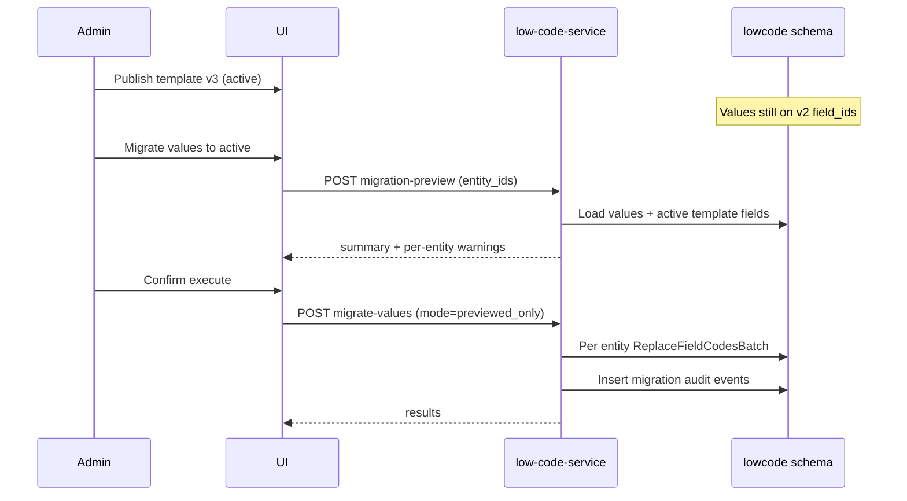

# Low-code Migrate-to-Active Design v0.1

Date: 2026-06-23  
Project: `D:\Projects\freight-platform`  
Status: **Design document only — no code, no migrations, no UI**  
Related:

- `docs/LOW_CODE_FORM_TEMPLATE_VERSION_ACTIVATION_POLICY_V0.1.md`
- `docs/LOW_CODE_RUNTIME_INTEGRATION_POLICY_V0.1.md`
- `docs/LOW_CODE_RUNTIME_HEADERS_CONTRACT_V0.1.md`
- `docs/LOW_CODE_RUNTIME_NEXT_STEPS_V0.1.md`
- `docs/LOW_CODE_CUSTOM_FIELD_VALUES_API_V0.1.md`
- `docs/LOW_CODE_CLONE_PUBLISHED_TEMPLATE_TO_DRAFT_V0.1.md`

---

## Summary

When a new published form template version becomes **active**, existing custom field values may still reference **older template versions** (`form_template_id`, `field_id`). This document defines a safe, explicit, admin-driven migration path to remap values onto the active template by stable **`field_code`**, without changing core entity data, without silent deletion, and with preview + audit.

**v0.1 scope:** design only. A minimal **entity-level** admin migrate API already exists; batch preview, enhanced audit events, UI, and rollback are **future implementation packs**.

---

## Problem

Publishing a new version of a form template (clone → edit → publish) automatically makes it **active** per the activation policy. However:

1. Existing `custom_field_values` rows keep their original `field_id` and `form_template_id`.
2. New PUTs for create-first flows use the active template, but **historical entities** may remain on older field IDs.
3. Field definitions can change between versions: label, type, required flag, options, or removal.
4. Operators need a controlled way to **preview** impact and **migrate** values without breaking reads or core TMS entities.

Automatic migration on publish is **explicitly out of scope** — migration must be an admin action.

---

## Current State

### Database tables (schema `lowcode`)

| Table | Role in migration |
|-------|-------------------|
| `form_templates` | Versioned published templates; active = derived (highest `version` per `tenant_id + entity_type + code`) |
| `form_sections` | Layout grouping; cloned with new IDs on clone-to-draft |
| `form_fields` | Field definitions; **new UUID per version** on clone |
| `custom_field_values` | Runtime values; keyed by `field_id`, denormalized `field_code`, optional `form_template_id` |
| `configuration_audit_log` | Append-only audit; migration should add dedicated event kinds |

### `custom_field_values` storage model

```sql
-- infrastructure/migrations/000011_create_lowcode_custom_fields_v0.1.up.sql
UNIQUE (tenant_id, entity_type, entity_id, field_id)
-- columns: form_template_id, field_id, field_code, value_json
```

Important properties:

- Values are stored **per entity**, not per template version globally.
- **`field_code`** is denormalized and stable across clone/publish when the field is logically the same.
- **`field_id`** is version-specific — clone creates new field rows with new UUIDs.
- **`form_template_id`** is stored on each value row but **GET values API does not return it** in v0.1 (internal/audit use only).
- Uniqueness is on **`field_id`**, not `field_code` — migrating remaps `field_id` for the same logical field.

### Active template selection

`GET /api/v1/low-code/form-templates/active?entity_type=...&code=...` returns the active published template (derived policy — no DB `is_active` column).

### PUT custom field values validation

1. Client sends `form_template_id` (typically active template for new edits).
2. Service loads published template context and validates each `field_code` exists on that template.
3. `ValidateFieldValue` enforces field type, options, required, `system_field`, `read_only`.
4. Upsert uses `ON CONFLICT (tenant_id, entity_type, entity_id, field_id)`.

Unknown `field_code` → `FIELD_NOT_FOUND`. Values for fields **removed from a template** cannot be updated via PUT against the new template; they remain readable via GET until migrated or manually addressed.

### What happens today when a field exists in old version but not in new

| Action | Behavior |
|--------|----------|
| GET values | Old row still returned (`field_code`, `field_id`, `value_json`) |
| PUT with active template | `FIELD_NOT_FOUND` for removed field codes |
| Entity migrate-to-active (existing) | Field **skipped**; listed in `skipped_fields`; row **not deleted** |

### Partial implementation (already shipped)

Entity-level admin API (no preview, no batch):

```http
POST /v1/low-code/admin/custom-field-values/migrate-to-active
POST /api/v1/low-code/admin/custom-field-values/migrate-to-active
```

Behavior (see `CustomFieldValueService.MigrateToActiveTemplate`):

1. Resolve active template by `tenant_id + entity_type + code`.
2. Load all values for entity.
3. For each value: if `field_code` exists on active template and field is not `system_field` / `read_only`, re-validate value against **new** field definition and remap to new `field_id` + `form_template_id`.
4. `ReplaceFieldCodesBatch`: DELETE rows for migrated `field_code`s, INSERT with new IDs.
5. Skipped fields (removed from template, protected) remain unchanged.
6. Audit: reuses `CUSTOM_FIELD_VALUES_UPDATED` payload (not a dedicated migration event yet).

**Gaps vs target design:** no preview, no batch, no incompatible-type warnings (hard fail on validation error), no legacy/orphan labeling in API, no dedicated migration audit events, no UI, no rollback API.

---

## Target Behavior

When a new active template version is published:

| Rule | Description |
|------|-------------|
| New writes | Create-first and explicit PUTs should use the **active** template |
| Existing reads | Values on older template versions **must remain readable** via GET |
| No auto-migration | Publishing does **not** migrate entity values |
| Explicit migration | Only admin-triggered migration (preview → execute) |
| No core changes | Migration touches `lowcode.custom_field_values` only — **no** transport/rfx/billing entity columns |
| Audit required | Every preview and execute writes an audit event with full payload |
| Tenant isolation | All operations scoped by `X-Tenant-ID`; no cross-tenant migration |
| Idempotent execute | Re-running migration on already-migrated entity is safe (no-op or stable result) |

---

## Migration Scenarios

### 1. Field unchanged

- Same `field_code`, same `field_type`, compatible options.
- **Action:** copy value automatically; remap `field_id` + `form_template_id`.
- **Result:** `copied_fields` includes field; no warnings.

### 2. Field label changed

- Same `field_code`; display metadata differs.
- **Action:** value transfers unchanged (label is template metadata, not stored in value row).
- **Result:** `copied_fields`.

### 3. Field type changed

Examples: `TEXT → SELECT`, `NUMBER → MONEY`, `SELECT → MULTI_SELECT`.

- **Action:** run **compatibility validation** before copy.
- **Compatible:** value transformed if a deterministic rule exists (see Value Compatibility Rules).
- **Incompatible:** `incompatible_fields` warning; entity may be **blocked** from batch execute until resolved manually.
- **Current v0.1 API:** incompatible value causes validation error (400) — no soft warning path yet.

### 4. Field removed from new template

- Value exists for `field_code` not present on active template.
- **Action:** do **not** physically delete the row.
- **Design label:** **legacy / orphaned** value — still returned by GET, flagged in preview and UI.
- **Current v0.1 API:** field appears in `skipped_fields`; row preserved with old `field_id`.

### 5. Field added (optional)

- New `field_code` on active template; no existing value.
- **Action:** no row created during migration (empty/null).
- **Result:** entity may show empty field in active-template UI.

### 6. Field added (required)

- New required field with no value after migration.
- **Action:** migration completes but preview shows `missing_required_fields` warning.
- **Strict validation:** subsequent PUT or domain validation may fail until operator fills the field.
- **Rule:** migration must **not** fabricate placeholder values for required fields.

### 7. `system_field` / `read_only`

- Protected fields must not be migrated or overwritten.
- **Action:** skip; remain on source binding; listed in `skipped_fields` / `protected_fields`.
- Aligns with `SYSTEM_FIELD_PROTECTED` / `READ_ONLY_FIELD_PROTECTED` on PUT.

---

## Field Matching Strategy

### Primary match: `field_code`

Migration matches source values to target template fields **only by `field_code`**.

### Do not use `field_id` across versions

Clone-to-draft creates new `form_fields` rows with new UUIDs. `field_id` is version-local.

### Matching rules

| Condition | Outcome |
|-----------|---------|
| Same `field_code` + same `field_type` + compatible options | **Copy** value |
| Same `field_code` + same `field_type` + options changed | **Copy** if value still valid in new options; else **warning** |
| Same `field_code` + different `field_type` | **Compatibility check** → copy with transform, **warning**, or **block** |
| Source `field_code` missing in target template | **Legacy/orphaned** — retain row, do not delete |
| Target required field with no source value | **missing_required** warning |
| Target `system_field` or `read_only` | **Skip** — protected |

### Source template identification

For preview, infer **source template** per entity as:

- Most frequent `form_template_id` among entity's value rows, or
- Explicit `source_template_id` query param if entity has mixed templates (edge case).

---

## Value Compatibility Rules

Compatibility is evaluated **after** matching by `field_code`. JSON shape must satisfy target field validator.

| Source type | Target type | Rule |
|-------------|-------------|------|
| TEXT | TEXT | Always compatible |
| TEXT | SELECT | Compatible if trimmed string ∈ target options |
| NUMBER | NUMBER | Compatible |
| NUMBER | MONEY | Transform `{ "amount": <n>, "currency": "<default or tenant currency>" }` — **warning** (currency assumption) |
| SELECT | SELECT | Compatible if value ∈ new options; else **incompatible** |
| SELECT | MULTI_SELECT | Transform `"X"` → `["X"]` — **warning** |
| MULTI_SELECT | SELECT | Compatible only if array length 1 and value ∈ options; else **incompatible** |
| CHECKBOX | CHECKBOX | Compatible |
| DATE / DATETIME | Same | Compatible if format valid |
| MONEY | MONEY | Compatible if currency allowed (or **warning** on currency change) |
| Any | FILE / REFERENCE / object types | Structural validation only |
| Any | Protected types | **Skip** |

**v0.1 implementation note:** current `ValidateFieldValue` is strict — design adds **preview-time soft classification** (`compatible` / `warning` / `blocked`) before execute.

---

## Deleted Fields Policy

**Never silently delete** legacy values during migration.

| Policy | Detail |
|--------|--------|
| Storage | Orphan rows remain in `custom_field_values` with original `field_id` |
| Read | GET continues to return orphaned values |
| API labeling (future) | Optional `legacy: true` or separate `legacy_items` in GET/preview response |
| UI | Show **Legacy fields** section with template version hint |
| Cleanup | Explicit admin **archive legacy values** action (future pack) — not auto on migrate |
| Audit | `legacy_fields` array in migration audit payload |

---

## Added Required Fields Policy

| Policy | Detail |
|--------|--------|
| Detection | After simulated copy, check target template `required=true` fields missing in merged snapshot |
| Migration | Allowed to complete — migration is structural remap, not full entity validation |
| Warning | `missing_required_fields` in preview and audit |
| UI | Highlight entities needing manual completion |
| Strict gate | Optional `mode: strict` on execute — abort if any `missing_required_fields` (future) |
| No fabrication | Do not auto-fill required fields with defaults unless field has explicit `default_value` in template (future template feature) |

---

## Audit Requirements

### Future audit event kinds

| Event | When |
|-------|------|
| `CUSTOM_FIELD_VALUES_MIGRATION_PREVIEWED` | Preview API called (including dry-run batch) |
| `CUSTOM_FIELD_VALUES_MIGRATED_TO_ACTIVE` | Execute succeeded |
| `CUSTOM_FIELD_VALUES_MIGRATION_FAILED` | Execute failed (partial failure policy TBD — prefer all-or-nothing per entity) |

### Payload (all migration audit events)

```json
{
  "event_kind": "CUSTOM_FIELD_VALUES_MIGRATED_TO_ACTIVE",
  "tenant_id": "...",
  "entity_type": "TRANSPORT_ORDER",
  "entity_id": "...",
  "source_template_id": "...",
  "target_template_id": "...",
  "copied_fields": ["internal_cost_center", "cargo_class"],
  "legacy_fields": ["deprecated_field"],
  "missing_required_fields": ["new_mandatory_ref"],
  "incompatible_fields": [
    { "field_code": "priority", "reason": "SELECT value not in new options" }
  ],
  "skipped_fields": ["system_status"],
  "mode": "previewed_only",
  "batch_id": "optional-correlation-id"
}
```

Plus standard audit metadata: `actor` (`X-User-ID`), `request_id` (`X-Request-ID`), `changed_at`.

**Current gap:** entity migrate uses `CUSTOM_FIELD_VALUES_UPDATED` — dedicated kinds are a future enhancement (non-breaking additive change to audit action mapping).

---

## API Design Proposal

> **Not implemented in this pack.** Endpoints below are the target contract for implementation packs.

Headers (all admin migration endpoints): `X-Tenant-ID` required; `X-User-ID`, `X-Request-ID` optional per runtime headers contract.

### 1. Preview migration (batch)

```http
POST /v1/low-code/admin/form-templates/{activeTemplateId}/migration-preview
POST /api/v1/low-code/admin/form-templates/{activeTemplateId}/migration-preview
```

Request:

```json
{
  "entity_type": "TRANSPORT_ORDER",
  "entity_ids": ["2db04b49-665c-469f-bcb1-ffeb1274fedb", "..."]
}
```

Response:

```json
{
  "summary": {
    "entities_checked": 10,
    "safe_to_migrate": 8,
    "warnings": 2,
    "blocked": 0
  },
  "items": [
    {
      "entity_id": "...",
      "source_template_id": "...",
      "target_template_id": "...",
      "status": "safe",
      "copied_fields": ["cargo_class"],
      "legacy_fields": [],
      "missing_required_fields": [],
      "incompatible_fields": [],
      "warnings": []
    }
  ]
}
```

- `{activeTemplateId}` must match the **active** published template (reject if older published version ID passed).
- Max batch size enforced (e.g. 100 entities per request — configurable).
- Dry-run only — no DB writes except audit preview event.

### 2. Execute migration (batch)

```http
POST /v1/low-code/admin/form-templates/{activeTemplateId}/migrate-values
POST /api/v1/low-code/admin/form-templates/{activeTemplateId}/migrate-values
```

Request:

```json
{
  "entity_type": "TRANSPORT_ORDER",
  "entity_ids": ["..."],
  "mode": "previewed_only"
}
```

- `mode: previewed_only` — execute only entities that were previewed in the same session/batch token (future: `preview_token` UUID).
- All-or-nothing **per entity** (partial field copy within entity is current behavior; batch should report per-entity status).
- Idempotent: re-migrate already-active values → `migrated_count: 0`, status ok.

Response:

```json
{
  "summary": { "entities_migrated": 8, "entities_skipped": 2, "entities_failed": 0 },
  "items": [ { "entity_id": "...", "status": "ok", "migrated_count": 3, "skipped_fields": [] } ]
}
```

### 3. Entity-level migrate (minimal v0.1 — exists)

```http
POST /v1/low-code/admin/custom-field-values/migrate-to-active
```

Request:

```json
{
  "entity_type": "TRANSPORT_ORDER",
  "entity_id": "...",
  "code": "transport_order_default",
  "validation_context": { "entity_status": "DRAFT", "role": "PLATFORM_ADMIN" }
}
```

Response (current):

```json
{
  "status": "ok",
  "active_template_id": "...",
  "migrated_count": 3,
  "skipped_count": 1,
  "skipped_fields": ["removed_field"]
}
```

**Future enhancements (same path, additive response fields):**

- `legacy_fields`, `missing_required_fields`, `incompatible_fields`
- `preview_required: true` gate unless `confirm: true`
- Dedicated migration audit event

---

## UI Design Proposal

> **Not implemented in this pack.**

### Admin template detail (active PUBLISHED)

Location: `/low-code/admin/form-templates/{id}` when template is **Active**.

- Button: **Migrate values to active**
- Opens preview modal:
  - Entity picker or post-publish prompt ("N entities on older version")
  - Summary: safe / warnings / blocked counts
  - Tables: legacy fields, missing required, incompatible fields
  - **Execute** disabled when `blocked > 0` (configurable: warnings allowed)

### Custom field values / entity detail

When GET detects values whose `form_template_id` (future exposed metadata) ≠ active template:

- Badge: **Older template values**
- Button: **Migrate this entity to active**
- Inline preview panel before execute
- Legacy fields section after migration if orphans remain

### Post-publish flow (future)

After successful publish making template active:

- Non-blocking banner: "Template v3 is active. 42 entities still on v2. [Preview migration]"
- Does **not** auto-migrate

---

## Batch Migration Flow



Recommended batch defaults:

| Parameter | Default |
|-----------|---------|
| Max entities per preview | 100 |
| Max entities per execute | 50 |
| Concurrency | 1 entity per transaction |
| Rate limit | Admin API throttle (future) |

---

## Safety Guardrails

| Guardrail | Requirement |
|-----------|-------------|
| Tenant filtering | Mandatory on all reads/writes; reject missing `X-Tenant-ID` |
| No cross-tenant migration | Source and target templates must belong to request tenant |
| Explicit migration | Never automatic on publish |
| No core entity mutation | No updates to `transport.*`, `rfx.*`, etc. |
| No status changes | Migration does not change transport order / shipment status |
| No silent deletion | Legacy/orphan values retained |
| Audit required | Preview and execute both audited |
| Preview before execute | Batch execute requires prior preview (token/session) |
| Dry-run supported | Preview endpoint is always dry-run |
| Max batch size | Enforced server-side |
| Idempotent migration | Safe to retry per entity |
| Rollback strategy | See below |
| Required fields | Cannot silently fabricate values |
| Protected fields | `system_field` / `read_only` never migrated |
| Authorization | Admin endpoints — gateway auth in future; not a substitute for tenant filter |

### Rollback strategy (design)

Migration is **forward-only** in v0.1 implementation. Rollback options (future):

1. **Re-migrate to previous published template** if it remains published (not active) — explicit reverse migration pack.
2. **Audit-based restore** — store full before/after snapshot in migration audit payload for manual ops restore.
3. **No automatic DB rollback** — prefer all-or-nothing transaction per entity.

---

## What Is Not Implemented Yet

| Item | Status |
|------|--------|
| Batch migration preview API | Not implemented |
| Batch migration execute API | Not implemented |
| Dedicated migration audit event kinds | Not implemented |
| Legacy/orphan labeling in GET values API | Not implemented |
| Admin UI migrate button / preview modal | Not implemented |
| Post-publish migration banner | Not implemented |
| Preview token / session binding | Not implemented |
| Soft incompatible-type warnings (vs hard 400) | Not implemented |
| Rollback / reverse migration API | Not implemented |
| Automatic migration on publish | **Intentionally excluded** |

**Partially implemented:**

- Entity-level `POST .../migrate-to-active` (field_code remap, skip orphans, basic audit)

---

## Verification Plan

### Design review (this pack)

- [x] Schema and current service behavior documented
- [x] Field matching and compatibility rules defined
- [x] API/UI proposals documented
- [x] Safety guardrails listed

### Future implementation verification

```powershell
cd D:\Projects\freight-platform

# Entity migrate (existing)
curl.exe -X POST -H "Content-Type: application/json" `
  -H "X-Tenant-ID: 74519f22-ff9b-4a8b-8fff-a958c689682f" `
  -H "X-User-ID: {admin-user-uuid}" `
  -H "X-Request-ID: migrate-test-001" `
  --data '{"entity_type":"TRANSPORT_ORDER","entity_id":"2db04b49-665c-469f-bcb1-ffeb1274fedb","code":"transport_order_default"}' `
  http://localhost:8080/api/v1/low-code/admin/custom-field-values/migrate-to-active

# After batch APIs ship:
# POST .../migration-preview
# POST .../migrate-values

# Audit
curl.exe -H "X-Tenant-ID: ..." `
  "http://localhost:8080/api/v1/low-code/audit-events?entity_type=TRANSPORT_ORDER&entity_id=..."

cd services/low-code-service
go test ./...

make integration-smoke-test
make lowcode-runtime-compliance-test
```

### Manual scenario checklist (QA)

1. Publish v2 while entities have v1 values → GET still works.
2. Preview shows copied / legacy / missing required / incompatible buckets.
3. Execute remaps `field_id` for compatible fields only.
4. Removed field value still in GET after migration.
5. Re-run migrate → idempotent.
6. Core transport order unchanged after migration.

---

## Next Action

Implementation order (separate packs — **no code in this pack**):

1. **Migration preview API** — batch dry-run + `CUSTOM_FIELD_VALUES_MIGRATION_PREVIEWED` audit
2. **Enhance entity-level migrate-to-active** — preview response shape, dedicated audit event, soft warnings
3. **Admin UI preview modal** — active template detail + entity detail entry points
4. **Batch migration after publish** — execute API + post-publish banner + rollback design spike

See `docs/NEXT_COMMANDS.md` → **Low-code Migrate-to-Active**.
