# Diagrams

## Context

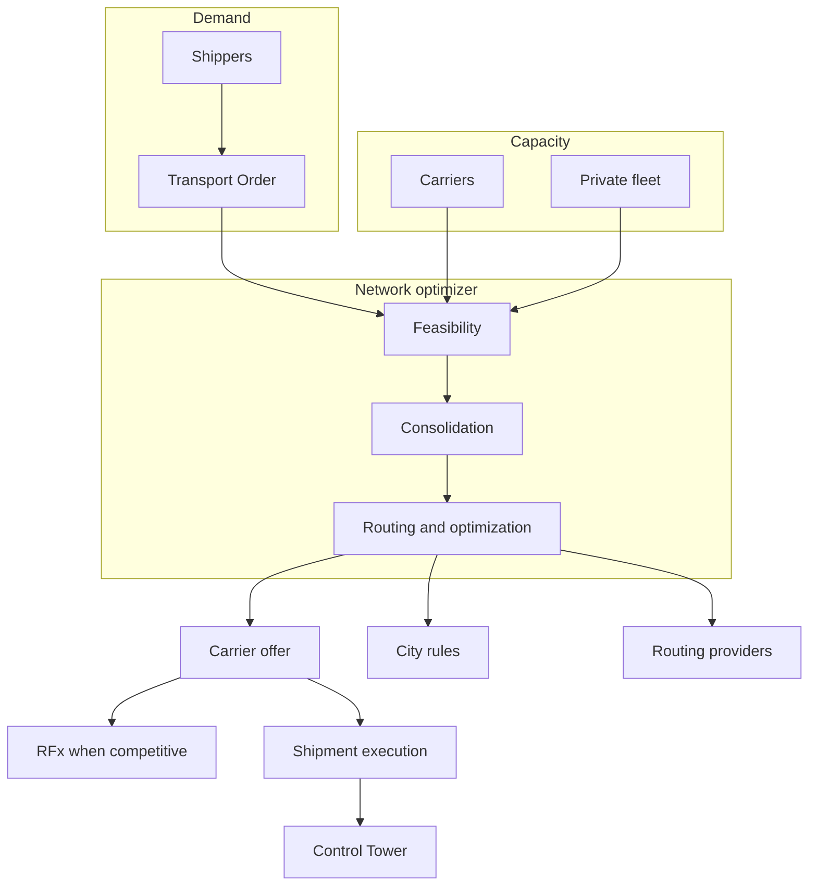

## Component

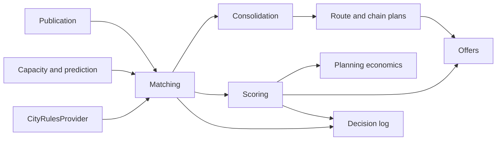

## Data flow

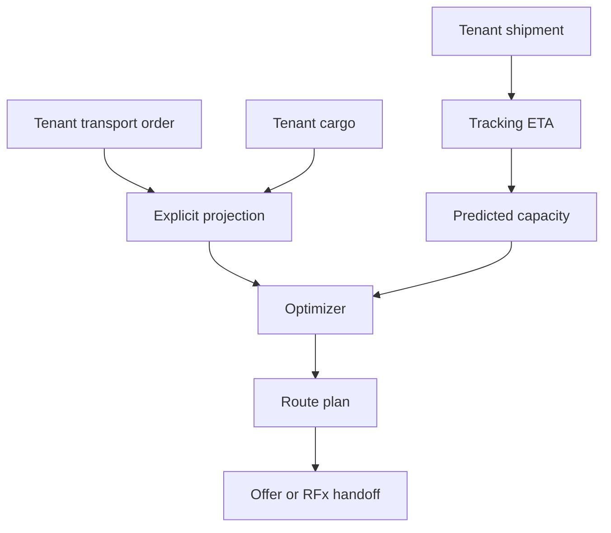

## Marketplace privacy flow

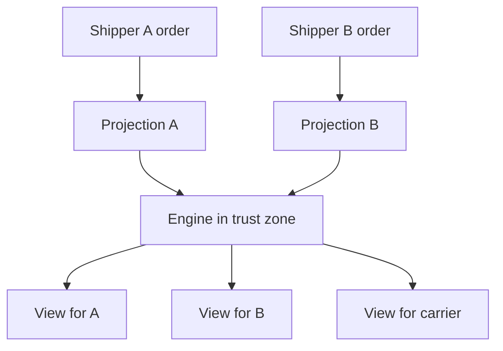

A's view does not include B's rate. The engine may hold both owner keys.

## Predictive capacity sequence

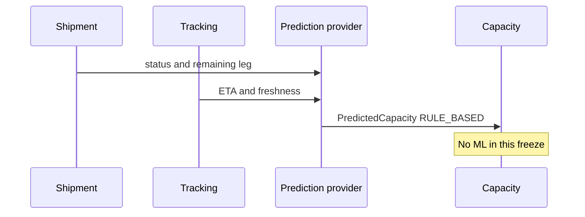

## Next load sequence

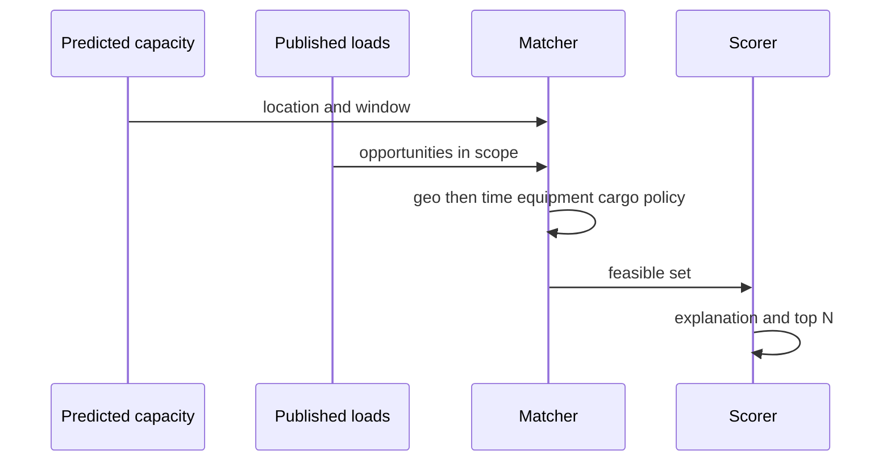

## Cross-shipper consolidation sequence

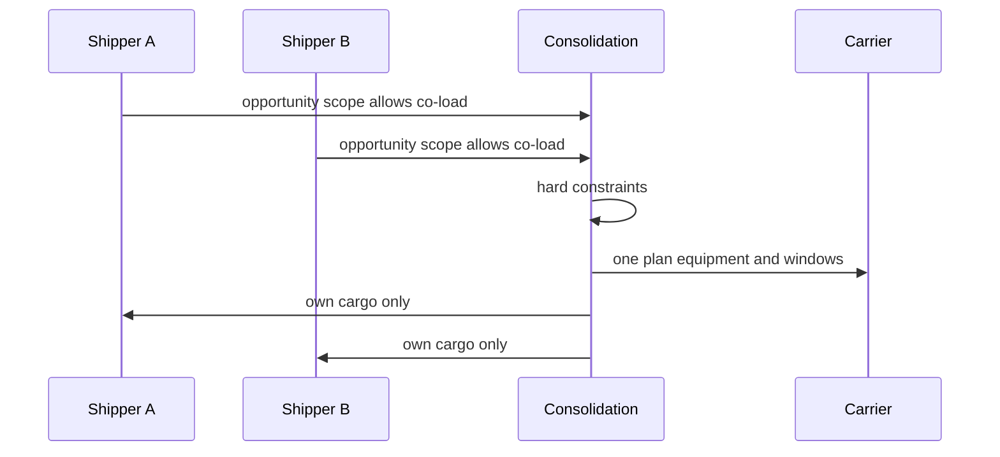

## Backhaul sequence

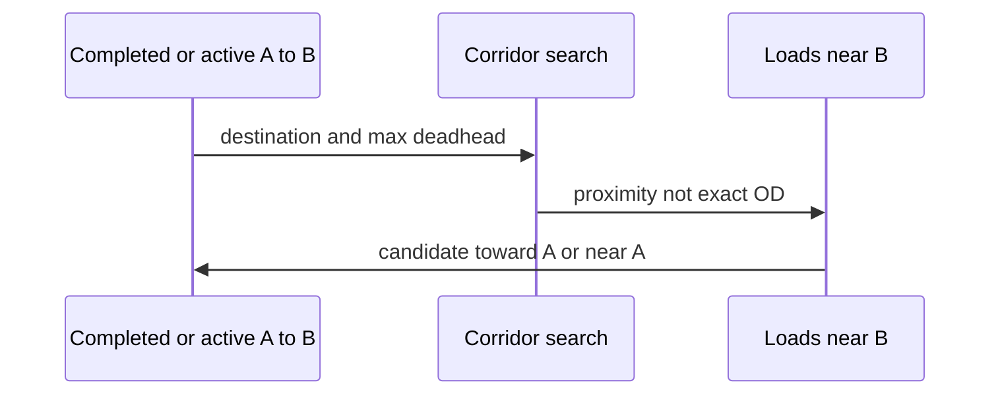

## Chain reoptimization sequence

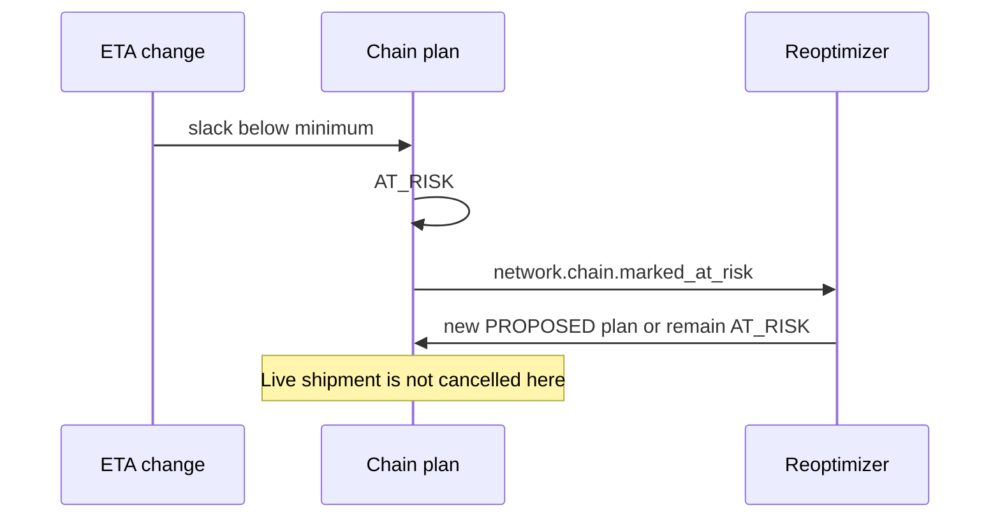

## Private fleet sequence

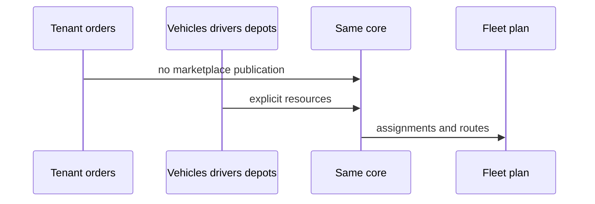

## Urban route sequence

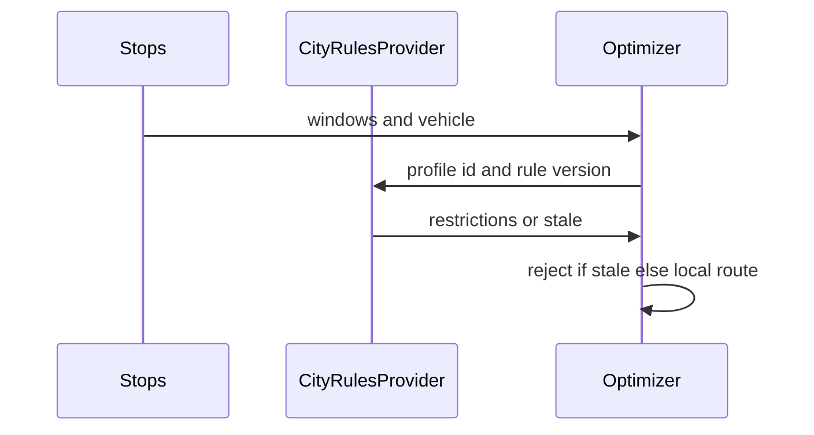

## Product shape

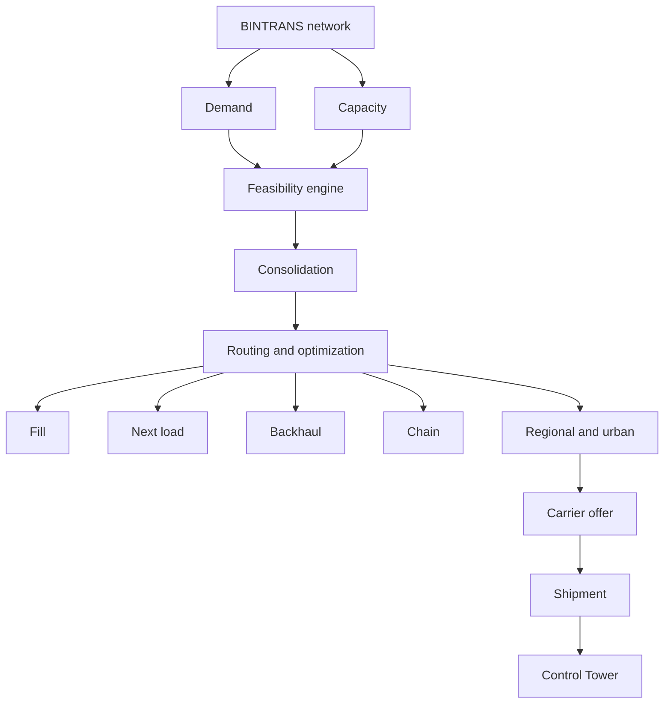
