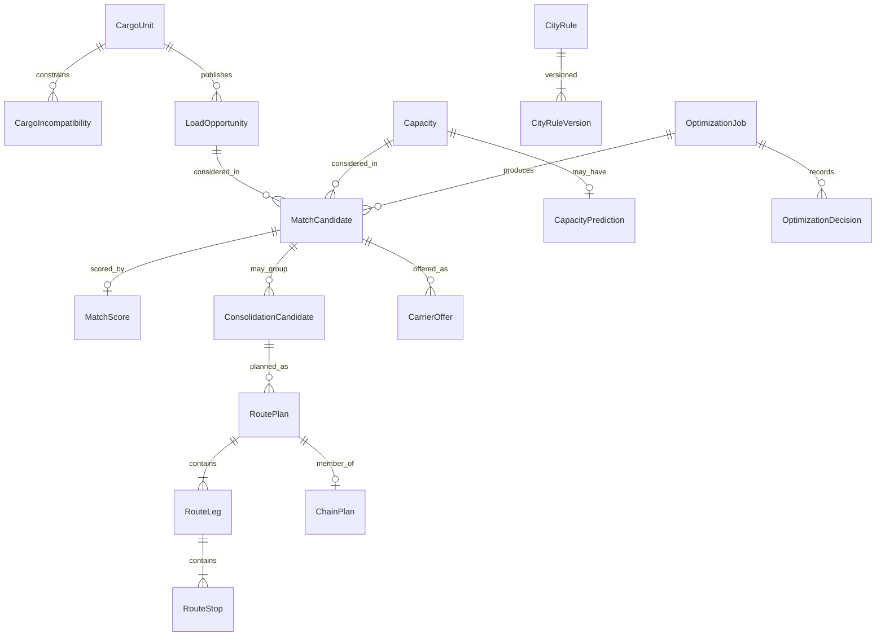

# ERD

Planning schema name if implementation is later approved: `network_optimizer`. No migration is created in this freeze.

Classification:

- **source-of-truth** — this context owns the write model
- **projection** — copy or reduction of another owner's data
- **derived** — computed from other rows and replaceable
- **immutable snapshot** — written once for audit or commercial freeze

| Entity | Class | Owner | Notes |
|--------|-------|-------|-------|
| CargoUnit | projection | network-optimizer, sourced from transport-order cargo | Not a second cargo master. |
| CargoCompatibility / CargoIncompatibility | source-of-truth | network-optimizer | Hard constraints. |
| LoadOpportunity | source-of-truth | network-optimizer | Explicit publication. Stores owner tenant internally. |
| Capacity | source-of-truth | network-optimizer | Time-bounded. Vehicle master stays in shipment-service. |
| CapacityPrediction | derived | network-optimizer | Rebuildable from input snapshots. Method recorded. |
| MatchCandidate | derived | network-optimizer | Includes hard rejects, not only winners. |
| MatchScore | derived | network-optimizer | Components persisted, not only a total. |
| ConsolidationCandidate | derived | network-optimizer | Cargo set plus residual capacity. |
| RoutePlan | source-of-truth | network-optimizer | Proposal. Not a shipment. |
| RouteLeg | source-of-truth | network-optimizer | Shareable by many cargo units. |
| RouteStop | source-of-truth | network-optimizer | Sequence, window, service, actions. |
| ChainPlan | source-of-truth | network-optimizer | Ordered plans for one capacity and horizon. |
| CarrierOffer | source-of-truth | network-optimizer | Marketplace offer. RFx remains tender SSOT. |
| CityRule | source-of-truth | city-rules context | Data, not solver code. |
| CityRuleVersion | immutable snapshot | city-rules context | Effective-dated. |
| OptimizationJob | source-of-truth | network-optimizer | One run. |
| OptimizationDecision | immutable snapshot | network-optimizer | Audit reconstruction. |

External aggregates referenced by id only, never copied as writable masters:

| External | Owner | Class in this context |
|----------|-------|------------------------|
| TransportOrder | transport-order-service | reference |
| Cargo / CargoItem | transport-order-service | source of CargoUnit projection |
| Shipment | shipment-service | reference; execution SSOT |
| Vehicle / Driver | shipment-service | reference |
| Location | transport-order-service | reference |
| ETA / Slot / Position | tracking-service | read models |
| Contract rate / rate snapshot | contract-rate-service / transport-order-service | immutable commercial input |
| Freight cost entry | freight-cost-service | not stored here |
| Freight request / award | rfx-service | reference when a mini-tender is opened |
| Settlement | billing-register-service | not stored here |
| Document | document-service | reference for required-document constraints |

`RouteStop` kinds `PickupStop`, `DeliveryStop`, `HubStop`, `DepotStop`, and `BreakStop` are values of `stop_kind`, not separate tables in v0.1.
