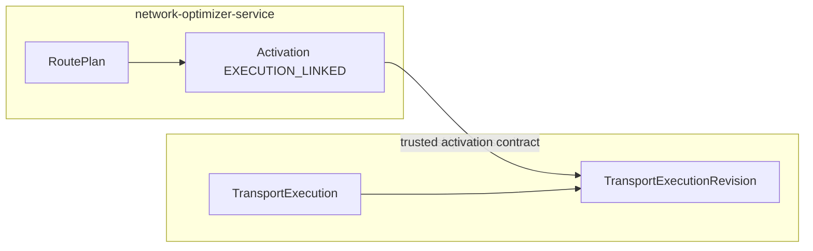
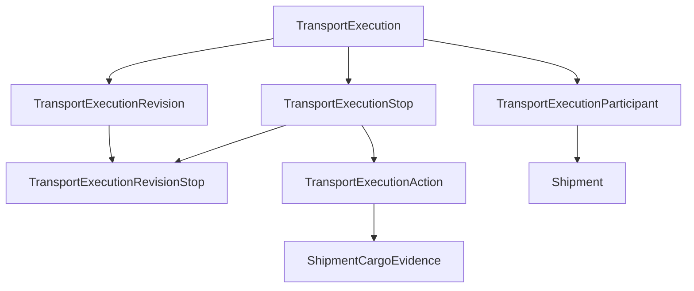

# Domain model

```text
EXECUTION_AGGREGATE_OWNER=shipment-service
EXECUTION_ROUTE_MODEL=TRANSPORT_EXECUTION
NEW_SERVICE_REQUIRED=NO
REUSE_EXISTING_SHIPMENT_AGGREGATE=NO
MULTI_SHIPMENT_EXECUTION_SUPPORTED_BY_MODEL=YES
DEPOT_START_WITHOUT_PREEXISTING_SHIPMENT_SUPPORTED=YES
EXECUTION_STOP_OWNER=shipment-service
STOP_ACTION_OWNER=shipment-service
DRIVER_TASK_OWNER=shipment-service
TRACKING_OWNER=tracking-service
CONTROL_TOWER_OWNER=control-tower-read-model-service
SLOT_WINDOW_RECORD_OWNER=tracking-service
SLOT_BOOKING_AUTHORITY=NOT_IMPLEMENTED
ROUTEPLAN_OWNER=network-optimizer-service
```

`REUSE_EXISTING_SHIPMENT_AGGREGATE=NO` means the shipment row is not the execution root. Shipment status, cargo evidence, and today's single-leg commands stay in `shipment-service`. No second service is introduced. A shipment has one origin and one destination, so it cannot parent a route that visits several shipments or that starts with no shipment at all.

## Relational boundary

| Entity | Parent | Role |
| --- | --- | --- |
| Shipment | itself | Coarse status for one commercial execution |
| TransportExecution | none | Driver route. Carrier, vehicle, driver, current revision |
| TransportExecutionRevision | TransportExecution | One activation. `ACTIVE` or `SUPERSEDED` |
| TransportExecutionParticipant | TransportExecution | One materialized `shipment_id` + `cargo_id` |
| TransportExecutionStop | TransportExecution | Stable stop. Parent never changes |
| TransportExecutionRevisionStop | revision + stop | Membership link only |
| TransportExecutionAction | TransportExecutionStop | Pickup or delivery of one materialized cargo |
| DriverStopTask | TransportExecutionStop | Current or next work for the route driver |
| ShipmentCargoEvidence | Shipment | Append-only proof. Already exists |

Notice-style `DriverTask` rows stay. They are not the route sequence.

`DEPOT_START` leaves `TransportExecution` without an anchor shipment. Participants appear only after each cargo subject has a trusted `shipment_id` and `cargo_id`. `CURRENT_TRIP` stores the existing trip shipment as one participant. Other cargos on that route are further participants. The trip shipment does not own the stop list.

## Diagram A — activation to projection



## Diagram B — execution route



The stop's parent arrow goes to the route. The revision reaches the stop only through the link.

## Identity

```text
EXECUTION_STOP_ID_ALLOCATED_BY=shipment-service
EXECUTION_STOP_PARENT=TransportExecution
EXECUTION_STOP_ID_SHIPMENT_ROW_OWNED=NO
ROUTEPLAN_STOP_REFERENCE=source_route_plan_stop_id
ONBOARD_CARGO_DELIVERY_ONLY=YES
COMPLETED_STOP_IMMUTABLE=YES
COMPLETED_STOP_ROW_REPARENTED=NO
```

`source_route_plan_stop_id` is never the primary key. A successor revision links the same stop id. It does not allocate a second id for a completed or in-service stop.

## Onboard cargo

If cargo evidence for a participant is `CONFIRMED_ONBOARD`, the projection creates a `DELIVERY` action only. It does not create a `PICKUP`. `UNLOADED` cargo produces no further action. A new load produces pickup and delivery only when the activated plan says so and the subject is already materialized to `shipment_id` and `cargo_id`. A raw `LOAD_OPPORTUNITY` does not. See `STOP_ACTION_MODEL.md`.

## What stays on the shipment row

Origin, destination, the single planned and actual pickup and delivery timestamps, and the coarse status remain per shipment. They summarize that shipment's own first pickup and final delivery. They do not describe the whole route. Intermediate stops do not overwrite them. See `SHIPMENT_FSM_ALIGNMENT.md`.

## Single-leg compatibility

A shipment that is not a participant of an `ACTIVE` revision keeps today's driver commands and status chain. Multi-stop behavior starts only after a projection exists. Existing milestones are not removed.
