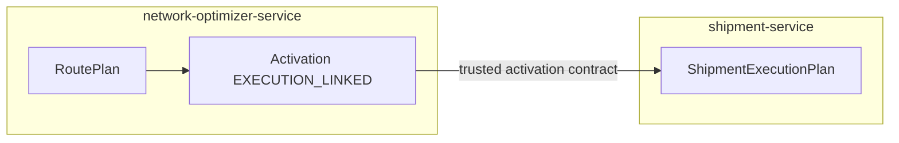
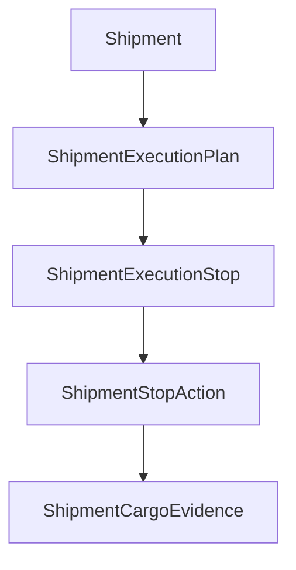

# Domain model

```text
EXECUTION_AGGREGATE_OWNER=shipment-service
NEW_AGGREGATE_REQUIRED=NO
REUSE_EXISTING_SHIPMENT_AGGREGATE=YES
EXECUTION_STOP_OWNER=shipment-service
STOP_ACTION_OWNER=shipment-service
DRIVER_TASK_OWNER=shipment-service
TRACKING_OWNER=tracking-service
CONTROL_TOWER_OWNER=control-tower-read-model-service
SLOT_WINDOW_OWNER=tracking-service
ROUTEPLAN_OWNER=network-optimizer-service
```

`NEW_AGGREGATE_REQUIRED=NO` means no new service and no second shipment. The shipment row stays the aggregate root because tenant, carrier, driver, vehicle, version, and the coarse status machine already live there. New child entities are required inside that aggregate. Putting stops on the optimizer would transfer execution ownership. Stuffing ordinals into `OriginLocationID` cannot represent more than one pickup.

## Children

| Entity | Root | Role |
| --- | --- | --- |
| Shipment | itself | Coarse status, assignment, commercial parties |
| ShipmentExecutionPlan | Shipment | One projection of one activation |
| ShipmentExecutionStop | Shipment via the plan | Shipment-owned stop |
| ShipmentStopAction | Shipment via the stop | Pickup or delivery of one cargo |
| DriverStopTask | Shipment via the stop | What the assigned driver must do next |
| ShipmentCargoEvidence | Shipment | Append-only proof; already exists |

Notice-style `DriverTask` rows stay. They are not stop tasks.

## Diagram A — activation to projection



## Diagram B — shipment aggregate



## Identity

```text
EXECUTION_STOP_ID_SHIPMENT_OWNED=YES
ROUTEPLAN_STOP_REFERENCE=source_route_plan_stop_id
ONBOARD_CARGO_DELIVERY_ONLY=YES
COMPLETED_STOP_IMMUTABLE=YES
```

`SHIPMENT_STOP_ID` is allocated by `shipment-service` when the projection is created. `ROUTEPLAN_STOP_ID` is stored as `source_route_plan_stop_id` and is never the primary key. Optimizer ids are not updated when a driver arrives. A later successor plan references the same shipment-owned ids for stops that already completed.

## Onboard cargo

If cargo evidence state is `CONFIRMED_ONBOARD`, the projection creates a `DELIVERY` action only. It does not create a `PICKUP`. That preserves NLO-0.3C and ADR-NET-019: no synthetic pickup for cargo already on the vehicle. `UNLOADED` cargo produces no further action. `PLANNED` or absent evidence on a new load produces `PICKUP` then `DELIVERY` when the activated plan says so.

## What stays on the shipment row

Origin, destination, the single planned and actual pickup and delivery timestamps, and the coarse status remain for shipments that have no execution plan. When a plan exists, those columns stay the first pickup and the final delivery summary. Intermediate stops do not overwrite them. See `SHIPMENT_FSM_ALIGNMENT.md`.

## Single-leg compatibility

A shipment with no `EXECUTION_LINKED` activation keeps today's driver commands and status chain. Multi-stop behavior starts only after a projection exists. Existing milestones are not removed.
