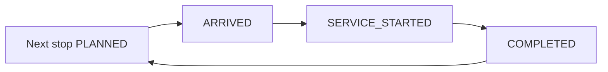

# Driver task model

```text
DRIVER_TASK_REUSE=PARTIAL
DRIVER_TASK_OWNER=shipment-service
DRIVER_NEXT_STOP_CONTRACT=CURRENT_AND_NEXT_ONLY
```

## What exists

The driver can, on one origin and one destination:

| Capability | Support today |
| --- | --- |
| Next action | Yes, as the next milestone for the shipment status |
| Arrive | Yes, `ARRIVED_AT_PICKUP` or `ARRIVED_AT_DELIVERY` |
| Loaded | Yes, `PICKUP_COMPLETED` |
| Unloaded | Yes, `DELIVERY_COMPLETED` |
| Delay | Yes, shipment-scoped delay with a new ETA |
| Problem | Yes, exception categories and `driver.problem.reported` |
| Completion | Yes, delivery completion ends the shipment execution tail |
| Offline retry | Partial. Idempotency keys exist. The app blocks submit while offline and does not queue |

`DRIVER_TASK_REUSE=PARTIAL`. Reuse the driver identity, shipment authorization, idempotency table, exception and delay records, device registry, and transactional outbox. Do not overload `driver_task.task_type`. That check constraint and the acknowledgement FSM (`PENDING`, `READ`, `ACKNOWLEDGED`) describe an inbox notice. A stop needs arrive, service, and complete.

Notice tasks stay as they are, including Control Tower requests for delay reason and arrival confirmation.

## DriverStopTask

Future relationship, not implemented here:

```text
ShipmentExecutionStop → DriverStopTask
```

| Field | Rule |
| --- | --- |
| `task_id` | Shipment-owned |
| `driver_id` | Assigned shipment driver at projection, or the driver after an audited reassignment |
| `vehicle_id` | Shipment vehicle |
| `shipment_id` | Required |
| `execution_stop_id` | Required |
| `ordinal` | Copy of the stop ordinal |
| `location_id` | Null only for a position anchor, which is not tasked |
| `planned_arrival` | Copy of the stop planned arrival |
| `action_summary` | Counts and types of actions on that stop. Cargo ids the driver must handle. No other shipper's commercial terms |
| `status` | Mirrors the stop status. The stop is authoritative |
| `version` | Optimistic concurrency |

Creating the task does not complete it. Task rows for `PLANNED` stops are materialised with the projection so the driver can list current and next. Status changes happen in the same transaction as the stop command.

`START` position anchors get no task. Completed tasks remain after supersede.

## UX contract

No UI change in this freeze. The future flow is:

```text
Current stop
Next stop
location
planned arrival
cargo actions
Arrived
Start operation
Confirm pickup or delivery
Report issue
Complete
Next stop
```

The list shows the current open stop and the following stop. It does not show optimizer scores, rejected plans, or other tenants' orders.

## Offline

```text
OFFLINE_MODEL=CLIENT_QUEUE_SERVER_IDEMPOTENCY
```

The server remains authoritative through `driver_operation_idempotency`, extended so the resource may be an execution stop or action. The client may hold unsent commands with stable keys and send them in ordinal order when the network returns. The server:

- replays the same key with the stored response
- rejects a command for a stop that is not current, even if the phone was offline
- does not merge conflicting offline edits

Lost GPS does not block a manual arrive. The existing offline banner behavior remains valid until the queue exists. The queue is a later implementation wave, not a second protocol.

## Diagram C — driver lifecycle



Travel between stops is not a stop status. The shipment stays `IN_TRANSIT` and the following stop stays `PLANNED`.
