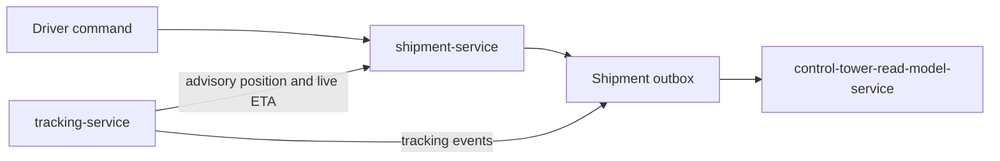

# Events

```text
OUTBOX_SAME_TRANSACTION=YES
EXECUTION_EVENTS_USE_SEPARATE_VERSION_STREAM=YES
```

Shipment status mutations already insert `transport.shipment_event_outbox` in the same transaction as the row change. Stop and plan mutations follow that function. A failed outbox insert rolls back the stop write. There is no new outbox subsystem.

## Version stream

Control Tower detects gaps on the shipment aggregate version for `shipment.status.changed`. Stop progress must not consume that counter. Otherwise a stop event would look like a missing status change, or a status consumer would have to ignore unknown types inside a version sequence it treats as complete.

Execution events use aggregate type `SHIPMENT_EXECUTION_PLAN`, aggregate id of the plan, and the plan version. Status events stay aggregate type `SHIPMENT`. Both rows go into the existing shipment outbox table.

## Names

Existing names stay for the facts they already mean.

| Event | When |
| --- | --- |
| `shipment.created`, `shipment.status.changed`, `shipment.cancelled` | Unchanged coarse lifecycle |
| `driver.task_created`, `driver.task_completed`, `driver.task_expired`, `driver.task_cancelled` | Notice inbox only |
| `driver.delay.reported` | Delay, with optional `execution_stop_id` |
| `driver.problem.reported` | Problem, with optional `execution_stop_id` and `action_id`. Legacy `driver.exception_reported` still maps to this in Control Tower |
| `driver.arrived_at_pickup`, `driver.departed_pickup`, `driver.arrived_at_delivery`, `driver.delivery.completed` | Single-leg shipments that have no execution plan |

New names, shipment-owned:

```text
shipment.execution_plan.created
shipment.execution_plan.superseded
shipment.route_stop.current
shipment.route_stop.arrived
shipment.route_stop.service_started
shipment.route_stop.completed
shipment.route_stop.sequence_overridden
```

`shipment.route_stop.arrived` and `shipment.route_stop.completed` match the names NLO-0.4A already reserved for shipment-service. Delayed and problem facts reuse the driver events above instead of `stop.delayed` and `stop.problem` duplicates.

Tracking-owned, advisory:

```text
tracking.stop.approaching
```

Planning-owned, not emitted by shipment-service:

```text
network.route_plan.execution_linked
network.route_plan.superseded
```

## Diagram E — event flow



Tracking does not write the shipment stop row. The arrow into shipment-service is the current-stop id shipment publishes for ETA targeting, and the advisory signals tracking publishes back. Completion never originates in tracking or in the optimizer.
