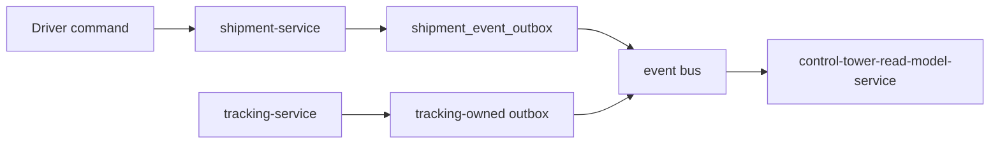

# Events

```text
OUTBOX_SAME_TRANSACTION=YES
OUTBOX_IS_SERVICE_LOCAL=YES
EXECUTION_EVENTS_USE_SEPARATE_VERSION_STREAM=YES
TRACKING_EVENT_USES_SHIPMENT_OUTBOX=NO
TRACKING_EVENT_OWNER=tracking-service
```

`OUTBOX_SAME_TRANSACTION=YES` means the service that mutates a row inserts its own outbox row in that same transaction. It does not mean every service shares `transport.shipment_event_outbox`.

Shipment-service already inserts `transport.shipment_event_outbox` in the same transaction as a shipment mutation. Execution route, revision, stop, and action mutations follow that function, because shipment-service owns those rows. A failed outbox insert rolls back the execution write.

Tracking-service owns position, freshness, live ETA, and `tracking.stop.approaching`. Those events are published from a tracking-owned outbox in the same transaction as the tracking mutation, then onto the event bus. Tracking must not insert `tracking.stop.approaching`, or any new tracking-owned event, into `transport.shipment_event_outbox`.

Today's tracking publisher does insert some driver tracking-loss events into `transport.shipment_event_outbox`. That is existing code. This freeze does not extend it. The approaching event is not added to that table. A tracking-owned outbox is an implementation change and is not started here.

## Version stream

Control Tower detects gaps on the shipment aggregate version for `shipment.status.changed`. Stop progress must not consume that counter.

Execution events use aggregate type `TRANSPORT_EXECUTION`, aggregate id of the route, and the revision version. They still go into `transport.shipment_event_outbox`, because shipment-service is the writer. Status events stay aggregate type `SHIPMENT`. A participant shipment id is inside the payload when the fact is about that shipment. The route id is always present.

## Names

| Event | Owner | When |
| --- | --- | --- |
| `shipment.created`, `shipment.status.changed`, `shipment.cancelled` | shipment-service | Unchanged coarse lifecycle of one shipment |
| `driver.task_created`, `driver.task_completed`, `driver.task_expired`, `driver.task_cancelled` | shipment-service | Notice inbox only |
| `driver.delay.reported` | shipment-service | Delay, with optional `execution_stop_id` |
| `driver.problem.reported` | shipment-service | Problem, with optional `execution_stop_id` and `action_id` |
| `driver.arrived_at_pickup`, `driver.departed_pickup`, `driver.arrived_at_delivery`, `driver.delivery.completed` | shipment-service | Single-leg shipments that are not on an active route |
| `shipment.execution_plan.created` | shipment-service | Revision created |
| `shipment.execution_plan.superseded` | shipment-service | Revision superseded |
| `shipment.route_stop.current` | shipment-service | Current stop on the active revision |
| `shipment.route_stop.arrived` | shipment-service | Stop arrived |
| `shipment.route_stop.service_started` | shipment-service | Service started |
| `shipment.route_stop.completed` | shipment-service | Stop completed |
| `shipment.route_stop.sequence_overridden` | shipment-service | Operator override |
| `tracking.stop.approaching` | tracking-service | Advisory. Tracking-owned outbox only |
| `network.route_plan.execution_linked` | network-optimizer-service | Post-link fact, after `EXECUTION_LINKED`. `AGENT_D_CONTRACT_REQUIRED`. `IMPLEMENTED_TODAY=NO`. Not the projection trigger |
| `network.route_plan.superseded` | network-optimizer-service | Planning audit. Not the execution switch |

`shipment.route_stop.arrived` and `shipment.route_stop.completed` match the names NLO-0.4A reserved for shipment-service. Delay and problem reuse the driver events. The event names stay on the shipment prefix because shipment-service publishes them. The aggregate is the route, not one arbitrary shipment.

## Diagram E — event flow



Shipment-service may tell tracking which stop id is current, by its own execution event. Tracking does not write the stop row and does not write the shipment outbox. Completion never originates in tracking or in the optimizer.
