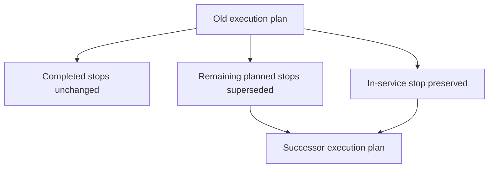

# Replan and successor execution

```text
REPLAN_SUCCESSOR_MODEL_FROZEN=YES
COMPLETED_STOP_IMMUTABLE=YES
COMPLETED_HISTORY_PRESERVED=YES
REMAINING_STOPS_SUPERSEDED_SAFELY=YES
CURRENT_STOP_REPLAN_RULE=PRESERVE_IN_SERVICE_STOP
```

Agent D creates the successor RoutePlan and activates it. Agent C does not resequence. Execution switches future work when the successor activation is `EXECUTION_LINKED` and passes the stale check.

## Diagram D



## What happens

| Piece | Rule |
| --- | --- |
| Completed stops | Same shipment-owned ids. No update of timestamps, location, actions, or evidence. Copied onto the successor only as immutable references, still `COMPLETED` |
| Current stop in `ARRIVED` or `SERVICE_STARTED` | Preserved until completion. Not superseded. The successor's matching stop uses the same shipment-owned id and keeps status and actual timestamps |
| Remaining `PLANNED` stops | Mark `CANCELLED` with reason `SUPERSEDED` on the old plan. The successor gets new shipment-owned ids for those stops |
| Driver current task | The in-service task stays with the driver who is on that stop |
| Future driver tasks | Cancelled with the superseded stops. New tasks are created for the successor's open stops |
| Old plan status | `SUPERSEDED` in the same transaction as the successor insert |
| Shipment status | Unchanged |

`SKIPPED` and `CANCELLED` history is kept with its reason.

## In-service lock

```text
CURRENT_STOP_REPLAN_RULE=PRESERVE_IN_SERVICE_STOP
```

If the driver has already arrived or started service, that stop cannot be removed or reordered by the successor. If the successor contract omits that stop or changes its location or its incomplete actions, projection fails with `409 IN_SERVICE_STOP_CONFLICT` and leaves the old plan `ACTIVE`.

A `PLANNED` current stop, including the next stop while the vehicle is en route, may be superseded.

## One active plan

The supersede and the insert commit together. Readers never see two `ACTIVE` plans. This matches the planning rule that two plans are not independently execution-linked, applied here to execution rows.

## Onboard cargo

The successor's actions still follow evidence. Cargo already `CONFIRMED_ONBOARD` is delivery-only on the successor. Completing the preserved in-service stop can append new evidence before the successor's later stops run. It does not rewrite evidence already stored.
