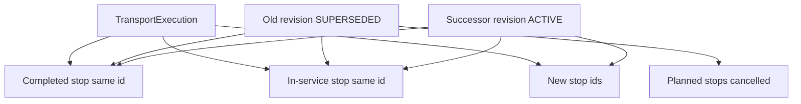

# Replan and successor execution

```text
REPLAN_SUCCESSOR_MODEL_FROZEN=YES
REPLAN_PERSISTENCE=ROUTE_OWNS_STOPS_REVISIONS_LINK_THEM
COMPLETED_STOP_IMMUTABLE=YES
COMPLETED_HISTORY_IMMUTABLE=YES
COMPLETED_STOP_ROW_REPARENTED=NO
COMPLETED_STOP_ID_CHANGED=NO
IN_SERVICE_STOP_ROW_REPARENTED=NO
REMAINING_STOPS_SUPERSEDED_SAFELY=YES
CURRENT_STOP_REPLAN_RULE=PRESERVE_IN_SERVICE_STOP
```

Agent D creates the successor RoutePlan and persists its activation as `PENDING_EXECUTION`. Agent C does not resequence. Execution switches future work only when the successor projection command commits. `EXECUTION_LINKED` is Agent D's following status, after shipment-service has returned `execution_id` and `revision_id`.

Stops are children of `TransportExecution`. A revision does not own them. `TransportExecutionRevisionStop` is the only way a revision names a stop. That is why a completed row can appear in the successor without gaining a second parent.

## Diagram D



The arrows from revisions are membership links. The arrows from the route are the parent. Completed and in-service rows stay on the route.

## What happens

| Piece | Rule |
| --- | --- |
| Completed stops | Same id. `execution_id` unchanged. No update of timestamps, location, actions, or evidence. New link `INHERITED_COMPLETED` stores the successor RoutePlan stop id. The introducing link keeps the original stop id |
| Current stop in `ARRIVED` or `SERVICE_STARTED` | Same id. `execution_id` unchanged. Status and actual timestamps unchanged. New link `INHERITED_IN_SERVICE` stores the successor RoutePlan stop id. Incomplete actions get a new `TransportExecutionRevisionAction` row for the successor action ids |
| Remaining `PLANNED` stops | Status `CANCELLED`, reason `SUPERSEDED`. They stay parented by the route. The successor does not link them as open work. New stop ids are allocated on the same route and linked `INTRODUCED` |
| Driver current task | Stays on the in-service stop and the same driver |
| Future driver tasks | Cancelled with the superseded planned stops. New tasks for introduced stops |
| Old revision | `SUPERSEDED` in the same transaction as the successor insert |
| Participant shipment status | Unchanged |

`SKIPPED` and `CANCELLED` history is kept with its reason. Those rows are not re-parented.

## In-service lock

```text
CURRENT_STOP_REPLAN_RULE=PRESERVE_IN_SERVICE_STOP
```

If the driver has arrived or started service, that stop cannot be removed or reordered by the successor. The successor contract is compared to the stable stop by semantic fingerprint: role, point, location or anchor coordinates, and each incomplete action's type, `shipment_tenant_id`, `shipment_id`, `cargo_id`, and `cargo_version`. The successor's own RoutePlan stop and action ids are recorded on the new links. They are not required to equal the introducing plan's ids. If the fingerprint does not match, projection fails with `409 IN_SERVICE_STOP_CONFLICT` and leaves the old revision `ACTIVE`. The successor activation is not `EXECUTION_LINKED`.

A `PLANNED` next stop, including while the vehicle is between stops, may be superseded.

## One active revision

The supersede and the insert commit together. Readers never see two `ACTIVE` revisions of one route. A shipment stays in at most one active execution.

## Onboard cargo

The successor's new actions still follow evidence for each materialized participant. Cargo already `CONFIRMED_ONBOARD` is delivery-only. Completing the preserved in-service stop can append new evidence. It does not rewrite evidence already stored. An unresolved `LOAD_OPPORTUNITY` on the successor blocks projection with `EXECUTION_SUBJECT_UNMATERIALIZED` and does not supersede the old revision.
