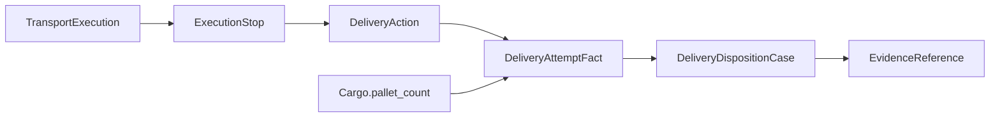

# TMS-RETURN-0.1 domain model

A delivery outcome belongs to one execution stop, one shipment, one cargo, and a pallet quantity.
It does not belong to the shipment status.

`HANDLING_UNIT_ID_SUPPORT=DEFERRED`. `handling_unit_id` and `pallet_id` are stored only as null.
The authoritative quantity is `transport.cargoes.pallet_count` for UOM `PALLET`.
Accepted quantity is summed from append-only `delivery_attempt_facts`.
Remaining onboard quantity is `pallet_count - accepted`. Rejected quantity stays in that remainder.

Onboard presence requires a completed pickup action or the latest append-only cargo evidence state `PICKED_UP` or `CONFIRMED_ONBOARD`.
Historical `shipment_cargo_execution_evidence` rows are not updated.
