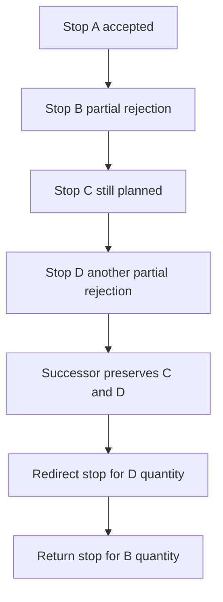

# TMS-RETURN-0.1 multi-stop flow

A rejection at one delivery stop does not cancel the execution, the shipment, or later deliveries.

The authorize command must list every stop that is still `PLANNED` or `ARRIVED` on the active revision.
The server clones those stops into the successor and inserts only the new canonical return or redirect stop.
Completed stops stay on the historical revision. Their rows, timestamps, and membership are not rewritten.
`SERVICE_STARTED` still rejects the whole successor, using the 0.1F lock.
The execution id stays the same.
