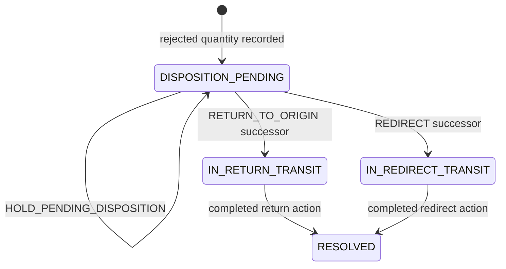

# TMS-RETURN-0.1 disposition state machine

Shipment coarse status is not used.

Hold does not create a revision.
Return and redirect cannot both become active for the same case.
A driver may record the rejection. A driver cannot authorize return or redirect.
Resolution requires a completed introduced action on the successor revision at the authorized canonical location.
