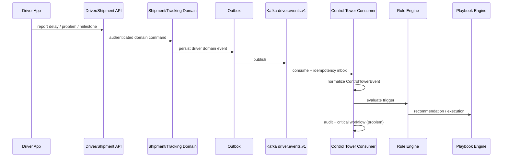

# Control Tower Driver Event Integration v0.8.1

This document describes the event-driven integration between Driver/backend domain actions and Control Tower automation.

## Architecture

## Event topic

- Producer topic: `driver.events.v1` (`SHIPMENT_KAFKA_DRIVER_TOPIC`)
- Consumer topic: `driver.events.v1` (`CONTROL_TOWER_DRIVER_KAFKA_TOPIC`)
- Shipment status events remain on `shipment.status.v1`

## Normalized event

Control Tower normalizes Kafka payloads into `ControlTowerEvent` before rule evaluation. Required fields:

- `event_id`, `event_type`, `tenant_id`, `shipment_id`, `occurred_at`
- Optional: `driver_id`, `severity`, `reason_code`, `reason_text`, `eta`, location fields

## Driver event mapping

| Logical event | Source | Action |
|---|---|---|
| driver.location.updated | tracking-service ingest | stored only; no CT automation by default |
| driver.arrived_at_pickup | driver operational event | outbox + optional CT rules |
| driver.departed_pickup | driver operational event | outbox + optional CT rules |
| driver.arrived_at_delivery | driver operational event | outbox + optional CT rules |
| driver.delivery.completed | driver operational event | outbox + optional CT rules |
| driver.delay.reported | `POST /v1/driver/me/shipments/{id}/delays` | outbox + `driver_delay_reported` trigger |
| driver.problem.reported | driver exception report | outbox + critical workflow + `driver_problem_reported` trigger |
| driver.documents.uploaded | document upload intent (existing) | reuse when present |
| driver.tracking.lost | tracking loss detector | outbox + `tracking_lost` trigger |
| driver.tracking.restored | tracking loss detector | outbox + `driver_tracking_restored` trigger |

## Tracking lost/restored

Server-side detector in `tracking-service`:

- Threshold: `CONTROL_TOWER_DRIVER_TRACKING_LOST_AFTER_MINUTES` (default = stale threshold)
- State table: `tracking.driver_tracking_automation_state`
- Emits one `driver.tracking.lost` per transition to `TRACKING_LOST`
- Emits `driver.tracking.restored` when tracking resumes

## Tenant security

- Tenant derived server-side from authenticated driver context
- CT consumer validates shipment tenant before processing
- Duplicate events deduplicated via `control_tower.driver_event_inbox`

## Configuration

| Variable | Purpose |
|---|---|
| `CONTROL_TOWER_DRIVER_EVENTS_ENABLED` | Enable CT driver Kafka consumer |
| `CONTROL_TOWER_DRIVER_KAFKA_TOPIC` | Driver events topic |
| `CONTROL_TOWER_DRIVER_KAFKA_GROUP_ID` | Consumer group |
| `SHIPMENT_KAFKA_DRIVER_TOPIC` | Outbox publisher driver topic |
| `CONTROL_TOWER_DRIVER_TRACKING_LOST_AFTER_MINUTES` | Tracking loss threshold |
| `TRACKING_LOSS_DETECTOR_ENABLED` | Enable server-side detector |

## Idempotency

- Kafka/event_id uniqueness: `control_tower.driver_event_inbox (tenant_id, event_id)`
- Playbook recommendations reuse existing automation idempotency keys

## ACK compatibility

`driver.problem.reported` seeds `control_tower.critical_event_workflow` using the existing acknowledgement API:

`POST /api/v1/control-tower/critical-events/{eventId}/acknowledge`
