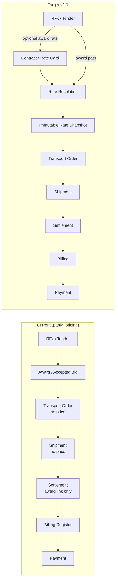
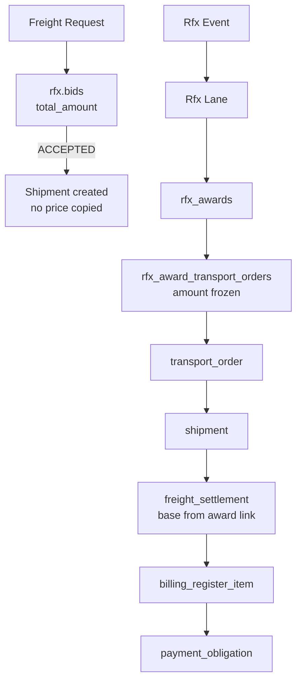
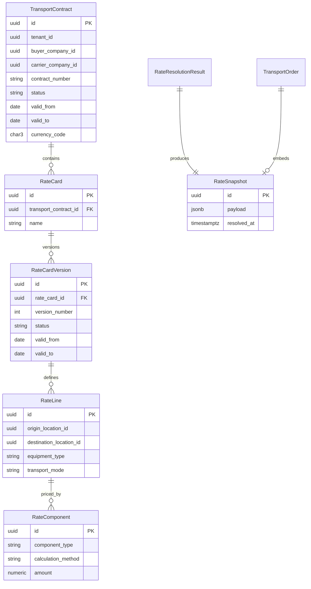
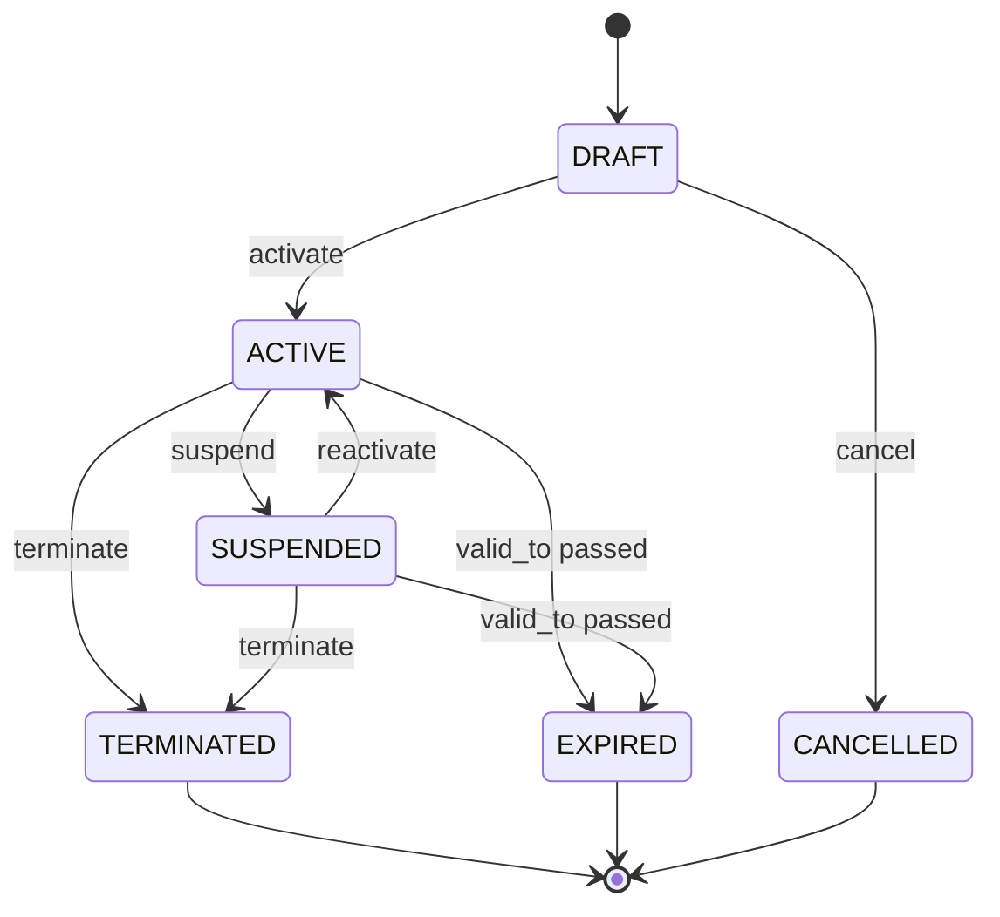
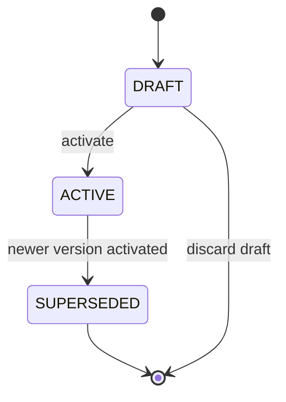
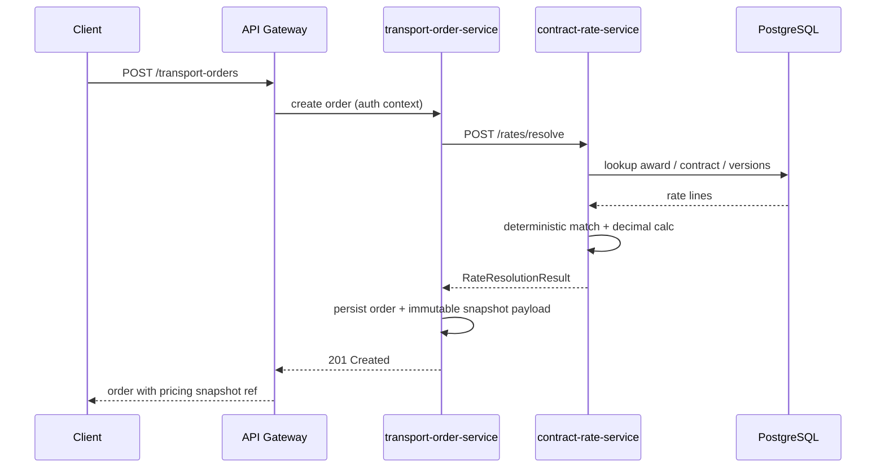

# FREIGHT CONTRACT & RATE MANAGEMENT v2.0 — Architecture & Domain Contract Freeze

**Status:** Architecture freeze (documentation only)  
**Base SHA:** `a4471727239372840707e5ee5ef8aa882c826636` (FREIGHT PAYMENTS WORKSPACE v1.9.3 merge)  
**Branch:** `arch/freight-contract-rate-management-v2.0`  
**Date:** 2026-08-20

---

## 1. Executive Summary

Freight Contract & Rate Management v2.0 introduces the missing **commercial pricing layer** between procurement (RFx) and execution (Transport Order → Shipment → Settlement → Billing → Payment).

Today the platform has **two partial pricing paths** but **no unified contract/rate master data**, and **Transport Orders do not persist agreed price**. Settlement reads base freight exclusively from `rfx.rfx_award_transport_orders` (formal RFx award conversion path). Spot/mini-tender accepted bids carry price on `rfx.bids` but that amount is **not propagated** to transport orders or settlements in the current chain.

This architecture freezes:

- A new **`contract-rate-service`** owning contracts, versioned rate cards, resolution, and audit
- **Deterministic rate resolution** with explicit source precedence (award → contract → manual spot → fail)
- **Immutable rate snapshots** copied into Transport Order context at pricing time
- **Strict boundaries** with Settlement (execution accessorials), Billing, and Payment (downstream only)
- **ROAD-only v2.0 MVP** with exact location UUID lane matching aligned to existing RFx/TO models

**Critical invariants (frozen):**

| Invariant | Value |
|-----------|-------|
| `SNAPSHOT_IMMUTABLE` | YES |
| `HISTORICAL_ORDER_REPRICING` | NO |
| `RATE_VERSION_EDIT_AFTER_ACTIVATION` | NO |
| `CONTRACT_CHANGE_MUTATES_ORDER` | NO |
| `SETTLEMENT_RECALCULATES_FROM_LATEST_RATE` | NO |
| `PAYMENT_RECALCULATES_RATE` | NO |

---

## 2. Current-State Discovery

### 2.1 Repository inspection summary

| Area | Finding | Status |
|------|---------|--------|
| Dedicated contract service | None | **NOT_FOUND** |
| Dedicated rate card service | None | **NOT_FOUND** |
| Contract aggregate in any service | None | **NOT_FOUND** |
| Rate versioning model | None (award link is point-in-time amount only) | **NOT_FOUND** |
| Transport order agreed price | No price/currency columns on `transport.transport_orders` | **NOT_FOUND** |
| Shipment price duplication | No price columns on `transport.shipments` | **NOT_FOUND** |
| RFx bid pricing | `rfx.bids` / `rfx.bid_items` with component breakdown | **FOUND** |
| Formal RFx award → TO link | `rfx.rfx_award_transport_orders` with frozen `amount` | **FOUND** |
| Settlement base freight | From award link via `LoadShipmentContext` | **FOUND** |
| Payment canonical money | `shopspring/decimal`, scale 2 | **FOUND** |
| RFx/billing money | `float64` + `round2()` | **FOUND** (legacy) |
| Canonical locations | `transport.locations` UUID refs | **FOUND** |
| Equipment type on TO/RFx lane | `equipment_type` string field | **FOUND** |
| Temporal versioning elsewhere | Document versions, settlement status — not rates | **PARTIAL** |

### 2.2 System context (current vs target)



---

## 3. Existing Pricing Data Map

Evidence from merged main (`a447172`).

### 3.1 RFx bid price representation

**Path A — Spot / mini-tender (`freight_requests`):**

| Location | Fields | Evidence |
|----------|--------|----------|
| `rfx.bids` | `total_amount`, `base_amount`, `fuel_surcharge_amount`, `currency_code`, `status` | Migration `000004`, domain `services/rfx-service/internal/domain/bid.go` |
| `rfx.bid_items` | Per-item amounts, `lane_id` column (DB only — **not populated in app**) | Migration `000006` |

Domain uses `float64` with `round2()` for bid totals.

**Path B — Formal RFx (`rfx_events` → lots → lanes → responses):**

| Location | Fields | Evidence |
|----------|--------|----------|
| `rfx.rfx_response_lane_bids` | Lane-level bid amounts on formal responses | Migration `000039` area |
| `rfx.rfx_awards` | Award header per lot/lane | `services/rfx-service/internal/domain/rfx_award.go` |
| `rfx.rfx_award_transport_orders` | **`amount`**, `currency_code`, `rfx_lane_id`, `transport_order_id` | Migration `000039_rfx_award_transport_order_v1.4.up.sql` |

### 3.2 Award price representation

| Flow | Storage | Status |
|------|---------|--------|
| Spot accept bid | `rfx.bids.status = ACCEPTED`, amounts on bid row | **FOUND** — not linked to TO price |
| Formal award → TO | `rfx.rfx_award_transport_orders.amount` | **FOUND** — frozen at conversion |

### 3.3 Transport Order price/currency

`transport.transport_orders` columns (migration `000004`, domain `transport_order.go`):

- `origin_location_id`, `destination_location_id`, `equipment_type`, `transport_mode`
- **No `amount`, `currency_code`, or pricing snapshot columns**

**Status: NOT_FOUND**

### 3.4 Shipment price/currency

`transport.shipments` — carrier, status, transport_order_id reference.

**No price columns. Status: NOT_FOUND**

### 3.5 Settlement base freight amount

`billing.freight_settlements.base_freight_amount` populated from:

```go
// services/billing-register-service/internal/repository/freight_settlement_repository.go
SELECT ... amount::float8, currency_code ... FROM rfx.rfx_award_transport_orders
WHERE tenant_id = $1 AND transport_order_id = $2
```

- Requires award link; returns validation error if missing
- Does **not** read bid table or any contract
- Accessorials: `approved_accessorial_total` added at settlement execution time

**Status: FOUND** (award-link path only)

### 3.6 Settlement accessorial amount

`billing.freight_settlement_accessorials` — proposed/approved at execution, amounts entered or calculated from approved quantity × rate **at settlement time** (not from contract master in v1.7).

Contract rate rules for accessorial **unit rates** are **NOT_FOUND** today.

### 3.7 Billing amount source

| Source | Mechanism | Status |
|--------|-----------|--------|
| Manual register item | Client supplies `base_amount` on create | **FOUND** |
| Settlement-derived | `IncludeInRegister` copies settlement totals | **FOUND** |

Billing does **not** perform rate resolution.

### 3.8 Payment obligation amount source

`payment-service` creates obligations from billing register `total_with_vat` (post v1.9.x integration).

Uses `shopspring/decimal` with `MoneyScale = 2`.

Payment does **not** recompute freight rates.

### 3.9 Pricing flow diagram (as-is)



---

## 4. Existing Lane / Location Model

### 4.1 Canonical location

| Concept | Representation | Status |
|---------|----------------|--------|
| Location master | `transport.locations` UUID PK, tenant-scoped | **FOUND** |
| Address embedding | Location record holds address fields | **FOUND** |
| City/region codes as match keys | Not used for TO/RFx lane matching | **NOT_FOUND** |

### 4.2 RFx lane model

`RfxLane` (`services/rfx-service/internal/domain/rfx_lot.go`):

- `origin_location_id` (UUID, required)
- `destination_location_id` (UUID, required)
- `equipment_type` (string)
- Linked to `rfx_lots` / `rfx_events`

Formal award conversion copies lane context into transport order creation.

### 4.3 Transport order location model

`TransportOrder` (`services/transport-order-service/internal/domain/transport_order.go`):

- `OriginLocationID`, `DestinationLocationID` (UUID)
- `EquipmentType` (string)
- `TransportMode` — ROAD enforced for v1 paths

### 4.4 RateLane reuse decision

**Decision:** `RateLine` matching uses **EXACT_LOCATION** precision:

- Match key: `(origin_location_id, destination_location_id, equipment_type, transport_mode=ROAD)`
- Reuses canonical `transport.locations` UUIDs — **no parallel lane entity**
- Future ZONE/CITY/REGION matching documented as extension; not in v2.0 MVP

| Question | Answer |
|----------|--------|
| Q5. Are RFx lanes reusable for contract rates? | **YES** — same location UUID + equipment_type dimensions |
| Q6. Canonical vehicle/equipment type? | **FOUND** — `equipment_type` string on TO and RfxLane (no separate enum service) |

---

## 5. Service Ownership Decision

```
SERVICE_BOUNDARY_DECISION = NEW_STANDALONE_SERVICE
SERVICE_NAME = contract-rate-service
```

### 5.1 Rationale

| Criterion | Assessment |
|-----------|------------|
| Domain cohesion | Contracts, rate cards, versioning, resolution are a distinct bounded context |
| Existing ownership | No service owns this today |
| Change frequency | Rate master data lifecycle differs from RFx events or settlement execution |
| Audit/compliance | Commercial terms require dedicated audit trail |

### 5.2 Alternatives rejected

| Alternative | Why rejected |
|-------------|--------------|
| `rfx-service` | Would turn RFx into generic financial master-data; violates single responsibility |
| `transport-order-service` | TO should consume snapshots, not own rate master data |
| `billing-register-service` | Settlement owns execution closing; billing owns register — not procurement rates |
| `payment-service` | Explicitly forbidden; payment is downstream of agreed amounts |

### 5.3 Service responsibilities

**Owns:**

- `TransportContract` lifecycle
- `RateCard`, `RateCardVersion`, `RateLine`, `RateComponent`
- Rate resolution algorithm (read-only compute)
- Contract/rate audit events
- Optional: resolution audit log (not order snapshot storage — see §14)

**Does NOT own:**

- Transport order persistence (except via API contract for snapshot handoff)
- Settlement accessorial execution
- Billing register or payment obligations

---

## 6. Domain Aggregates



### 6.1 TransportContract

Commercial agreement between buyer (shipper) and carrier.

### 6.2 RateCard

Logical grouping of rates under a contract (e.g. "Standard lanes Q1").

### 6.3 RateCardVersion

Immutable versioned rate table once activated.

### 6.4 RateLine

One lane rate row: origin/destination/equipment/mode + validity inherited from version.

### 6.5 RateComponent

Priced component on a rate line (BASE_FREIGHT, FUEL_SURCHARGE, etc.).

### 6.6 RateSnapshot

Immutable agreed-price payload attached to Transport Order at pricing time.

### 6.7 RateResolutionResult

Transient resolution output; serialized into snapshot.

### 6.8 Optional v2.0 deferrals

`FuelSurchargeRule` (indexed) — future; v2.0 uses PERCENT component only.  
`RateAuditEvent` — **included** in v2.0 MVP.

---

## 7. Transport Contract Lifecycle

### 7.1 Statuses

| Status | Meaning |
|--------|---------|
| `DRAFT` | Editable; not eligible for rate resolution |
| `ACTIVE` | Eligible for resolution within validity window |
| `SUSPENDED` | Temporarily ineligible; reversible |
| `TERMINATED` | Permanently closed by actor |
| `EXPIRED` | System-derived when `valid_to < current_date` |
| `CANCELLED` | Draft abandoned |

### 7.2 State diagram



### 7.3 Transitions and actors

| Transition | Actor | Idempotent |
|------------|-------|------------|
| DRAFT → ACTIVE | BUYER admin or PLATFORM_ADMIN | YES |
| ACTIVE → SUSPENDED | BUYER or PLATFORM_ADMIN | YES |
| SUSPENDED → ACTIVE | BUYER or PLATFORM_ADMIN | YES |
| ACTIVE/SUSPENDED → TERMINATED | BUYER or PLATFORM_ADMIN | YES |
| DRAFT → CANCELLED | BUYER or PLATFORM_ADMIN | YES |
| → EXPIRED | System job or lazy check on read/resolution | N/A |

CARRIER may **VIEW** contracts where they are party; **mutations** are BUYER-side or platform unless explicitly delegated (future).

### 7.4 Edit rules

| State | Editable fields |
|-------|-----------------|
| DRAFT | All mutable fields, rate cards (draft versions only) |
| ACTIVE | `description`, `external_reference` only (non-pricing metadata) |
| SUSPENDED | Same as ACTIVE (metadata only) |
| TERMINATED / EXPIRED / CANCELLED | **None** |

**Immutable after activation:** `buyer_company_id`, `carrier_company_id`, `contract_number`, `valid_from`, `currency_code` (currency policy locked).

New pricing changes require **new rate card version**, never in-place mutation of ACTIVE version rows.

### 7.5 Automatic EXPIRED

- On rate resolution and contract read: if `status = ACTIVE` and `current_date > valid_to`, treat as EXPIRED (persist transition via background job or activation guard)
- EXPIRED is **final** (no reactivation without new contract)

### 7.6 TERMINATED

- **Final** — no transition out
- Existing snapshots and historical orders unaffected

---

## 8. Rate Card Versioning

### 8.1 Model

```
RateCard
  └── Version 1 (SUPERSEDED)
  └── Version 2 (ACTIVE)
  └── Version 3 (DRAFT)
```

### 8.2 Version fields

| Field | Required | Notes |
|-------|----------|-------|
| `id` | YES | UUID |
| `rate_card_id` | YES | FK |
| `version_number` | YES | Monotonic per card, starts at 1 |
| `valid_from` | YES | Inclusive pricing date lower bound |
| `valid_to` | NO | NULL = open-ended |
| `status` | YES | DRAFT, ACTIVE, SUPERSEDED |
| `supersedes_version_id` | NO | Previous ACTIVE version |
| `created_at` | YES | |
| `activated_at` | NO | Set on activation |
| `created_by` | YES | |

### 8.3 Version lifecycle



### 8.4 Rules

1. **No in-place edit** of ACTIVE version lines or components
2. Old versions remain **readable** for audit and historical snapshot explanation
3. **At most one ACTIVE version** per rate card for any given `pricing_date` (see §25)
4. Activation of version N **supersedes** prior ACTIVE version on same card (sets `SUPERSEDED`, may set previous `valid_to`)
5. Overlapping ACTIVE versions **across different rate cards** on same contract allowed if lanes differ; same lane scope overlap → **FAIL activation**

---

## 9. Lane Matching Model

### 9.1 v2.0 matching dimensions

| Dimension | Required | Source |
|-----------|----------|--------|
| `tenant_id` | YES | Auth context |
| `buyer_company_id` | YES | Request |
| `carrier_company_id` | YES | Request |
| `origin_location_id` | YES | TO / resolve request |
| `destination_location_id` | YES | TO / resolve request |
| `equipment_type` | YES | Normalized string match |
| `transport_mode` | YES | `ROAD` only v2.0 |
| `pricing_date` | YES | Usually TO `planned_pickup_date` or explicit |
| `currency_code` | CONDITIONAL | Must match contract currency when contract-sourced |

### 9.2 Precision

**v2.0: EXACT_LOCATION** — UUID pair equality on canonical `transport.locations`.

Future (out of MVP): CITY, REGION, ZONE hierarchy with specificity scoring.

### 9.3 Ambiguity

If two ACTIVE rate lines match with **equal specificity** (same dimensions), resolution returns **`RATE_AMBIGUOUS`** — fail closed.

Deterministic tie-break **not** used unless explicit priority field added (deferred).

---

## 10. Rate Components

### 10.1 v2.0 component set

| Component | Contract pre-order | Settlement execution | v2.0 MVP |
|-----------|-------------------|---------------------|----------|
| `BASE_FREIGHT` | YES | Snapshot only | **YES** |
| `FUEL_SURCHARGE` | YES (PERCENT) | Snapshot only | **YES** |
| `WAITING` / `DETENTION` | Unit rate rule | Approved qty × rate | **RULE ONLY** |
| `EXTRA_STOP` | Unit rate rule | Approved at settlement | **DEFER** |
| `LOADING` | Unit rate rule | Approved at settlement | **DEFER** |
| `UNLOADING` | Unit rate rule | Approved at settlement | **DEFER** |
| `OTHER_ACCESSORIAL` | Generic rule slot | Settlement-owned | **DEFER** |

### 10.2 Accessorial boundary

```
CONTRACT/RATE SERVICE owns:  unit rate rule (e.g. 2,500 RUB/hour waiting)
SETTLEMENT SERVICE owns:     approved quantity, execution charge calculation
```

Settlement **must not** read live contract tables for historical closing — it consumes **snapshot values** or **settlement-time approved accessorial lines**.

Example:

- Contract: `WAITING = 2,500 RUB/hour` (stored in snapshot as contracted unit rate)
- Execution: 3 approved hours
- Settlement: `7,500 RUB` payable — calculated at settlement, not stored in contract service

---

## 11. Money / Precision Rules

### 11.1 Current platform state

| Layer | Representation | Status |
|-------|----------------|--------|
| PostgreSQL | `NUMERIC(18,2)` amounts, `CHAR(3)` currency | **FOUND** |
| payment-service | `shopspring/decimal`, `MoneyScale=2` | **FOUND** |
| rfx-service | `float64` + `round2()` | **FOUND** (legacy) |
| billing-register-service | `float64` + `round2()` | **FOUND** (legacy) |
| OpenAPI schemas | `number` / `double` | **FOUND** |
| shared-go money package | None | **NOT_FOUND** |

### 11.2 v2.0 canonical rules (frozen)

| Rule | Value |
|------|-------|
| Canonical decimal precision | **2** scale (align with `payment-service` MoneyScale) |
| DB type | `NUMERIC(18,2)` |
| Go canonical type | `shopspring/decimal` in contract-rate-service |
| `float64` for canonical money | **FORBIDDEN** |
| JS float as source of truth | **FORBIDDEN** |
| Currency code | ISO 4217, 3 chars, validated centrally |
| Rounding | Half-up to 2 decimals at component total and grand total boundaries |
| Calculation ownership | Server-side only in contract-rate-service |

### 11.3 Currency validation

Reuse pattern from `payment-service/internal/domain/money.go` and billing `NormalizeCurrencyCode`.

Central validation function in contract-rate-service; future extraction to `packages/shared-go` optional.

### 11.4 Discovery answers

| Q | Answer |
|---|--------|
| Q7. Money precision today? | DB 2dp; payment decimal scale 2; RFx/billing float64 legacy |
| Q8. Currencies validated centrally? | **PARTIAL** — payment strict; billing normalize; no single shared package |

---

## 12. Rate Resolution Algorithm

### 12.1 When resolution runs

**Single rule:** Rate resolution executes at **Transport Order CREATE** (including award-generated orders).

- Idempotent: retried CREATE with same idempotency key must not duplicate snapshot
- SUBMIT transition does **not** re-resolve unless explicit manual re-price command added (out of MVP)

### 12.2 Pricing source precedence

```
1. EXPLICIT_AWARD_PRICE     — formal rfx_award_transport_orders OR linked accepted bid
2. CONTRACT_RATE            — eligible ACTIVE contract + ACTIVE rate version
3. MANUAL_SPOT              — authorized explicit spot price (requires permission)
4. RATE_NOT_FOUND           — fail closed, no silent fallback
```

Precedence validated against current flow: formal award path already carries amount; spot bid path needs snapshot bridge in v2.0C.

### 12.3 Pseudocode

```
function ResolveRate(ctx, request):
  validate tenant from auth context (never trust client tenant header alone)
  validate buyer_company_id, carrier_company_id membership

  if request.explicit_award_link_id:
    award = loadAwardLink(tenant, award_link_id)
    if not award: return NOT_FOUND
    return buildResultFromAward(award)

  if request.explicit_bid_id:
    bid = loadAcceptedBid(tenant, bid_id)
    if bid.status != ACCEPTED: return VALIDATION_ERROR
    return buildResultFromBid(bid)

  if request.manual_spot_amount authorized:
    validate actor has OVERRIDE_SPOT_PRICE permission
    return buildResultFromManual(request)

  contracts = findActiveContracts(tenant, buyer, carrier, pricing_date)
  candidates = []
  for contract in contracts:
    for card in contract.rate_cards:
      version = findActiveVersion(card, pricing_date)
      if not version: continue
      lines = matchRateLines(version, origin, dest, equipment, ROAD)
      candidates.addAll(lines with contract+card+version context)

  if len(candidates) == 0:
    return RATE_NOT_FOUND

  if len(candidates) > 1 AND sameSpecificity(candidates):
    return RATE_AMBIGUOUS

  line = deterministicSelect(candidates)  // UUID order tie-break ONLY if specificity differs

  components = calculateComponents(line)  // decimal arithmetic
  return RateResolutionResult(MATCHED, components, totals, metadata)
```

**Deterministic select:** Prefer highest specificity (future zones); v2.0 all equal → AMBIGUOUS, not row-order wins.

### 12.4 Sequence diagram



---

## 13. Pricing Source Precedence

| Priority | Source type | `source_id` | Notes |
|----------|-------------|-------------|-------|
| 1 | `RFQ_AWARD` | `rfx_award_transport_orders.id` | Formal RFx conversion |
| 1b | `SPOT_BID` | `rfx.bids.id` | Accepted mini-tender bid |
| 2 | `CONTRACT_RATE` | `rate_line.id` + version/card/contract IDs | Active contract path |
| 3 | `MANUAL_SPOT` | override audit id | Requires permission |
| — | `RATE_NOT_FOUND` | — | Create order fails or draft-without-price policy (see §16) |

**Award always wins** when explicitly linked on order create.

---

## 14. Immutable Rate Snapshot

### 14.1 Storage decision

```
SNAPSHOT_OWNER = transport-order-service (physical storage)
SNAPSHOT_AUTHORITY = contract-rate-service (resolution logic)
STORAGE_DECISION = HYBRID_C — values copied into TO, not reference-only
```

| Option | Assessment |
|--------|------------|
| A. TO DB only | **Selected** — TO independently auditable |
| B. contract-rate DB only | Rejected — TO would depend on external service for historical reads |
| C. Hybrid copy | **Selected** — CR resolves; TO stores full JSON payload + hash |

### 14.2 Table (transport-order schema)

Proposed: `transport.transport_order_rate_snapshots`

- `id`, `tenant_id`, `transport_order_id` (unique)
- `pricing_source`, `source_ids` (jsonb)
- `contract_number`, `rate_version_number` (denormalized labels)
- `origin_location_id`, `destination_location_id`, `equipment_type`
- `currency_code`
- `components` (jsonb array with type, method, unit, amount)
- `base_amount`, `total_amount` NUMERIC(18,2)
- `resolved_at`, `pricing_date`
- `resolution_request_hash` (idempotency)
- **No UPDATE path** — insert-only repository API

### 14.3 Snapshot fields (minimum)

- `pricing_source` (enum)
- `award_link_id` / `bid_id` / `contract_id` / `rate_card_id` / `rate_version_id` / `rate_line_id` (nullable set)
- `contract_number`, `rate_card_name`, `version_number`
- Lane match: origin/dest IDs + display labels optional
- `equipment_type`, `transport_mode`
- `currency_code`
- Per-component: `type`, `calculation_method`, `rate_value`, `calculated_amount`
- `base_amount`, `total_amount`
- `resolved_at`, `pricing_date`, `resolved_by_service` = contract-rate-service vX

### 14.4 Invariants

| Rule | Value |
|------|-------|
| SNAPSHOT_IMMUTABLE | YES |
| HISTORICAL_ORDER_REPRICING | NO |
| CONTRACT_CHANGE_MUTATES_ORDER | NO |

### 14.5 Discovery answers

| Q | Answer |
|---|--------|
| Q10. Which service owns snapshot creation? | **contract-rate-service** resolves; **transport-order-service** persists |
| Q11. Physical DB location? | **transport-order-service DB** (transport schema) |

---

## 15. RFx / Award Integration

### 15.1 Formal RFx path (existing)

Award conversion creates `rfx_award_transport_orders` with frozen `amount` before/during TO create.

**v2.0 behavior:**

- Resolution precedence 1 uses award link amount
- Snapshot **copies award values** into TO payload (not only FK reference)
- Contract metadata may attach for analytics if award issued under contract (optional `contract_id` on award — future)

### 15.2 Spot bid path (gap today)

Accepted bid has price on `rfx.bids` but shipment/TO path lacks price propagation.

**v2.0C integration:**

- TO create from bid passes `bid_id`
- Resolver builds snapshot from bid component breakdown
- Settlement updated to read base freight from **TO snapshot** (not only award link)

### 15.3 Semantics preserved

- Award amount at conversion time remains immutable in `rfx_award_transport_orders`
- Snapshot duplicates for TO audit — does not mutate award row

---

## 16. Transport Order Integration

### 16.1 Create flow

1. Client/gateway calls TO create with commercial context (`award_link_id`, `bid_id`, or lane + companies for contract lookup, or `manual_spot` with auth)
2. TO calls `contract-rate-service` `/rates/resolve`
3. On `MATCHED`: persist order + snapshot in single TX
4. On `RATE_NOT_FOUND`: reject create (default) — alternative `DRAFT_WITHOUT_PRICE` out of MVP
5. On `AMBIGUOUS`: reject with explicit error

### 16.2 Idempotency

- Same `Idempotency-Key` on TO create returns existing order with same snapshot
- Snapshot insert tied to order id — unique constraint prevents duplicate pricing

### 16.3 Contract suspended between draft and submit

- Resolution at CREATE uses contract status at that moment
- If contract suspends after order created: **no repricing** — snapshot frozen

### 16.4 Pricing date

Default: `planned_pickup_date` on TO, else `current_date` (tenant TZ policy TBD in implementation).

---

## 17. Shipment Boundary

Shipment **does not** own contract master data or live rates.

Shipment reads pricing context via:

```
shipment.transport_order_id → transport_order_rate_snapshot
```

No duplicate price columns on `transport.shipments` in v2.0.

---

## 18. Settlement Boundary

### 18.1 Formula (unchanged conceptually)

```
agreed base freight (from TO snapshot)
+ approved execution accessorials
± approved adjustments
= settlement amount
```

### 18.2 v2.0C change

`LoadShipmentContext` must evolve:

```
Current:  rfx_award_transport_orders.amount only
Target:   transport_order_rate_snapshots.total_amount (base)
          with award link as provenance fallback during migration
```

### 18.3 Settlement consumes

| Field | Source |
|-------|--------|
| `base_freight_amount` | TO rate snapshot `total_amount` (or base component sum per policy) |
| `currency_code` | Snapshot |
| `buyer_company_id`, `carrier_company_id` | Snapshot / order |
| Accessorial unit rates | Snapshot contracted rates (optional v2.0C+) |
| Approved accessorial qty | Settlement execution |

| Q | Answer |
|---|--------|
| Q12. Exact data Settlement consumes? | Base + currency from snapshot; accessorials at execution |

---

## 19. Billing / Payment Boundary

| Service | Role | Rate resolution |
|---------|------|-----------------|
| Billing register | Invoice/register items from settlement or manual | **NO** |
| Payment | Obligations from register totals | **NO** |

**Never:** Payment → recompute Rate

Direction frozen:

```
Rate → Order snapshot → Settlement → Billing → Payment Obligation → Payment
```

---

## 20. Tenant / Company Isolation

### 20.1 Tenant scope

All contract/rate tables include `tenant_id`. Queries always filter by verified auth tenant.

### 20.2 Company model (existing)

Companies table + memberships (existing platform model). Contract parties:

- `buyer_company_id` — SHIPPER / BUYER
- `carrier_company_id` — CARRIER

Forwarder: **PARTIAL** in platform — v2.0 contracts are buyer-carrier dyad; forwarder as buyer proxy uses buyer_company_id.

**No separate company master** — use existing company UUIDs.

### 20.3 Security rules

| Rule | Value |
|------|-------|
| Tenant from verified auth | YES |
| Company context revalidated | YES |
| Client identity headers trusted | **NO** |
| Cross-tenant reads | DENY |
| Cross-company rate leakage | DENY — carrier sees only contracts where `carrier_company_id = actor.company` |
| IDOR | Prevent by tenant + company party checks on every read/mutation |

Gateway pattern: same as paymentGuard — `company_id` query param revalidated against membership.

---

## 21. RBAC

### 21.1 v1 permissions

| Permission | BUYER admin | CARRIER | PLATFORM_ADMIN |
|------------|-------------|---------|----------------|
| VIEW_CONTRACTS | own buyer contracts | party contracts | all tenant |
| CREATE_CONTRACT | YES | NO | YES |
| EDIT_DRAFT_CONTRACT | YES | NO | YES |
| ACTIVATE_CONTRACT | YES | NO | YES |
| SUSPEND_CONTRACT | YES | NO | YES |
| TERMINATE_CONTRACT | YES | NO | YES |
| VIEW_RATES | YES | YES (party) | YES |
| EDIT_DRAFT_RATES | YES | NO | YES |
| ACTIVATE_RATE_VERSION | YES | NO | YES |
| RESOLVE_RATE | internal S2S | internal | internal |
| OVERRIDE_SPOT_PRICE | policy-based | NO | YES |

Map to existing platform roles where present; extend auth service permission registry in v2.0A.

---

## 22. Audit

### 22.1 Required events

| Event | Trigger |
|-------|---------|
| `CONTRACT_CREATED` | POST contract |
| `CONTRACT_ACTIVATED` | activate transition |
| `CONTRACT_SUSPENDED` | suspend |
| `CONTRACT_TERMINATED` | terminate |
| `CONTRACT_EXPIRED` | system |
| `RATE_VERSION_CREATED` | POST version |
| `RATE_VERSION_ACTIVATED` | activate version |
| `RATE_VERSION_SUPERSEDED` | supersession |
| `RATE_RESOLVED` | each resolution (correlation id) |
| `MANUAL_SPOT_PRICE_RECORDED` | override used |

Actor: `user_id`, `company_id` from verified context.

Storage: `contract_rate.audit_event` append-only.

Rate resolution: **audit-only** in v2.0 — not Kafka event (see §23).

---

## 23. Outbox / Events

```
OUTBOX_REQUIRED_V2_0 = NO
```

Future optional events (consumers identified):

| Event | Consumer | v2.0 |
|-------|----------|------|
| `contract.activated` | Analytics, cache invalidation | DEFER |
| `contract.suspended` | Resolution eligibility cache | DEFER |
| `rate.version.activated` | Notification | DEFER |
| `rate.resolved` | None required | **NO** — audit log sufficient |

No event spam in v2.0 MVP.

---

## 24. Proposed REST API

Base path via gateway: `/api/v1/`

### 24.1 Contract endpoints

| Method | Path | Purpose |
|--------|------|---------|
| POST | `/transport-contracts` | Create draft |
| GET | `/transport-contracts` | List (tenant + company filter) |
| GET | `/transport-contracts/{id}` | Detail |
| PATCH | `/transport-contracts/{id}` | Update draft/metadata |
| POST | `/transport-contracts/{id}/activate` | Activate |
| POST | `/transport-contracts/{id}/suspend` | Suspend |
| POST | `/transport-contracts/{id}/terminate` | Terminate |
| POST | `/transport-contracts/{id}/cancel` | Cancel draft |

### 24.2 Rate endpoints

| Method | Path | Purpose |
|--------|------|---------|
| POST | `/transport-contracts/{id}/rate-cards` | Create rate card |
| GET | `/transport-contracts/{id}/rate-cards` | List cards |
| GET | `/rate-cards/{id}` | Card detail |
| POST | `/rate-cards/{id}/versions` | Create draft version + lines |
| GET | `/rate-cards/{id}/versions` | List versions |
| GET | `/rate-card-versions/{id}` | Version detail with lines |
| POST | `/rate-card-versions/{id}/activate` | Activate version |

### 24.3 Resolve endpoint

| Method | Path | Purpose |
|--------|------|---------|
| POST | `/rates/resolve` | Server-side resolution (S2S + gateway) |

**Request:** `buyer_company_id`, `carrier_company_id`, `origin_location_id`, `destination_location_id`, `equipment_type`, `transport_mode`, `pricing_date`, optional award/bid/manual fields.

**Response:**

```json
{
  "status": "MATCHED | NO_MATCH | AMBIGUOUS",
  "result": { /* RateResolutionResult */ }
}
```

### 24.4 API versioning

OpenAPI per-service spec `contract-rate-service.yaml` merged in future slice — **no changes in this architecture PR**.

---

## 25. Proposed Database Model

### 25.1 Schema

```
SCHEMA_NAME = contract_rate
```

### 25.2 Tables

| Table | Purpose |
|-------|---------|
| `contract_rate.transport_contract` | Contract aggregate root |
| `contract_rate.rate_card` | Rate card |
| `contract_rate.rate_card_version` | Versioned rate table |
| `contract_rate.rate_line` | Lane match row |
| `contract_rate.rate_component` | Component amounts |
| `contract_rate.audit_event` | Append-only audit |

**Transport order side (transport schema):**

| Table | Purpose |
|-------|---------|
| `transport.transport_order_rate_snapshots` | Immutable snapshot |

### 25.3 Key columns (transport_contract)

| Column | Required |
|--------|----------|
| id, tenant_id | YES |
| buyer_company_id, carrier_company_id | YES |
| contract_number | YES |
| external_reference | NO |
| name | YES |
| description | NO |
| status | YES |
| valid_from, valid_to | from required; to optional |
| currency_code | YES |
| created_at/by, updated_at/by | YES |
| activated_at/by | on activation |
| terminated_at/by | on terminate |

### 25.4 Constraints

| Constraint | Enforcement |
|------------|-------------|
| Unique contract number | `UNIQUE (tenant_id, buyer_company_id, contract_number)` |
| Version uniqueness | `UNIQUE (rate_card_id, version_number)` |
| valid_to >= valid_from | CHECK |
| Non-negative amounts | CHECK on component amounts |
| Currency format | CHECK length = 3 |
| ACTIVE version lines immutable | Service-layer + no UPDATE API |
| One ACTIVE version per card per date | Service transaction + partial unique index on `(rate_card_id)` WHERE status='ACTIVE' — activation checks overlap |
| Tenant-safe FKs | All FKs include tenant_id match in service checks |

### 25.5 Temporal overlap policy

**FAIL activation** if two ACTIVE versions of the same rate card have overlapping `[valid_from, valid_to]`.

Cross-card lane overlap on same contract: activation must detect duplicate `(origin, dest, equipment, mode)` across ACTIVE versions → **FAIL**.

PostgreSQL: CHECK for dates; overlap detection in serializable transaction (same pattern as settlement idempotency).

### 25.6 Concurrency

- Version activation: `SELECT FOR UPDATE` on rate_card row
- Contract terminate during resolution: resolution snapshot uses point-in-time read; terminated after read does not affect in-flight TX that already validated ACTIVE
- Duplicate activate: idempotent return current state

---

## 26. Concurrency / Idempotency

| Command | Idempotent |
|---------|------------|
| activate contract | YES |
| suspend contract | YES |
| terminate contract | YES |
| activate rate version | YES |
| rate resolution | Pure function (read-only) |
| snapshot creation | YES via order idempotency key + unique (transport_order_id) |

---

## 27. OpenAPI Strategy

1. Add `scripts/openapi` profile for `contract-rate-service` (future v2.0A)
2. Generate `packages/openapi/contract-rate-service.yaml`
3. Merge into `packages/openapi/openapi.yaml` via existing generator
4. **Preserve payment schema isolation** from FINDING_005/006/007 — separate profile namespace
5. Gateway routes added in dedicated slice after service exists

**This architecture PR:** no OpenAPI file changes.

---

## 28. Frontend Workspace Proposal

App: `apps/web-procurement`

| Route | Purpose |
|-------|---------|
| `/contracts` | Contract list, filters by status/carrier |
| `/contracts/{id}` | Detail, lifecycle actions |
| `/contracts/{id}/rates` | Rate cards, version history, lane table |
| `/contracts/{id}/rates/simulate` | Resolve preview (read-only) |

UX: separate view vs mutate permissions; activation confirmations; version diff read-only.

**FRONTEND_IMPLEMENTED = NO**

---

## 29. Implementation Slices

### v2.0A — Contract & Rate Backend Core

| Item | Detail |
|------|--------|
| Scope | contract-rate-service scaffold, contract CRUD/lifecycle, rate card + draft versions, audit |
| Dependencies | Auth, company service, location read API |
| Migrations | `contract_rate.*` tables |
| Services | New contract-rate-service, gateway stubs |
| API | Contract + rate card endpoints |
| Tests | Unit + integration PG |
| Gate | Contract lifecycle + draft version CRUD green |

### v2.0B — Rate Resolution + Immutable Snapshot

| Item | Detail |
|------|--------|
| Scope | Rate line/components, activation overlap rules, `/rates/resolve`, decimal money |
| Dependencies | v2.0A, transport.locations |
| Migrations | rate_line, rate_component, indexes |
| Services | contract-rate-service |
| API | resolve + activate version |
| Tests | Resolution determinism, ambiguous/overlap failures |
| Gate | Resolve returns MATCHED/NO_MATCH/AMBIGUOUS correctly |

### v2.0C — Transport Order / Settlement Integration

| Item | Detail |
|------|--------|
| Scope | TO snapshot persistence, create-time resolution, settlement reads snapshot |
| Dependencies | v2.0B, transport-order-service, billing-register-service |
| Migrations | transport_order_rate_snapshots; settlement loader change |
| Services | transport-order, billing-register, contract-rate |
| API | TO create extended; internal S2S resolve |
| Tests | E2E award, contract, bid paths |
| Gate | Historical order unchanged after contract change |

### v2.0D — Contract & Rate Workspace UI

| Item | Detail |
|------|--------|
| Scope | web-procurement contract/rate screens |
| Dependencies | v2.0B APIs |
| Gate | Buyer can activate contract and rate version |

### v2.0E — Hardening / E2E / Final Merge

| Item | Detail |
|------|--------|
| Scope | OpenAPI merge, gateway routes, RBAC wiring, load tests, docs |
| Gate | Full chain RFx/Contract → TO → Settlement → Billing → Payment |

---

## 30. Out of Scope

- RAIL, SEA, AIR, MULTIMODAL
- AI rate optimization, dynamic market pricing
- External fuel index integration
- Banking / payments changes
- Automatic reconciliation, ERP/1C
- Capacity management, slot booking, claims, CO2, route optimization
- Distance engine / PER_KM (unless explicitly added later)
- Complex zone matching

---

## 31. Risks / Open Questions

### 31.1 Critical open questions

**None blocking architecture freeze.** All Q1–Q14 answered in discovery sections.

### 31.2 Non-blocking questions

| Topic | Notes |
|-------|-------|
| Shared money package | Extract decimal helpers to shared-go during v2.0A? |
| DRAFT order without price | Product policy for manual orders — default reject |
| Equipment type enum | Normalize free-text vs catalog — follow TO validation |
| VAT on snapshot | Settlement keeps VAT; snapshot stores freight ex-VAT |
| Spot bid → settlement without TO | v2.0C aligns bid path through TO snapshot |

---

## 32. Architecture Decision Summary

| ADR | Decision |
|-----|----------|
| ADR-001 | New `contract-rate-service` owns contract/rate master data |
| ADR-002 | Exact location UUID lane matching for v2.0 |
| ADR-003 | Rate card versioning with immutable ACTIVE rows |
| ADR-004 | Snapshot stored in transport-order DB as value copy |
| ADR-005 | Award price precedence over contract rate |
| ADR-006 | `shopspring/decimal` + NUMERIC(18,2) for contract-rate money |
| ADR-007 | Fuel surcharge v2.0 = fixed PERCENT component only |
| ADR-008 | Settlement owns execution accessorials; contract owns unit rules |
| ADR-009 | Fail closed on AMBIGUOUS and RATE_NOT_FOUND |
| ADR-010 | No Kafka outbox in v2.0 MVP |

---

## Appendix A — Discovery Questions (Q1–Q14)

| # | Question | Answer |
|---|----------|--------|
| Q1 | Where does awarded freight price live today? | Formal: `rfx.rfx_award_transport_orders.amount`. Spot: `rfx.bids.total_amount` (ACCEPTED) |
| Q2 | Does Transport Order persist agreed price? | **NO** |
| Q3 | Does Shipment duplicate price? | **NO** |
| Q4 | Where does Settlement obtain base freight? | `rfx_award_transport_orders` via `LoadShipmentContext` |
| Q5 | Are RFx lanes reusable for contract rates? | **YES** — same location UUID + equipment_type |
| Q6 | Existing canonical equipment type? | **PARTIAL** — string field, no enum service |
| Q7 | Money precision? | DB 2dp; payment decimal; RFx/billing float64 legacy |
| Q8 | Currencies validated centrally? | **PARTIAL** |
| Q9 | Temporal versioning elsewhere? | **PARTIAL** — documents/settlements, not rates |
| Q10 | Which service owns snapshot creation? | CR resolves; TO persists |
| Q11 | Snapshot physical DB? | transport-order schema |
| Q12 | Settlement consumes? | Base + currency from snapshot (post v2.0C) |
| Q13 | Company roles for contracts? | BUYER manages; CARRIER views party contracts |
| Q14 | v2.0 calculation methods needed? | FLAT (base), PERCENT (fuel) — PER_HOUR for waiting rules optional |

---

## Appendix B — Supported v2.0 Calculation Methods

| Method | Use | Input source |
|--------|-----|--------------|
| FLAT | BASE_FREIGHT | Fixed lane price |
| PERCENT | FUEL_SURCHARGE | % of base component |
| PER_HOUR | WAITING (rule only) | Contracted unit rate; qty at settlement |

**Deferred:** PER_KM, PER_TON, PER_STOP

---

*End of architecture document.*
