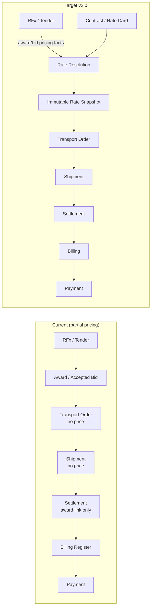
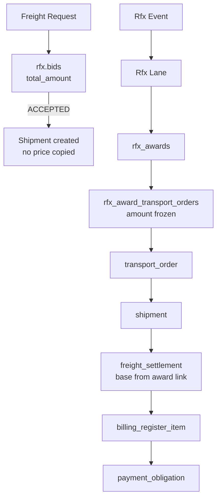
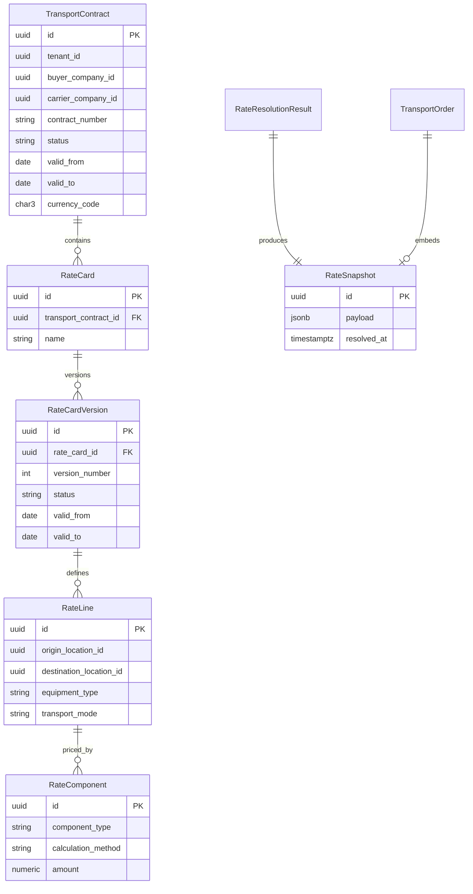
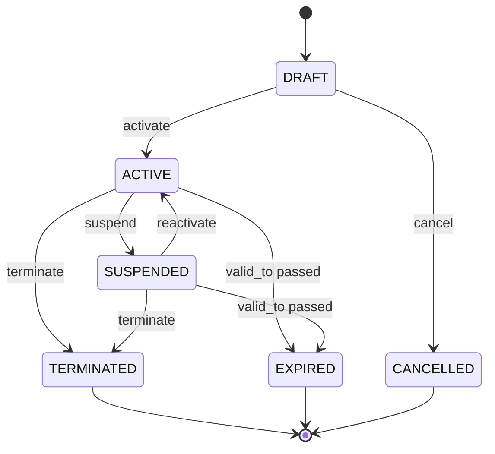
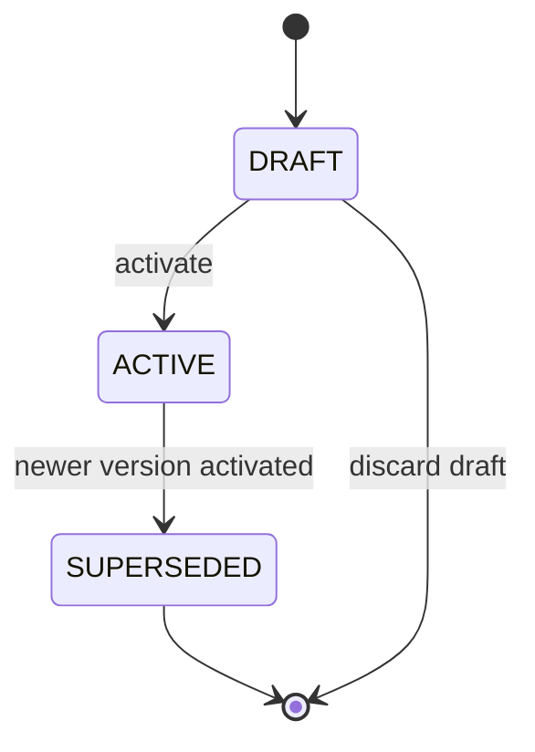
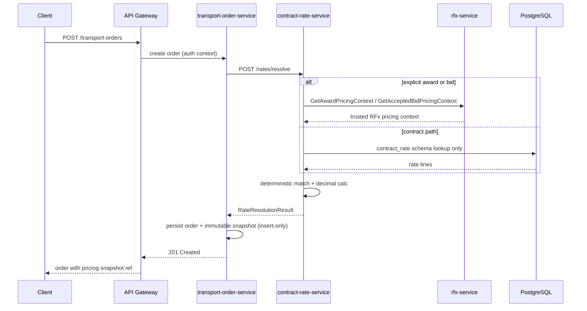

# FREIGHT CONTRACT & RATE MANAGEMENT v2.0 — Architecture & Domain Contract Freeze

**Status:** Architecture freeze (documentation only)  
**Base SHA:** `a4471727239372840707e5ee5ef8aa882c826636` (FREIGHT PAYMENTS WORKSPACE v1.9.3 merge)  
**Branch:** `arch/freight-contract-rate-management-v2.0`  
**Date:** 2026-08-20

---

## 1. Executive Summary

Freight Contract & Rate Management v2.0 introduces the missing **commercial pricing layer** between procurement (RFx) and execution (Transport Order → Shipment → Settlement → Billing → Payment).

Today the platform has **two partial pricing paths** but **no unified contract/rate master data**, and **Transport Orders do not persist agreed price**. Settlement reads base freight exclusively from `rfx.rfx_award_transport_orders` (formal RFx award conversion path). Spot/mini-tender accepted bids carry price on `rfx.bids` but that amount is **not propagated** to transport orders or settlements in the current chain.

This architecture freezes:

- A new **`contract-rate-service`** owning contracts, versioned rate cards, resolution, and audit
- **Deterministic rate resolution** with explicit source precedence (award → contract → manual spot → fail)
- **Immutable rate snapshots** copied into Transport Order context at pricing time
- **Strict boundaries** with Settlement (execution accessorials), Billing, and Payment (downstream only)
- **ROAD-only v2.0 MVP** with exact location UUID lane matching aligned to existing RFx/TO models

**Critical invariants (frozen):**

| Invariant | Value |
|-----------|-------|
| `SNAPSHOT_IMMUTABLE` | YES |
| `HISTORICAL_ORDER_REPRICING` | NO |
| `RATE_VERSION_EDIT_AFTER_ACTIVATION` | NO |
| `CONTRACT_CHANGE_MUTATES_ORDER` | NO |
| `SETTLEMENT_RECALCULATES_FROM_LATEST_RATE` | NO |
| `PAYMENT_RECALCULATES_RATE` | NO |
| `SETTLEMENT_FUEL_DOUBLE_COUNT` | NO — `base_freight_amount` = `snapshot.total_amount` |
| `CONTRACT_RATE_DIRECT_RFX_DB_READS` | NO |
| `INFER_BASE_FROM_TOTAL` | NO |
| `MANUFACTURE_COMPONENT_SPLIT` | NO |
| `AGGREGATE_ONLY_BASE_AMOUNT` | NULL — never inferred from total |

---

## 2. Current-State Discovery

### 2.1 Repository inspection summary

| Area | Finding | Status |
|------|---------|--------|
| Dedicated contract service | None | **NOT_FOUND** |
| Dedicated rate card service | None | **NOT_FOUND** |
| Contract aggregate in any service | None | **NOT_FOUND** |
| Rate versioning model | None (award link is point-in-time amount only) | **NOT_FOUND** |
| Transport order agreed price | No price/currency columns on `transport.transport_orders` | **NOT_FOUND** |
| Shipment price duplication | No price columns on `transport.shipments` | **NOT_FOUND** |
| RFx bid pricing | `rfx.bids` / `rfx.bid_items` with component breakdown | **FOUND** |
| Formal RFx award → TO link | `rfx.rfx_award_transport_orders` with frozen `amount` | **FOUND** |
| Settlement base freight | From award link via `LoadShipmentContext` | **FOUND** |
| Payment canonical money | `shopspring/decimal`, scale 2 | **FOUND** |
| RFx/billing money | `float64` + `round2()` | **FOUND** (legacy) |
| Canonical locations | `transport.locations` UUID refs | **FOUND** |
| Equipment type on TO/RFx lane | `equipment_type` string field | **FOUND** |
| Temporal versioning elsewhere | Document versions, settlement status — not rates | **PARTIAL** |
| Generic Transport Order idempotency | No `Idempotency-Key` on TO create in transport-order-service | **NOT_FOUND** |
| Award → TO conversion retry safety | Existing link returned per lot/event scope in rfx award conversion | **PARTIAL** |

### 2.2 System context (current vs target)



---

## 3. Existing Pricing Data Map

Evidence from merged main (`a447172`).

### 3.1 RFx bid price representation

**Path A — Spot / mini-tender (`freight_requests`):**

| Location | Fields | Evidence |
|----------|--------|----------|
| `rfx.bids` | `total_amount`, `base_amount`, `fuel_surcharge_amount`, `currency_code`, `status` | Migration `000004`, domain `services/rfx-service/internal/domain/bid.go` |
| `rfx.bid_items` | Per-item amounts, `lane_id` column (DB only — **not populated in app**) | Migration `000006` |

Domain uses `float64` with `round2()` for bid totals.

**Path B — Formal RFx (`rfx_events` → lots → lanes → responses):**

| Location | Fields | Evidence |
|----------|--------|----------|
| `rfx.rfx_response_lane_bids` | Lane-level bid amounts on formal responses | Migration `000039` area |
| `rfx.rfx_awards` | Award header per lot/lane | `services/rfx-service/internal/domain/rfx_award.go` |
| `rfx.rfx_award_transport_orders` | **`amount`**, `currency_code`, `rfx_lane_id`, `transport_order_id` | Migration `000039_rfx_award_transport_order_v1.4.up.sql` |

### 3.2 Award price representation

| Flow | Storage | Status |
|------|---------|--------|
| Spot accept bid | `rfx.bids.status = ACCEPTED`, amounts on bid row | **FOUND** — not linked to TO price |
| Formal award → TO | `rfx.rfx_award_transport_orders.amount` | **FOUND** — frozen at conversion |

### 3.3 Transport Order price/currency

`transport.transport_orders` columns (migration `000004`, domain `transport_order.go`):

- `origin_location_id`, `destination_location_id`, `equipment_type`, `transport_mode`
- **No `amount`, `currency_code`, or pricing snapshot columns**

**Status: NOT_FOUND**

### 3.4 Shipment price/currency

`transport.shipments` — carrier, status, transport_order_id reference.

**No price columns. Status: NOT_FOUND**

### 3.5 Settlement base freight amount

`billing.freight_settlements.base_freight_amount` populated from:

```go
// services/billing-register-service/internal/repository/freight_settlement_repository.go
SELECT ... amount::float8, currency_code ... FROM rfx.rfx_award_transport_orders
WHERE tenant_id = $1 AND transport_order_id = $2
```

- Requires award link; returns validation error if missing
- Does **not** read bid table or any contract
- Accessorials: `approved_accessorial_total` added at settlement execution time

**Status: FOUND** (award-link path only)

### 3.6 Settlement accessorial amount

`billing.freight_settlement_accessorials` — proposed/approved at execution, amounts entered or calculated from approved quantity × rate **at settlement time** (not from contract master in v1.7).

Contract rate rules for accessorial **unit rates** are **NOT_FOUND** today.

### 3.7 Billing amount source

| Source | Mechanism | Status |
|--------|-----------|--------|
| Manual register item | Client supplies `base_amount` on create | **FOUND** |
| Settlement-derived | `IncludeInRegister` copies settlement totals | **FOUND** |

Billing does **not** perform rate resolution.

### 3.8 Payment obligation amount source

`payment-service` creates obligations from billing register `total_with_vat` (post v1.9.x integration).

Uses `shopspring/decimal` with `MoneyScale = 2`.

Payment does **not** recompute freight rates.

### 3.9 Pricing flow diagram (as-is)



---

## 4. Existing Lane / Location Model

### 4.1 Canonical location

| Concept | Representation | Status |
|---------|----------------|--------|
| Location master | `transport.locations` UUID PK, tenant-scoped | **FOUND** |
| Address embedding | Location record holds address fields | **FOUND** |
| City/region codes as match keys | Not used for TO/RFx lane matching | **NOT_FOUND** |

### 4.2 RFx lane model

`RfxLane` (`services/rfx-service/internal/domain/rfx_lot.go`):

- `origin_location_id` (UUID, required)
- `destination_location_id` (UUID, required)
- `equipment_type` (string)
- Linked to `rfx_lots` / `rfx_events`

Formal award conversion copies lane context into transport order creation.

### 4.3 Transport order location model

`TransportOrder` (`services/transport-order-service/internal/domain/transport_order.go`):

- `OriginLocationID`, `DestinationLocationID` (UUID)
- `EquipmentType` (string)
- `TransportMode` — ROAD enforced for v1 paths

### 4.4 RateLane reuse decision

**Decision:** `RateLine` matching uses **EXACT_LOCATION** precision:

- Match key: `(origin_location_id, destination_location_id, equipment_type, transport_mode=ROAD)`
- Reuses canonical `transport.locations` UUIDs — **no parallel lane entity**
- Future ZONE/CITY/REGION matching documented as extension; not in v2.0 MVP

| Question | Answer |
|----------|--------|
| Q5. Are RFx lanes reusable for contract rates? | **YES** — same location UUID + equipment_type dimensions |
| Q6. Canonical vehicle/equipment type? | **FOUND** — `equipment_type` string on TO and RfxLane (no separate enum service) |

---

## 5. Service Ownership Decision

```
SERVICE_BOUNDARY_DECISION = NEW_STANDALONE_SERVICE
SERVICE_NAME = contract-rate-service
```

### 5.1 Rationale

| Criterion | Assessment |
|-----------|------------|
| Domain cohesion | Contracts, rate cards, versioning, resolution are a distinct bounded context |
| Existing ownership | No service owns this today |
| Change frequency | Rate master data lifecycle differs from RFx events or settlement execution |
| Audit/compliance | Commercial terms require dedicated audit trail |

### 5.2 Alternatives rejected

| Alternative | Why rejected |
|-------------|--------------|
| `rfx-service` | Would turn RFx into generic financial master-data; violates single responsibility |
| `transport-order-service` | TO should consume snapshots, not own rate master data |
| `billing-register-service` | Settlement owns execution closing; billing owns register — not procurement rates |
| `payment-service` | Explicitly forbidden; payment is downstream of agreed amounts |

### 5.3 Service responsibilities

**Owns:**

- `TransportContract` lifecycle
- `RateCard`, `RateCardVersion`, `RateLine`, `RateComponent`
- Rate resolution algorithm (read-only compute)
- Contract/rate audit events
- Optional: resolution audit log (not order snapshot storage — see §14)

**Does NOT own:**

- Transport order persistence (except via API contract for snapshot handoff)
- Settlement accessorial execution
- Billing register or payment obligations

---

## 6. Domain Aggregates



### 6.1 TransportContract

Commercial agreement between buyer (shipper) and carrier.

### 6.2 RateCard

Logical grouping of rates under a contract (e.g. "Standard lanes Q1").

### 6.3 RateCardVersion

Immutable versioned rate table once activated.

### 6.4 RateLine

One lane rate row: origin/destination/equipment/mode + validity inherited from version.

### 6.5 RateComponent

Priced component on a rate line (BASE_FREIGHT, FUEL_SURCHARGE, etc.).

### 6.6 RateSnapshot

Immutable agreed-price payload attached to Transport Order at pricing time.

- `total_amount` is **always required** on MATCHED snapshots
- `base_amount` is **nullable** when authoritative BASE_FREIGHT is unknown (aggregate-only RFx sources)
- `component_breakdown_status` (`AVAILABLE` | `UNAVAILABLE`) is authoritative for interpreting `components`

### 6.7 RateResolutionResult

Transient resolution output; serialized into snapshot.

| Field | CONTRACT_RATE | Aggregate-only RFQ_AWARD / SPOT_BID |
|-------|---------------|--------------------------------------|
| `total_amount` | Required | Required (authoritative aggregate) |
| `base_amount` | Required (BASE_FREIGHT) | **Optional / NULL** when breakdown unavailable |
| `components` | Authoritative rows | Empty `[]` when breakdown unavailable |

```
RATE_RESOLUTION_BASE_AMOUNT_REQUIRED_FOR_CONTRACT_RATE = YES
RATE_RESOLUTION_BASE_AMOUNT_REQUIRED_FOR_AGGREGATE_ONLY_RFX = NO
RATE_RESOLUTION_TOTAL_AMOUNT_REQUIRED = YES
```

### 6.8 Optional v2.0 deferrals

`FuelSurchargeRule` (indexed) — future; v2.0 uses PERCENT component only.  
`RateAuditEvent` — **included** in v2.0 MVP.

---

## 7. Transport Contract Lifecycle

### 7.1 Statuses

| Status | Meaning |
|--------|---------|
| `DRAFT` | Editable; not eligible for rate resolution |
| `ACTIVE` | Eligible for resolution within validity window |
| `SUSPENDED` | Temporarily ineligible; reversible |
| `TERMINATED` | Permanently closed by actor |
| `EXPIRED` | System-derived when `valid_to < current_date` |
| `CANCELLED` | Draft abandoned |

### 7.2 State diagram



### 7.3 Transitions and actors

| Transition | Actor | Idempotent |
|------------|-------|------------|
| DRAFT → ACTIVE | BUYER admin or PLATFORM_ADMIN | YES |
| ACTIVE → SUSPENDED | BUYER or PLATFORM_ADMIN | YES |
| SUSPENDED → ACTIVE | BUYER or PLATFORM_ADMIN | YES |
| ACTIVE/SUSPENDED → TERMINATED | BUYER or PLATFORM_ADMIN | YES |
| DRAFT → CANCELLED | BUYER or PLATFORM_ADMIN | YES |
| → EXPIRED | System job or lazy check on read/resolution | N/A |

CARRIER may **VIEW** contracts where they are party; **mutations** are BUYER-side or platform unless explicitly delegated (future).

### 7.4 Edit rules

| State | Editable fields |
|-------|-----------------|
| DRAFT | All mutable fields, rate cards (draft versions only) |
| ACTIVE | `description`, `external_reference` only (non-pricing metadata) |
| SUSPENDED | Same as ACTIVE (metadata only) |
| TERMINATED / EXPIRED / CANCELLED | **None** |

**Immutable after activation:** `buyer_company_id`, `carrier_company_id`, `contract_number`, `valid_from`, `currency_code` (currency policy locked).

New pricing changes require **new rate card version**, never in-place mutation of ACTIVE version rows.

### 7.5 Automatic EXPIRED

- On rate resolution and contract read: if `status = ACTIVE` and `current_date > valid_to`, treat as EXPIRED (persist transition via background job or activation guard)
- EXPIRED is **final** (no reactivation without new contract)

### 7.6 TERMINATED

- **Final** — no transition out
- Existing snapshots and historical orders unaffected

---

## 8. Rate Card Versioning

### 8.1 Model

```
RateCard
  └── Version 1 (SUPERSEDED)
  └── Version 2 (ACTIVE)
  └── Version 3 (DRAFT)
```

### 8.2 Version fields

| Field | Required | Notes |
|-------|----------|-------|
| `id` | YES | UUID |
| `rate_card_id` | YES | FK |
| `version_number` | YES | Monotonic per card, starts at 1 |
| `valid_from` | YES | Inclusive pricing date lower bound |
| `valid_to` | NO | NULL = open-ended |
| `status` | YES | DRAFT, ACTIVE, SUPERSEDED |
| `supersedes_version_id` | NO | Previous ACTIVE version |
| `created_at` | YES | |
| `activated_at` | NO | Set on activation |
| `created_by` | YES | |

### 8.3 Version lifecycle



### 8.4 Rules (frozen v2.0 MVP)

```
ONE_ACTIVE_VERSION_PER_RATE_CARD = YES
FUTURE_SCHEDULED_ACTIVE_VERSION_V2_0 = NO
```

1. **No in-place edit** of ACTIVE version lines or components — price rows are immutable after activation
2. Old versions remain **readable** for audit and historical snapshot explanation
3. **Exactly one ACTIVE version per RateCard at any time** — no simultaneous future-scheduled ACTIVE versions in v2.0 MVP
4. A RateCard may have: one ACTIVE version; zero or more DRAFT versions; SUPERSEDED historical versions
5. Activating a new version **atomically supersedes** the current ACTIVE version on the same card (see §8.5)
6. Lifecycle metadata on a SUPERSEDED version may change only as part of the controlled SUPERSEDE transition — **never** silent edits to historical rate amounts/components
7. `pricing_date` must fall within the ACTIVE version `[valid_from, valid_to]` to be eligible; otherwise the version is not matched
8. **Cross-rate-card duplicate lane scope** on the same contract: activation must **FAIL** if duplicate logical lane scope is detectable across ACTIVE cards (see §25.5)

### 8.5 Activation procedure (frozen)

When a DRAFT version activates:

1. `SELECT FOR UPDATE` lock on `rate_card`
2. Verify new DRAFT version validity (`valid_to >= valid_from`)
3. Verify no duplicate lane scope conflict across ACTIVE rate cards on the same contract
4. Mark previous ACTIVE version as `SUPERSEDED` (set `supersedes_version_id` linkage; may set previous `valid_to`)
5. Activate new version (`status = ACTIVE`, set `activated_at`)
6. Commit atomically

Duplicate activate requests: idempotent return of current ACTIVE state.

---

## 9. Lane Matching Model

### 9.1 v2.0 matching dimensions

| Dimension | Required | Source |
|-----------|----------|--------|
| `tenant_id` | YES | Auth context |
| `buyer_company_id` | YES | Request |
| `carrier_company_id` | YES | Request |
| `origin_location_id` | YES | TO / resolve request |
| `destination_location_id` | YES | TO / resolve request |
| `equipment_type` | YES | Normalized string match |
| `transport_mode` | YES | `ROAD` only v2.0 |
| `pricing_date` | YES | Usually TO `planned_pickup_date` or explicit |
| `currency_code` | CONDITIONAL | Must match contract currency when contract-sourced |

### 9.2 Precision

**v2.0: EXACT_LOCATION** — UUID pair equality on canonical `transport.locations`.

Future (out of MVP): CITY, REGION, ZONE hierarchy with specificity scoring.

### 9.3 Ambiguity

If two ACTIVE rate lines match with **equal specificity** (same dimensions), resolution returns **`RATE_AMBIGUOUS`** — fail closed.

Deterministic tie-break **not** used unless explicit priority field added (deferred).

---

## 10. Rate Components

### 10.1 v2.0 component set

| Component | Contract pre-order | Settlement execution | v2.0 MVP |
|-----------|-------------------|---------------------|----------|
| `BASE_FREIGHT` | YES | Snapshot only | **YES** |
| `FUEL_SURCHARGE` | YES (PERCENT) | Snapshot only | **YES** |
| `WAITING` / `DETENTION` | Unit rate rule | Approved qty × rate | **RULE ONLY** |
| `EXTRA_STOP` | Unit rate rule | Approved at settlement | **DEFER** |
| `LOADING` | Unit rate rule | Approved at settlement | **DEFER** |
| `UNLOADING` | Unit rate rule | Approved at settlement | **DEFER** |
| `OTHER_ACCESSORIAL` | Generic rule slot | Settlement-owned | **DEFER** |

### 10.2 Accessorial boundary

```
CONTRACT/RATE SERVICE owns:  unit rate rule (e.g. 2,500 RUB/hour waiting)
SETTLEMENT SERVICE owns:     approved quantity, execution charge calculation
```

Settlement **must not** read live contract tables for historical closing — it consumes **snapshot values** or **settlement-time approved accessorial lines**.

Example:

- Contract: `WAITING = 2,500 RUB/hour` (stored in snapshot as contracted unit rate)
- Execution: 3 approved hours
- Settlement: `7,500 RUB` payable — calculated at settlement, not stored in contract service

---

## 11. Money / Precision Rules

### 11.1 Current platform state

| Layer | Representation | Status |
|-------|----------------|--------|
| PostgreSQL | `NUMERIC(18,2)` amounts, `CHAR(3)` currency | **FOUND** |
| payment-service | `shopspring/decimal`, `MoneyScale=2` | **FOUND** |
| rfx-service | `float64` + `round2()` | **FOUND** (legacy) |
| billing-register-service | `float64` + `round2()` | **FOUND** (legacy) |
| OpenAPI schemas | `number` / `double` | **FOUND** |
| shared-go money package | None | **NOT_FOUND** |

### 11.2 v2.0 canonical rules (frozen)

| Rule | Value |
|------|-------|
| Canonical decimal precision | **2** scale (align with `payment-service` MoneyScale) |
| DB type | `NUMERIC(18,2)` |
| Go canonical type | `shopspring/decimal` in contract-rate-service |
| `float64` for canonical money | **FORBIDDEN** |
| JS float as source of truth | **FORBIDDEN** |
| Currency code | ISO 4217, 3 chars, validated centrally |
| Rounding | Half-up to 2 decimals at component total and grand total boundaries |
| Calculation ownership | Server-side only in contract-rate-service |

### 11.3 NULL vs ZERO semantics (frozen)

| Value | Meaning |
|-------|---------|
| `NULL` | **UNKNOWN** — authoritative source did not provide this value |
| `0.00` | **KNOWN ZERO** — authoritative source confirmed zero |

These meanings are **not interchangeable**. Do not use `0.00` for unknown base or fuel components.

### 11.4 Aggregate-only snapshot invariants (frozen)

```
SNAPSHOT_BASE_AMOUNT_SEMANTICS = Authoritative BASE_FREIGHT component only
SNAPSHOT_TOTAL_AMOUNT_SEMANTICS = Authoritative agreed pre-execution total
AGGREGATE_ONLY_BASE_AMOUNT = NULL / OMITTED / UNKNOWN
AGGREGATE_ONLY_TOTAL_AMOUNT = REQUIRED (authoritative aggregate)
AGGREGATE_ONLY_COMPONENTS = [] (empty — not invented)
AGGREGATE_ONLY_COMPONENT_BREAKDOWN_STATUS = UNAVAILABLE
INFER_BASE_FROM_TOTAL = NO
INFER_FUEL_FROM_TOTAL = NO
MANUFACTURE_COMPONENT_SPLIT = NO
ZERO_USED_FOR_UNKNOWN = NO
```

### 11.5 Currency validation

Reuse pattern from `payment-service/internal/domain/money.go` and billing `NormalizeCurrencyCode`.

Central validation function in contract-rate-service; future extraction to `packages/shared-go` optional.

### 11.6 Discovery answers

| Q | Answer |
|---|--------|
| Q7. Money precision today? | DB 2dp; payment decimal scale 2; RFx/billing float64 legacy |
| Q8. Currencies validated centrally? | **PARTIAL** — payment strict; billing normalize; no single shared package |

---

## 12. Rate Resolution Algorithm

### 12.1 When resolution runs

**Single rule:** Rate resolution executes at **Transport Order CREATE** (including award-generated orders).

- SUBMIT transition does **not** re-resolve unless explicit manual re-price command added (out of MVP)
- Snapshot retry safety is defined in §16.2 and §26 — generic TO command idempotency is a **v2.0C requirement**, not an existing capability

### 12.2 Pricing source precedence (frozen)

```
PRICING_SOURCE_PRECEDENCE =
  1. RFQ_AWARD / ACCEPTED_SPOT_BID
  2. CONTRACT_RATE
  3. MANUAL_SPOT_FALLBACK
  4. RATE_NOT_FOUND
```

Semantics:

- Explicit valid award/bid **always wins** when linked on the request
- If no award/bid is linked, search eligible contract rate candidates
- Manual spot is considered **only when zero contract candidates match**
- Manual spot requires `USE_MANUAL_SPOT_PRICE` permission
- Manual spot must **not** silently bypass an eligible contract rate
- Client-supplied award/bid monetary values are **never** authoritative (see §15.4)
- If an explicitly linked award/bid source is invalid, **fail closed** — no fallback to contract rate
- Manual override despite an existing contract is a separate repricing capability — **out of scope** for v2.0 MVP

### 12.3 Pseudocode

```
function ResolveRate(ctx, request):
  validate tenant from auth context (never trust client tenant header alone)
  validate buyer_company_id, carrier_company_id membership

  // --- Priority 1: Explicit award (RFx service is source of truth) ---
  if request.explicit_award_link_id:
    awardCtx = rfxPricingProvider.GetAwardPricingContext(tenant, award_link_id)
    if awardCtx == NOT_FOUND: return SOURCE_NOT_FOUND
    if awardCtx.tenant_id != tenant OR party mismatch: return SOURCE_FORBIDDEN
    if lane/currency/equipment mismatch vs request: return PRICING_SOURCE_MISMATCH
    return buildResultFromAwardContext(awardCtx)

  // --- Priority 1b: Explicit accepted bid ---
  if request.explicit_bid_id:
    bidCtx = rfxPricingProvider.GetAcceptedBidPricingContext(tenant, bid_id)
    if bidCtx == NOT_FOUND: return SOURCE_NOT_FOUND
    if bidCtx.status != ACCEPTED: return INVALID_PRICING_SOURCE
    if lane/currency/equipment mismatch vs request: return PRICING_SOURCE_MISMATCH
    return buildResultFromBidContext(bidCtx)

  // --- Priority 2: Contract rate lookup ---
  contracts = findActiveContracts(tenant, buyer, carrier, pricing_date)
  candidates = []
  for contract in contracts:
    for card in contract.rate_cards:
      version = findActiveVersion(card)   // exactly ONE ACTIVE per card
      if version == nil: continue
      if pricing_date not in version.validity window: continue
      lines = matchRateLines(version, origin, dest, equipment, ROAD)
      candidates.addAll(lines with contract+card+version context)

  if len(candidates) == 1:
    components = calculateComponents(candidates[0])  // decimal arithmetic
    return RateResolutionResult(MATCHED, CONTRACT_RATE, components, totals, metadata)

  if len(candidates) > 1:
    return RATE_AMBIGUOUS

  // --- Priority 3: Manual spot fallback (only when zero contract candidates) ---
  if len(candidates) == 0:
    if request.manual_spot_amount supplied:
      if not authorized(USE_MANUAL_SPOT_PRICE): return FORBIDDEN
      return buildResultFromManual(request)
    return RATE_NOT_FOUND
```

**No arbitrary DB row ordering.** **No manual check before contract resolution.**

### 12.4 Sequence diagram



Note: contract-rate-service reads **only** `contract_rate.*` tables directly. RFx pricing facts come through **rfx-service internal API** — no cross-schema SQL.

---

## 13. Pricing Source Precedence

| Priority | Source type (`PricingSource`) | `source_id` | Notes |
|----------|-----------------------------|-------------|-------|
| 1 | `RFQ_AWARD` | `rfx_award_transport_orders.id` | Formal RFx conversion; facts from rfx-service |
| 1b | `SPOT_BID` | `rfx.bids.id` | Accepted mini-tender bid; facts from rfx-service |
| 2 | `CONTRACT_RATE` | `rate_line.id` + version/card/contract IDs | Active contract path |
| 3 | `MANUAL_SPOT` | manual spot audit id | Fallback only when zero contract match; requires `USE_MANUAL_SPOT_PRICE` |
| — | `RATE_NOT_FOUND` | — | Fail closed; default rejects TO create |

**Award/bid always wins** when explicitly linked. **Invalid explicit source never falls through to contract.**

---

## 14. Immutable Rate Snapshot

### 14.1 Storage decision

```
SNAPSHOT_PHYSICAL_OWNER = transport-order-service
SNAPSHOT_AUTHORITY = contract-rate-service
STORAGE_DECISION = HYBRID_C — full immutable value copy, not reference-only
CONTRACT_RATE_DIRECT_RFX_DB_READS = NO
```

| Option | Assessment |
|--------|------------|
| A. TO DB only | **Selected** — TO independently auditable |
| B. contract-rate DB only | Rejected — TO would depend on external service for historical reads |
| C. Hybrid copy | **Selected** — CR resolves; TO stores full JSON payload + hash |

### 14.2 Table (transport-order schema)

Proposed: `transport.transport_order_rate_snapshots`

- `id`, `tenant_id`, `transport_order_id` (unique)
- `pricing_source`, `source_ids` (jsonb)
- `contract_number`, `rate_version_number` (denormalized labels)
- `origin_location_id`, `destination_location_id`, `equipment_type`
- `currency_code` CHAR(3) NOT NULL
- `components` JSONB NOT NULL — empty array `[]` when breakdown unavailable (see §14.6)
- `base_amount` NUMERIC(18,2) **NULL** — authoritative BASE_FREIGHT only; NULL when unknown
- `total_amount` NUMERIC(18,2) **NOT NULL** — authoritative agreed pre-execution total
- `component_breakdown_status` NOT NULL — `AVAILABLE` | `UNAVAILABLE`
- `resolved_at`, `pricing_date`
- `resolution_request_hash` (audit/defense metadata — **not** TO command idempotency substitute)
- **No UPDATE path** — insert-only repository API

### 14.3 Snapshot money semantics (frozen)

| Field | Semantics |
|-------|-----------|
| `base_amount` | Authoritative **BASE_FREIGHT component only**; **NULL when unknown** |
| `total_amount` | Authoritative **agreed pre-execution total**; always NOT NULL on MATCHED |
| `component_breakdown_status` | Authoritative for interpreting `components` |
| `components` | Authoritative component rows when `AVAILABLE`; empty `[]` when `UNAVAILABLE` |

**When `component_breakdown_status = AVAILABLE`:**

- `base_amount` IS NOT NULL
- `components` contains authoritative rows (e.g. BASE_FREIGHT, FUEL_SURCHARGE)
- `total_amount` = sum of contracted pre-execution components

**When `component_breakdown_status = UNAVAILABLE` (aggregate-only RFx):**

- `total_amount` = authoritative aggregate from rfx-service
- `base_amount` = **NULL** — do **not** set to `total_amount`, do **not** set to `0.00`
- `components` = **empty `[]`** — no synthetic BASE_FREIGHT or FUEL_SURCHARGE rows

For v2.0 MVP contracted pre-execution components in `total_amount` when `AVAILABLE`:

- `BASE_FREIGHT`
- `FUEL_SURCHARGE` (when applicable)

Waiting/detention and other execution accessorials are **not** included in `total_amount` until approved at settlement.

```
RATE_SNAPSHOT_VAT = EXCLUDED
```

VAT remains owned by Settlement/Billing per existing flow.

**Example (CONTRACT_RATE, AVAILABLE):** BASE_FREIGHT = 100,000 RUB; FUEL_SURCHARGE = 8% → `base_amount = 100,000.00`, fuel component = 8,000.00, `total_amount = 108,000.00`, `component_breakdown_status = AVAILABLE`.

**Example (RFQ_AWARD aggregate-only, UNAVAILABLE):** authoritative total = 108,000 RUB, base/fuel unknown → `base_amount = NULL`, `components = []`, `total_amount = 108,000.00`, `component_breakdown_status = UNAVAILABLE`.

Settlement v2.0C consumes `total_amount` as the agreed pre-execution freight amount (see §18). **NULL `base_amount` does not block settlement.**

### 14.4 Snapshot fields (minimum)

- `pricing_source` (enum)
- `award_link_id` / `bid_id` / `contract_id` / `rate_card_id` / `rate_version_id` / `rate_line_id` (nullable set)
- `contract_number`, `rate_card_name`, `version_number`
- Lane match: origin/dest IDs + display labels optional
- `equipment_type`, `transport_mode`
- `currency_code`
- `component_breakdown_status` (`AVAILABLE` | `UNAVAILABLE`)
- Per-component (when AVAILABLE): `type`, `calculation_method`, `rate_value`, `calculated_amount`
- `base_amount` (nullable), `total_amount` (required)
- `resolved_at`, `pricing_date`, `resolved_by_service` = contract-rate-service vX

### 14.5 Invariants

| Rule | Value |
|------|-------|
| SNAPSHOT_IMMUTABLE | YES |
| HISTORICAL_ORDER_REPRICING | NO |
| CONTRACT_CHANGE_MUTATES_ORDER | NO |
| SNAPSHOT_REFERENCE_ONLY | NO |

### 14.6 Award / bid snapshot normalization (frozen)

#### RFQ_AWARD (`RFQ_AWARD`)

**Case A — authoritative breakdown available:**

RFx award: base = 100,000; fuel = 8,000; total = 108,000

| Field | Value |
|-------|-------|
| `base_amount` | 100,000.00 |
| `total_amount` | 108,000.00 |
| `components` | authoritative rows |
| `component_breakdown_status` | `AVAILABLE` |

**Case B — only authoritative aggregate available:**

RFx award: total = 108,000; base = unknown; fuel = unknown

| Field | Value |
|-------|-------|
| `base_amount` | **NULL** |
| `total_amount` | 108,000.00 |
| `components` | **`[]`** |
| `component_breakdown_status` | `UNAVAILABLE` |

It is unknown whether 108,000 means 100,000+8,000 fuel or 108,000 base-only or another composition — **do not infer**.

#### SPOT_BID (`SPOT_BID`)

Identical semantic rule.

**Case A — authoritative breakdown** (e.g. bid exposes `base_amount`, `fuel_surcharge_amount`, `total_amount`): copy accurately; `component_breakdown_status = AVAILABLE`.

**Case B — aggregate-only:** `base_amount = NULL`, `total_amount = authoritative total`, `components = []`, `component_breakdown_status = UNAVAILABLE`.

#### CONTRACT_RATE

Unchanged — always `AVAILABLE`:

- `base_amount` = BASE_FREIGHT (NOT NULL)
- components include BASE_FREIGHT + FUEL_SURCHARGE when applicable
- `total_amount` = sum of pre-execution components
- `component_breakdown_status = AVAILABLE`

**Never manufacture component splits from aggregate-only sources. Never set `base_amount = total_amount` when breakdown is unavailable.**

### 14.7 Analytics semantics

For aggregate-only RFx snapshots:

| Metric | Value |
|--------|-------|
| `TOTAL_CONTRACTED_FREIGHT` | Known — `total_amount` |
| `BASE_FREIGHT` | **UNKNOWN** (NULL) |
| `FUEL_SURCHARGE` | **UNKNOWN** (NULL) |

Unknown must remain unknown — not converted to zero, not converted to total.

Future analytical enrichment (if product requires) must use a **separate non-authoritative projection** — it must **not** mutate the commercial snapshot.

### 14.8 Historical immutability

If breakdown was `UNAVAILABLE` at order creation and RFx later gains detailed data:

- **Do NOT mutate** the existing snapshot
- Historical snapshot represents what was authoritative **at pricing time**
- `SNAPSHOT_IMMUTABLE = YES` applies regardless of `base_amount` NULL

### 14.9 Discovery answers

| Q | Answer |
|---|--------|
| Q10. Which service owns snapshot creation? | **contract-rate-service** resolves; **transport-order-service** persists |
| Q11. Physical DB location? | **transport-order-service DB** (transport schema) |

---

## 15. RFx / Award Integration

### 15.1 Formal RFx path (existing)

Award conversion creates `rfx_award_transport_orders` with frozen `amount` before/during TO create.

**v2.0 behavior:**

- Resolution precedence 1 uses award link — pricing facts fetched via **rfx-service internal API**
- Snapshot **copies award values** into TO payload (not only FK reference)
- Contract metadata may attach for analytics if award issued under contract (optional `contract_id` on award — future)

### 15.2 Spot bid path (gap today)

Accepted bid has price on `rfx.bids` but shipment/TO path lacks price propagation.

**v2.0C integration:**

- TO create from bid passes `bid_id`
- Resolver builds snapshot from rfx-service trusted bid context
- Settlement updated to read agreed freight from **TO snapshot** (not only award link)

### 15.3 Semantics preserved

- Award amount at conversion time remains immutable in `rfx.rfx_award_transport_orders`
- Snapshot duplicates for TO audit — does not mutate award row

### 15.4 RFx pricing-source service boundary (frozen)

```
CONTRACT_RATE_DIRECT_RFX_DB_READS = NO
SOURCE_OF_TRUTH = rfx-service
CROSS_SCHEMA_SQL = NO
CLIENT_AWARD_AMOUNT_AUTHORITY = NO
CLIENT_BID_AMOUNT_AUTHORITY = NO
```

contract-rate-service owns a **pricing-source adapter interface**:

```
RFXPricingSourceProvider
  GetAwardPricingContext(tenant_id, award_link_id)
  GetAcceptedBidPricingContext(tenant_id, bid_id)
```

Implementation uses **internal service API** (server-side adapter) to rfx-service — not public client-trusted monetary fields, not direct reads of `rfx.*` tables.

Exact internal HTTP paths are v2.0C implementation detail if no endpoint exists today.

**Minimum normalized RFx pricing context** returned by rfx-service:

| Field | Required |
|-------|----------|
| `tenant_id` | YES |
| `source_type` (`RFQ_AWARD` / `SPOT_BID`) | YES |
| `source_id` | YES |
| `buyer_company_id`, `carrier_company_id` | YES |
| `origin_location_id`, `destination_location_id` | YES |
| `equipment_type`, `transport_mode` | YES |
| `currency_code` | YES |
| `total_amount` | YES |
| `base_amount` | If authoritative |
| `component_breakdown` | If authoritative |
| award/bid `status` | YES |

Resolver validates context against its request — source ID alone is insufficient without tenant/party consistency checks.

**Failure semantics (explicit linked source — no contract fallback):**

| Condition | Result |
|-----------|--------|
| Linked award not found | `SOURCE_NOT_FOUND` |
| Wrong tenant/company | `SOURCE_FORBIDDEN` (or `NOT_FOUND` per platform convention) |
| Bid not ACCEPTED | `INVALID_PRICING_SOURCE` |
| Currency/lane/equipment mismatch | `PRICING_SOURCE_MISMATCH` |

---

## 16. Transport Order Integration

### 16.1 Create flow

1. Client/gateway calls TO create with commercial context (`award_link_id`, `bid_id`, or lane + companies for contract lookup; `manual_spot` only as authorized fallback when no contract match)
2. TO calls `contract-rate-service` `/rates/resolve`
3. On `MATCHED`: persist order + snapshot in single TX
4. On `RATE_NOT_FOUND`: reject create (default) — alternative `DRAFT_WITHOUT_PRICE` out of MVP
5. On `AMBIGUOUS`: reject with explicit error

### 16.2 Idempotency and retry safety

**Current state (discovery):**

| Mechanism | Status |
|-----------|--------|
| Generic TO `Idempotency-Key` on create | **NOT_FOUND** |
| Award → TO conversion per lot/event scope | **PARTIAL** — existing link returned on retry (`award_conversion_repository.go`) |
| Snapshot uniqueness | **NOT_FOUND** — proposed in v2.0C |

**v2.0C requirements (future implementation — not current fact):**

1. `UNIQUE (tenant_id, transport_order_id)` on `transport.transport_order_rate_snapshots`
2. Snapshot repository: **INSERT-ONLY** — same transport order cannot obtain a second different snapshot
3. Award-generated TO: reuse existing award→TO scope uniqueness where available
4. Generic/manual TO create: v2.0C must introduce a proper request idempotency contract **or** use a verified repository mechanism — do not assume it exists today

`resolution_request_hash` is audit/defense metadata for correlating resolution inputs — **not** a substitute for Transport Order command idempotency unless implementation explicitly proves equivalence.

### 16.3 Contract suspended between draft and submit

- Resolution at CREATE uses contract status at that moment
- If contract suspends after order created: **no repricing** — snapshot frozen

### 16.4 Pricing date

Default: `planned_pickup_date` on TO, else `current_date` (tenant TZ policy TBD in implementation).

---

## 17. Shipment Boundary

Shipment **does not** own contract master data or live rates.

Shipment reads pricing context via:

```
shipment.transport_order_id → transport_order_rate_snapshot
```

No duplicate price columns on `transport.shipments` in v2.0.

---

## 18. Settlement Boundary

### 18.1 Formula (frozen)

```
settlement total =
  snapshot.total_amount                    // agreed pre-execution freight
  + approved execution-time accessorials
  ± approved settlement adjustments
```

### 18.2 Field semantics (frozen)

Despite the legacy column name, after v2.0C:

```
freight_settlements.base_freight_amount =
  SNAPSHOT_TOTAL_AMOUNT
  = AGREED_PRE_EXECUTION_FREIGHT_AMOUNT
```

It is **not** "raw BASE_FREIGHT component only".

| Invariant | Value |
|-----------|-------|
| `SETTLEMENT_REQUIRES_BASE_AMOUNT` | NO |
| `SETTLEMENT_REQUIRES_TOTAL_AMOUNT` | YES |
| `SETTLEMENT_BASE_FREIGHT_SOURCE` | `snapshot.total_amount` |
| `SETTLEMENT_BASE_COMPONENT_ADDED_SEPARATELY` | NO |
| `SETTLEMENT_FUEL_SURCHARGE_ADDED_AGAIN` | NO |
| `EXECUTION_ACCESSORIALS_ADDED_SEPARATELY` | YES |

**NULL `base_amount` on aggregate-only RFx snapshots does not block settlement** — `total_amount` is the canonical agreed pre-execution freight amount.

**Do not double-count:** settlement must not add fuel surcharge again when it is already included in `snapshot.total_amount`.

### 18.3 v2.0C loader change

`LoadShipmentContext` must evolve:

```
Current:  rfx_award_transport_orders.amount only
Target:   transport_order_rate_snapshots.total_amount
          with award link as provenance fallback during migration only
```

Settlement reads **immutable TO snapshot** — never live RateCard or contract tables.

### 18.4 Settlement consumes

| Field | Source |
|-------|--------|
| `base_freight_amount` | TO rate snapshot **`total_amount`** (agreed pre-execution freight) |
| `currency_code` | Snapshot |
| `buyer_company_id`, `carrier_company_id` | Snapshot / order |
| Accessorial unit rates | Snapshot contracted rates (optional v2.0C+) for execution calculation |
| Approved accessorial qty | Settlement execution |

| Q | Answer |
|---|--------|
| Q12. Exact data Settlement consumes? | `snapshot.total_amount` + currency; execution accessorials added separately |

---

## 19. Billing / Payment Boundary

| Service | Role | Rate resolution |
|---------|------|-----------------|
| Billing register | Invoice/register items from settlement or manual | **NO** |
| Payment | Obligations from register totals | **NO** |

**Never:** Payment → recompute Rate

Direction frozen:

```
Rate → Order snapshot → Settlement → Billing → Payment Obligation → Payment
```

---

## 20. Tenant / Company Isolation

### 20.1 Tenant scope

All contract/rate tables include `tenant_id`. Queries always filter by verified auth tenant.

### 20.2 Company model (existing)

Companies table + memberships (existing platform model). Contract parties:

- `buyer_company_id` — SHIPPER / BUYER
- `carrier_company_id` — CARRIER

Forwarder: **PARTIAL** in platform — v2.0 contracts are buyer-carrier dyad; forwarder as buyer proxy uses buyer_company_id.

**No separate company master** — use existing company UUIDs.

### 20.3 Security rules

| Rule | Value |
|------|-------|
| Tenant from verified auth | YES |
| Company context revalidated | YES |
| Client identity headers trusted | **NO** |
| Cross-tenant reads | DENY |
| Cross-company rate leakage | DENY — carrier sees only contracts where `carrier_company_id = actor.company` |
| IDOR | Prevent by tenant + company party checks on every read/mutation |

Gateway pattern: same as paymentGuard — `company_id` query param revalidated against membership.

---

## 21. RBAC

### 21.1 v1 permissions

| Permission | BUYER admin | CARRIER | PLATFORM_ADMIN |
|------------|-------------|---------|----------------|
| VIEW_CONTRACTS | own buyer contracts | party contracts | all tenant |
| CREATE_CONTRACT | YES | NO | YES |
| EDIT_DRAFT_CONTRACT | YES | NO | YES |
| ACTIVATE_CONTRACT | YES | NO | YES |
| SUSPEND_CONTRACT | YES | NO | YES |
| TERMINATE_CONTRACT | YES | NO | YES |
| VIEW_RATES | YES | YES (party) | YES |
| EDIT_DRAFT_RATES | YES | NO | YES |
| ACTIVATE_RATE_VERSION | YES | NO | YES |
| RESOLVE_RATE | internal S2S | internal | internal |
| USE_MANUAL_SPOT_PRICE | policy-based | NO | YES |

`USE_MANUAL_SPOT_PRICE` authorizes **manual spot fallback when no contract rate matches** — it does **not** permit bypassing award/bid precedence or eligible contract rates.

Map to existing platform roles where present; extend auth service permission registry in v2.0A.

---

## 22. Audit

### 22.1 Required events

| Event | Trigger |
|-------|---------|
| `CONTRACT_CREATED` | POST contract |
| `CONTRACT_ACTIVATED` | activate transition |
| `CONTRACT_SUSPENDED` | suspend |
| `CONTRACT_TERMINATED` | terminate |
| `CONTRACT_EXPIRED` | system |
| `RATE_VERSION_CREATED` | POST version |
| `RATE_VERSION_ACTIVATED` | activate version |
| `RATE_VERSION_SUPERSEDED` | supersession |
| `RATE_RESOLVED` | each resolution (correlation id) |
| `MANUAL_SPOT_PRICE_RECORDED` | authorized manual spot fallback used |

Actor: `user_id`, `company_id` from verified context.

Storage: `contract_rate.audit_event` append-only.

Rate resolution: **audit-only** in v2.0 — not Kafka event (see §23).

---

## 23. Outbox / Events

```
OUTBOX_REQUIRED_V2_0 = NO
```

Future optional events (consumers identified):

| Event | Consumer | v2.0 |
|-------|----------|------|
| `contract.activated` | Analytics, cache invalidation | DEFER |
| `contract.suspended` | Resolution eligibility cache | DEFER |
| `rate.version.activated` | Notification | DEFER |
| `rate.resolved` | None required | **NO** — audit log sufficient |

No event spam in v2.0 MVP.

---

## 24. Proposed REST API

Base path via gateway: `/api/v1/`

### 24.1 Contract endpoints

| Method | Path | Purpose |
|--------|------|---------|
| POST | `/transport-contracts` | Create draft |
| GET | `/transport-contracts` | List (tenant + company filter) |
| GET | `/transport-contracts/{id}` | Detail |
| PATCH | `/transport-contracts/{id}` | Update draft/metadata |
| POST | `/transport-contracts/{id}/activate` | Activate |
| POST | `/transport-contracts/{id}/suspend` | Suspend |
| POST | `/transport-contracts/{id}/terminate` | Terminate |
| POST | `/transport-contracts/{id}/cancel` | Cancel draft |

### 24.2 Rate endpoints

| Method | Path | Purpose |
|--------|------|---------|
| POST | `/transport-contracts/{id}/rate-cards` | Create rate card |
| GET | `/transport-contracts/{id}/rate-cards` | List cards |
| GET | `/rate-cards/{id}` | Card detail |
| POST | `/rate-cards/{id}/versions` | Create draft version + lines |
| GET | `/rate-cards/{id}/versions` | List versions |
| GET | `/rate-card-versions/{id}` | Version detail with lines |
| POST | `/rate-card-versions/{id}/activate` | Activate version |

### 24.3 Resolve endpoint

| Method | Path | Purpose |
|--------|------|---------|
| POST | `/rates/resolve` | Server-side resolution (S2S + gateway) |

**Request:** `buyer_company_id`, `carrier_company_id`, `origin_location_id`, `destination_location_id`, `equipment_type`, `transport_mode`, `pricing_date`, optional award/bid/manual fields.

**Response:**

```json
{
  "status": "MATCHED | NO_MATCH | AMBIGUOUS",
  "result": { /* RateResolutionResult */ }
}
```

**RateSnapshot / RateResolutionResult JSON semantics (future OpenAPI — not modified in this PR):**

- `total_amount`: required on MATCHED
- `base_amount`: nullable/optional — NULL when `component_breakdown_status = UNAVAILABLE`
- `component_breakdown_status`: required (`AVAILABLE` | `UNAVAILABLE`)
- `components`: required array; empty when `UNAVAILABLE`

### 24.4 API versioning

OpenAPI per-service spec `contract-rate-service.yaml` merged in future slice — **no changes in this architecture PR**.

---

## 25. Proposed Database Model

### 25.1 Schema

```
SCHEMA_NAME = contract_rate
```

### 25.2 Tables

| Table | Purpose |
|-------|---------|
| `contract_rate.transport_contract` | Contract aggregate root |
| `contract_rate.rate_card` | Rate card |
| `contract_rate.rate_card_version` | Versioned rate table |
| `contract_rate.rate_line` | Lane match row |
| `contract_rate.rate_component` | Component amounts |
| `contract_rate.audit_event` | Append-only audit |

**Transport order side (transport schema):**

| Table | Purpose |
|-------|---------|
| `transport.transport_order_rate_snapshots` | Immutable snapshot — see §25.7 |

### 25.7 Snapshot table money columns (proposed)

| Column | Type | Nullable | Notes |
|--------|------|----------|-------|
| `base_amount` | NUMERIC(18,2) | **YES** | NULL when breakdown unavailable |
| `total_amount` | NUMERIC(18,2) | **NO** | Authoritative agreed total; CHECK `>= 0` |
| `currency_code` | CHAR(3) | NO | ISO 4217 |
| `component_breakdown_status` | TEXT/ENUM | NO | `AVAILABLE` \| `UNAVAILABLE` |
| `components` | JSONB | NO | Empty `[]` when unavailable |

**Proposed conceptual CHECK (future migration — not implemented in this PR):**

```sql
CHECK (
  (component_breakdown_status = 'AVAILABLE' AND base_amount IS NOT NULL)
  OR
  (component_breakdown_status = 'UNAVAILABLE' AND base_amount IS NULL)
)
CHECK (total_amount IS NOT NULL AND total_amount >= 0)
```

Do **not** create migration in architecture task.

### 25.3 Key columns (transport_contract)

| Column | Required |
|--------|----------|
| id, tenant_id | YES |
| buyer_company_id, carrier_company_id | YES |
| contract_number | YES |
| external_reference | NO |
| name | YES |
| description | NO |
| status | YES |
| valid_from, valid_to | from required; to optional |
| currency_code | YES |
| created_at/by, updated_at/by | YES |
| activated_at/by | on activation |
| terminated_at/by | on terminate |

### 25.4 Constraints

| Constraint | Enforcement |
|------------|-------------|
| Unique contract number | `UNIQUE (tenant_id, buyer_company_id, contract_number)` |
| Version uniqueness | `UNIQUE (rate_card_id, version_number)` |
| valid_to >= valid_from | CHECK |
| Non-negative amounts | CHECK on component amounts |
| Currency format | CHECK length = 3 |
| ACTIVE version lines/components immutable | Service-layer + no UPDATE API |
| One ACTIVE version per rate card | Partial unique: `UNIQUE (rate_card_id) WHERE status = 'ACTIVE'` |
| Tenant-safe FKs | All FKs include tenant_id match in service checks |

### 25.5 Cross-rate-card lane conflict policy

Multiple ACTIVE RateCards under one contract may exist, but **duplicate logical lane scope is forbidden**:

If two ACTIVE rate lines under eligible cards match the same:

- tenant, contract, buyer, carrier
- origin, destination, equipment_type, ROAD mode
- pricing_date within both versions' validity

Then:

- **Activation:** FAIL with conflict error (preferred v2.0)
- **Resolution:** return `RATE_AMBIGUOUS` as defense in depth

There is **no** "multiple ACTIVE versions per card by non-overlapping pricing_date" model in v2.0 MVP — only one ACTIVE version per RateCard exists at any time.

PostgreSQL: CHECK for dates; lane conflict detection in serializable activation transaction.

### 25.6 Concurrency

- Version activation: `SELECT FOR UPDATE` on rate_card row
- Contract terminate during resolution: resolution snapshot uses point-in-time read; terminated after read does not affect in-flight TX that already validated ACTIVE
- Duplicate activate: idempotent return current state

---

## 26. Concurrency / Idempotency

| Command | Idempotent |
|---------|------------|
| activate contract | YES |
| suspend contract | YES |
| terminate contract | YES |
| activate rate version | YES |
| rate resolution | Pure function (read-only) |
| snapshot creation | UNIQUE `(tenant_id, transport_order_id)` + INSERT-ONLY; generic TO idempotency deferred to v2.0C |

---

## 27. OpenAPI Strategy

1. Add `scripts/openapi` profile for `contract-rate-service` (future v2.0A)
2. Generate `packages/openapi/contract-rate-service.yaml`
3. Merge into `packages/openapi/openapi.yaml` via existing generator
4. **Preserve payment schema isolation** from FINDING_005/006/007 — separate profile namespace
5. Gateway routes added in dedicated slice after service exists

**This architecture PR:** no OpenAPI file changes.

---

## 28. Frontend Workspace Proposal

App: `apps/web-procurement`

| Route | Purpose |
|-------|---------|
| `/contracts` | Contract list, filters by status/carrier |
| `/contracts/{id}` | Detail, lifecycle actions |
| `/contracts/{id}/rates` | Rate cards, version history, lane table |
| `/contracts/{id}/rates/simulate` | Resolve preview (read-only) |

UX: separate view vs mutate permissions; activation confirmations; version diff read-only.

**FRONTEND_IMPLEMENTED = NO**

---

## 29. Implementation Slices

### v2.0A — Contract & Rate Backend Core

| Item | Detail |
|------|--------|
| Scope | contract-rate-service scaffold, contract CRUD/lifecycle, rate cards, draft versions, audit, **one-active-version DB invariant** |
| Dependencies | Auth, company service, location read API |
| Migrations | `contract_rate.*` tables including partial unique ACTIVE constraint |
| Services | New contract-rate-service |
| API | Contract + rate card endpoints |
| Tests | Unit + integration PG |
| Gate | Contract lifecycle + draft version CRUD; at most one ACTIVE version per card |

### v2.0B — Rate Lines + Resolution

| Item | Detail |
|------|--------|
| Scope | Rate line/components, activation with lane conflict rejection, **contract-rate resolution**, decimal money, manual spot fallback (after zero contract match) |
| Dependencies | v2.0A, transport.locations |
| Migrations | rate_line, rate_component, indexes |
| Services | contract-rate-service |
| API | resolve + activate version |
| Tests | Precedence order, ambiguous/overlap failures, decimal calc |
| Gate | Resolve returns MATCHED/NO_MATCH/AMBIGUOUS; manual spot only after zero contract candidates |

### v2.0C — Pricing Source + TO Snapshot + Settlement

| Item | Detail |
|------|--------|
| Scope | **RFx pricing-source internal adapter**, award/bid normalization with aggregate-only NULL base semantics, immutable TO snapshot, **generic TO retry/idempotency requirement**, settlement reads `snapshot.total_amount` |
| Dependencies | v2.0B, transport-order-service, billing-register-service, rfx-service internal API |
| Migrations | `transport_order_rate_snapshots`; settlement loader change |
| Services | transport-order, billing-register, contract-rate, rfx-service (read API) |
| API | TO create extended; internal S2S resolve + RFx pricing context |
| Tests | E2E award (AVAILABLE and UNAVAILABLE breakdown), contract, bid paths; no fuel double-count; NULL base does not block settlement |
| Gate | Historical order unchanged after contract change; settlement uses snapshot.total_amount |

### v2.0D — Contract & Rate Workspace UI

| Item | Detail |
|------|--------|
| Scope | web-procurement contract/rate screens |
| Dependencies | v2.0B APIs |
| Gate | Buyer can activate contract and rate version |

### v2.0E — OpenAPI / Gateway / RBAC / E2E Hardening

| Item | Detail |
|------|--------|
| Scope | OpenAPI merge, gateway routes, RBAC wiring (`USE_MANUAL_SPOT_PRICE`), load tests, docs |
| Gate | Full chain RFx/Contract → TO → Settlement → Billing → Payment |

---

## 30. Out of Scope

- RAIL, SEA, AIR, MULTIMODAL
- AI rate optimization, dynamic market pricing
- External fuel index integration
- Banking / payments changes
- Automatic reconciliation, ERP/1C
- Capacity management, slot booking, claims, CO2, route optimization
- Distance engine / PER_KM (unless explicitly added later)
- Complex zone matching

---

## 31. Risks / Open Questions

### 31.1 Critical open questions

**None blocking architecture freeze.** All Q1–Q14 answered in discovery sections.

### 31.2 Non-blocking questions

| Topic | Notes |
|-------|-------|
| Shared money package | Extract decimal helpers to shared-go during v2.0A? |
| DRAFT order without price | Product policy for manual orders — default reject |
| Equipment type enum | Normalize free-text vs catalog — follow TO validation |
| Future scheduled rate versions | Out of v2.0 MVP — one ACTIVE per card only |
| Zone / hierarchy matching | Future extension beyond EXACT_LOCATION |
| Explicit manual repricing override | Out of v2.0 MVP — separate capability from `USE_MANUAL_SPOT_PRICE` fallback |
| Spot bid → settlement without TO | v2.0C aligns bid path through TO snapshot |
| Snapshot analytics enrichment | Separate non-authoritative projection; must not mutate commercial snapshot |

---

## 32. Architecture Decision Summary

| ADR | Decision |
|-----|----------|
| ADR-001 | New `contract-rate-service` owns contract/rate master data |
| ADR-002 | Exact location UUID lane matching for v2.0; ROAD only |
| ADR-003 | **One ACTIVE RateCardVersion per RateCard** in v2.0 MVP; no future-scheduled ACTIVE versions |
| ADR-004 | Immutable rate snapshot stored by transport-order-service as full value copy |
| ADR-005 | Pricing precedence: Award/Bid → Contract → Manual fallback → fail; invalid explicit source never falls through |
| ADR-006 | `shopspring/decimal` + NUMERIC(18,2) for contract-rate money |
| ADR-007 | Fuel surcharge v2.0 = fixed PERCENT component only |
| ADR-008 | Settlement owns execution accessorials; contract owns unit rules |
| ADR-009 | Fail closed on AMBIGUOUS and RATE_NOT_FOUND |
| ADR-010 | No Kafka outbox in v2.0 MVP |
| ADR-011 | Settlement `base_freight_amount` consumes `snapshot.total_amount` (agreed pre-execution amount); no fuel double-count |
| ADR-012 | RFx pricing facts via internal rfx-service API; **no contract-rate direct RFx DB reads** |
| ADR-013 | Generic TO idempotency is a **v2.0C requirement**, not an assumed existing capability |
| ADR-014 | Aggregate-only RFQ_AWARD / SPOT_BID snapshots preserve authoritative `total_amount`; `base_amount` remains **NULL** when component breakdown unavailable — no inferred decomposition |

---

## Appendix A — Discovery Questions (Q1–Q14)

| # | Question | Answer |
|---|----------|--------|
| Q1 | Where does awarded freight price live today? | Formal: `rfx.rfx_award_transport_orders.amount`. Spot: `rfx.bids.total_amount` (ACCEPTED) |
| Q2 | Does Transport Order persist agreed price? | **NO** |
| Q3 | Does Shipment duplicate price? | **NO** |
| Q4 | Where does Settlement obtain base freight? | `rfx_award_transport_orders` via `LoadShipmentContext` |
| Q5 | Are RFx lanes reusable for contract rates? | **YES** — same location UUID + equipment_type |
| Q6 | Existing canonical equipment type? | **PARTIAL** — string field, no enum service |
| Q7 | Money precision? | DB 2dp; payment decimal; RFx/billing float64 legacy |
| Q8 | Currencies validated centrally? | **PARTIAL** |
| Q9 | Temporal versioning elsewhere? | **PARTIAL** — documents/settlements, not rates |
| Q10 | Which service owns snapshot creation? | CR resolves; TO persists |
| Q11 | Snapshot physical DB? | transport-order schema |
| Q12 | Settlement consumes? | `snapshot.total_amount` as agreed pre-execution freight; accessorials at execution |
| Q13 | Company roles for contracts? | BUYER manages; CARRIER views party contracts |
| Q14 | v2.0 calculation methods needed? | FLAT (base), PERCENT (fuel) — PER_HOUR for waiting rules optional |

---

## Appendix B — Supported v2.0 Calculation Methods

| Method | Use | Input source |
|--------|-----|--------------|
| FLAT | BASE_FREIGHT | Fixed lane price |
| PERCENT | FUEL_SURCHARGE | % of base component |
| PER_HOUR | WAITING (rule only) | Contracted unit rate; qty at settlement |

**Deferred:** PER_KM, PER_TON, PER_STOP

---

*End of architecture document.*
