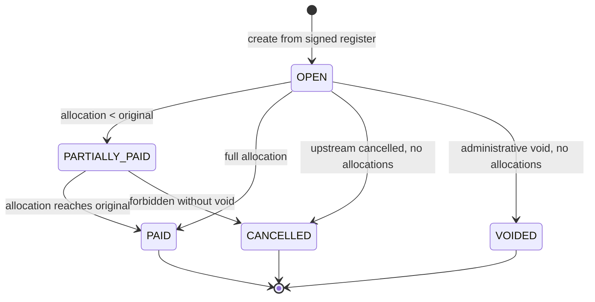
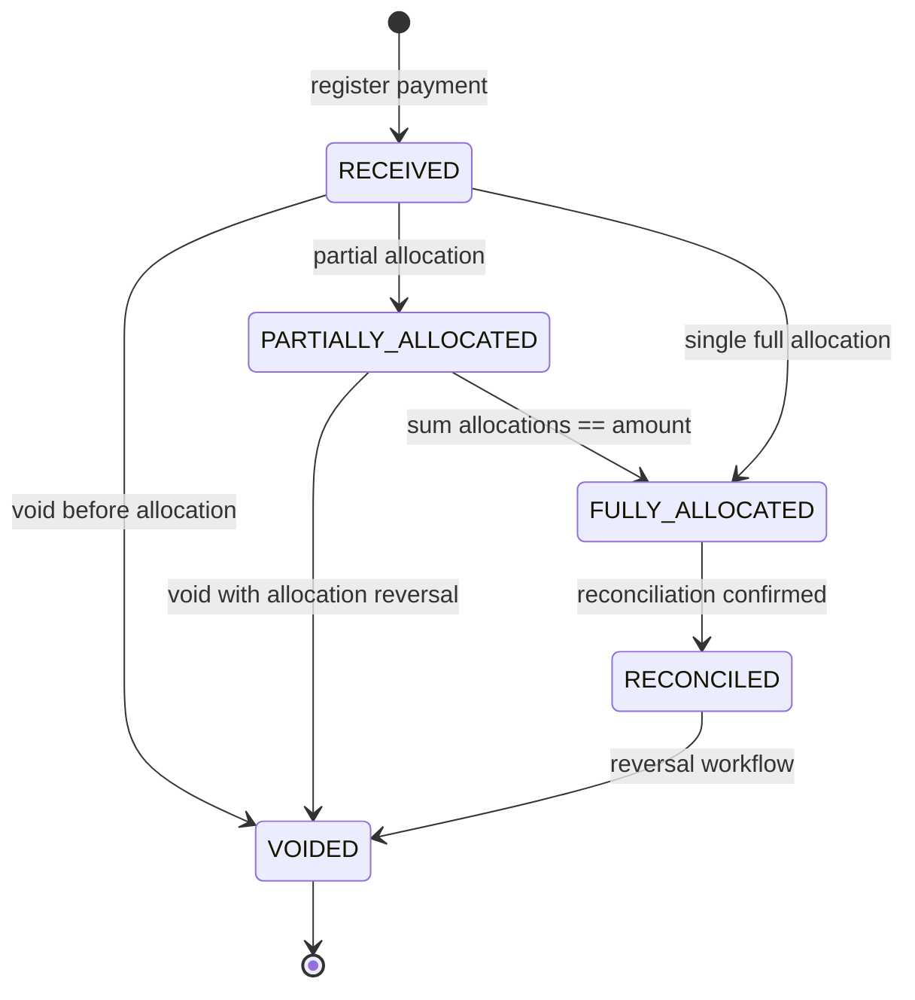
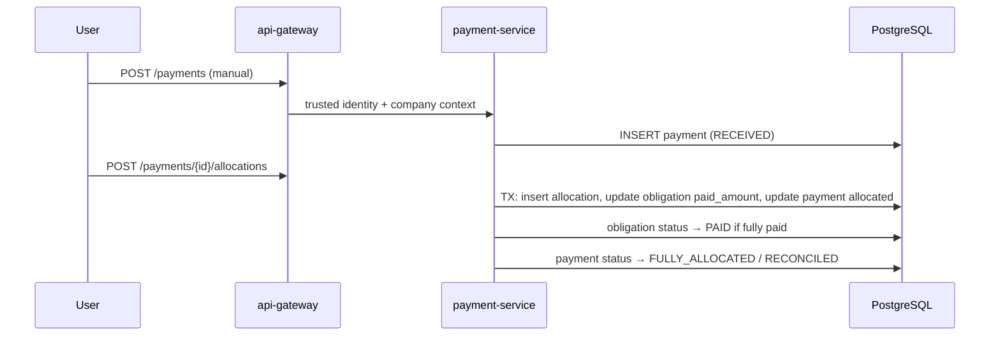
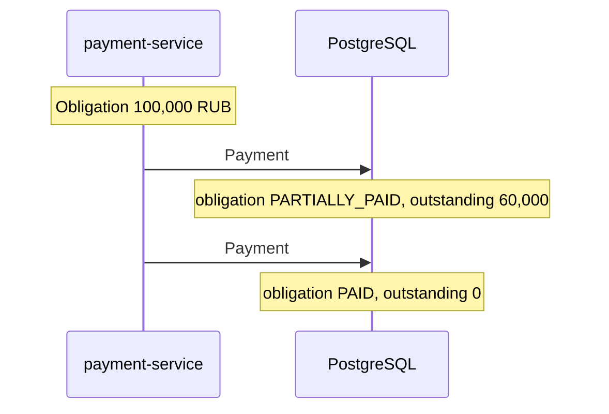
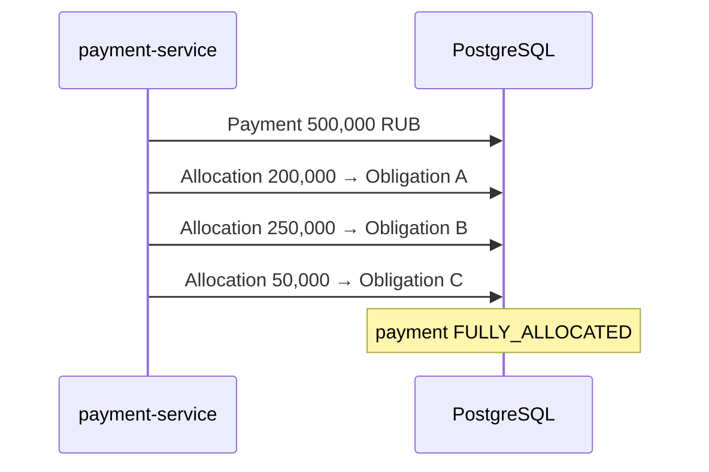
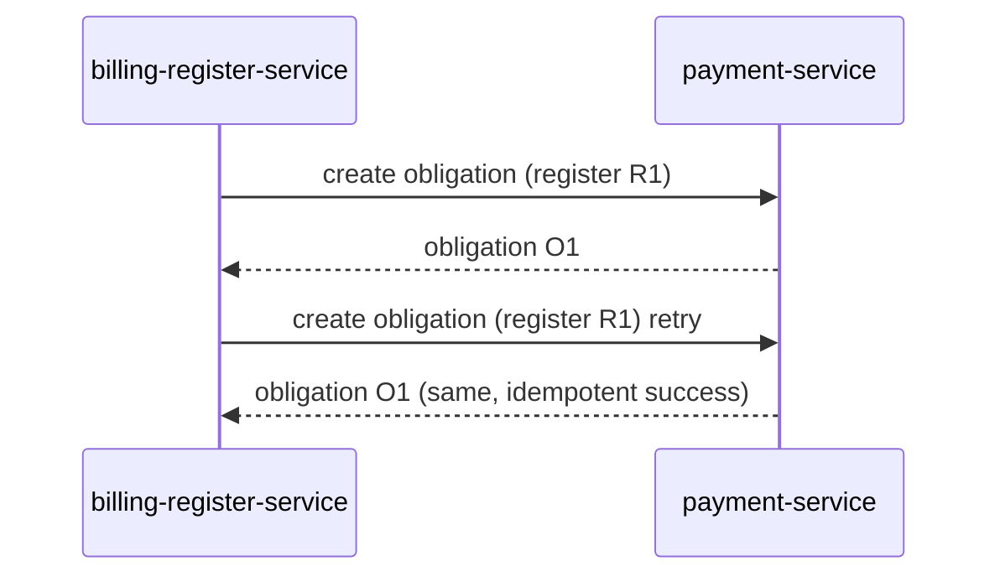

# Freight Payments & Reconciliation Architecture (v1.9.0)

**Status:** Architecture freeze **finalized** — design only, no production implementation in v1.9.0  
**Base:** `main` @ Freight Billing & Closing Documents v1.8.2  
**Next slice:** v1.9.1 Payment Backend Core

---

## 1. Context

The platform already implements the commercial chain through closing documents:

```
Transport Order → Execution/POD → Freight Settlement → Billing Register → Closing Documents
```

v1.8.2 ends with **mock/manual** register status transitions (`mark-paid`, `close`) that
record operational intent but do **not** create payment records, allocations, or reconciliation.

v1.9 introduces the next financial layer:

```
Closing Documents (accepted basis)
      ↓
Payment Obligation   (who owes whom, how much, by when)
      ↓
Payment              (record of money movement / bank receipt)
      ↓
Payment Allocation   (link payment ↔ obligation)
      ↓
Reconciliation       (confirmed financial match)
      ↓
Paid / Partially Paid / Overdue / Exception
```

**Scope of v1.9:** transport payment domain — obligation registration, payment recording,
allocation, reconciliation, overdue detection. **Not** a bank, escrow, card processor, or GL.

---

## 2. Existing System Discovery

### 2.1 Payment primitives today

| Discovery field | Result | Evidence |
|-----------------|--------|----------|
| `EXISTING_PAYMENT_SERVICE` | **NOT_FOUND** | No `payment-service` under `services/` |
| `EXISTING_PAYMENT_DOMAIN` | **PARTIAL** | Register status `PAID`/`CLOSED`; settlement status `READY_FOR_PAYMENT` |
| `EXISTING_PAYMENT_TABLES` | **NOT_FOUND** | No `payment*`, `ledger*`, AP/AR tables in migrations |
| `EXISTING_PAYMENT_API` | **PARTIAL** | `POST /billing-registers/{id}/mark-paid`, `POST …/close` — status flags only |
| `EXISTING_RECONCILIATION_DOMAIN` | **NOT_FOUND** | Settlement detail field `reconciliation` is amount **summary**, not bank reconciliation |
| `EXISTING_BANK_INTEGRATION` | **NOT_FOUND** | |
| `EXISTING_PAYMENT_PROVIDER` | **NOT_FOUND** | |
| `EXISTING_LEDGER` | **NOT_FOUND** | |
| `EXISTING_ACCOUNTS_PAYABLE` | **NOT_FOUND** | |
| `EXISTING_ACCOUNTS_RECEIVABLE` | **NOT_FOUND** | |

### 2.2 Freight Settlement v1.7 (SSOT for transport cost)

| Field | Value |
|-------|-------|
| Table | `billing.freight_settlements` |
| PK | `id` (UUID) |
| Tenant scope | `tenant_id` |
| Buyer | `buyer_company_id` |
| Carrier | `carrier_company_id` |
| Order link | `transport_order_id`, `shipment_id`, `award_link_id` |
| Currency | `currency_code` CHAR(3), default `RUB` |
| Base amount | `base_freight_amount` NUMERIC(18,2) |
| Accessorials | `approved_accessorial_total`; line items in `billing.settlement_accessorials` |
| Totals | `total_without_vat`, `vat_amount`, `total_with_vat` |
| Tax | `vat_rate` NUMERIC(5,2) |
| Statuses | `DRAFT`, `UNDER_REVIEW`, `DISPUTED`, `APPROVED`, `DOCUMENTS_READY`, `READY_FOR_PAYMENT`, `CANCELLED` |
| Register link | `billing_register_id`, `billing_register_item_id` |

**Financial immutability (current code):**

- Accessorial proposals only in `DRAFT` / `UNDER_REVIEW`.
- After `APPROVED`, totals stable unless dispute reopening.
- Amounts **snapshotted** into `billing_register_items` at register inclusion.
- Settlement with `billing_register_id != NULL` cannot be re-included elsewhere.

Settlement answers: **"What is the agreed transport cost?"**  
It is **not** a payment obligation or payment record.

### 2.3 Billing Register v1.8.2

| Field | Value |
|-------|-------|
| Table | `billing.billing_registers` |
| Statuses | `DRAFT` → `CALCULATED` → `UNDER_REVIEW` → `APPROVED` → `CLOSING_DOCUMENTS_CREATED` → `SENT_TO_EDO` → `SIGNED_BY_COUNTERPARTY` → `PAID` → `CLOSED` |
| Totals | `total_without_vat`, `vat_amount`, `total_with_vat` — server-summed from items |
| Currency | `currency_code` |
| Company scope | `customer_company_id` (buyer), `contractor_company_id` (carrier) |
| Settlement link | `billing_register_items.settlement_id`; unique `(tenant_id, settlement_id)` |

**Financial meaning (derived from code + v1.8 architecture doc):**

The billing register is a **closing batch / invoice basis**:

- Aggregates approved settlements into one payable batch.
- After `APPROVED`, line items and totals are frozen.
- Approved totals are copied to invoice/act/VAT/UPD at closing document creation.
- Mock EDO/payment statuses track operational workflow, not actual payments.

Register answers: **"What is the closing batch total and document basis?"**

### 2.4 Closing documents

| Entity | Table | Notes |
|--------|-------|-------|
| Package | `billing.closing_document_packages` | Types: `INVOICE_ONLY`, `ACT_PLUS_VAT_INVOICE`, `UPD`, `CUSTOM` |
| Invoice | `billing.invoices` | Amounts from register totals |
| Act | `billing.acts` | |
| VAT invoice | `billing.vat_invoices` | |
| UPD | `billing.upd_documents` | |

Document statuses default `DRAFT`; lifecycle driven by **register** status transitions.
Idempotency: one package + one of each doc type per register (migration 000044).

### 2.5 Money, audit, events, DB

| Topic | Finding |
|-------|---------|
| DB money | `NUMERIC(18,2)` throughout billing migrations |
| Go layer | `float64` + `round2()` in billing-register-service (`money_policy.go`) — legacy |
| Register audit | `billing.billing_register_audit_events` |
| Settlement audit | `billing.settlement_audit_events` |
| Outbox | **NOT_FOUND** in billing; **YES** in shipment-service (`transport.shipment_event_outbox`) |
| DB model | Shared PostgreSQL, schema-separated (`core`, `transport`, `rfx`, `documents`, `billing`) |
| Payment terms / due_date | **NOT_FOUND** |
| Bank accounts / BIK | **NOT_FOUND**; `core.companies.tax_id` exists (INN-like) |
| RBAC guards | `billingrbac`, `settlementrbac` + `companycontext.Enforcer` |

### 2.6 Gaps driving v1.9

1. No payment entity, allocation, or bank reconciliation.
2. `mark-paid` on register is a boolean workflow flag, not financial proof.
3. No due date / payment terms source.
4. No N:M payment ↔ obligation model.
5. No duplicate external payment protection.
6. No payment audit trail beyond register `MARKED_PAID` event.

---

## 3. Domain Boundaries & Source of Truth

| Concept | SSOT owner | v1.9 rule |
|---------|------------|-----------|
| Transport cost | `billing.freight_settlements` | Read-only reference; never re-edited by payment layer |
| Closing batch total | `billing.billing_registers` | Snapshot source for obligation amount |
| Legal closing docs | `billing.invoices/acts/vat_invoices/upd_documents` + document-service | Payment references obligation; does not regenerate docs |
| Payment obligation | **NEW** `payment-service` | Who owes whom, snapshot amount, due date |
| Payment record | **NEW** `payment-service` | Fact of payment (manual/import/API) |
| Allocation | **NEW** `payment-service` | N:M bridge |
| Reconciliation state | **NEW** `payment-service` | Derived from allocations + business rules |
| **Actual payment completion** | **`payment-service`** | **Canonical SSOT** — not billing register `PAID` |

**Critical rule — no duplicated editable money:**

```
Settlement amount  ≠  editable payment field
Register total     →  snapshotted into obligation.original_amount (immutable)
Payment.amount     →  recorded fact, not derived from client JSON without validation
Register PAID      →  projection synchronized from payment obligation (see §3.1)
```

### 3.1 Payment SSOT & elimination of dual payment truth

**`payment-service` is the canonical SSOT for actual payment state.**

`billing-register-service` register status `PAID` must **not** remain an independent
financial truth after v1.9.1 is deployed. There is **no dual mutable SSOT** for payment completion.

| Layer | Role |
|-------|------|
| `payment-service` | SSOT: obligations, payments, allocations, paid/outstanding amounts |
| `billing-register-service` | SSOT: closing batch, documents, EDO workflow; `PAID` is a **projection** |

**Compatibility period (v1.9.1 – v1.9.2):**

- The existing `POST /billing-registers/{id}/mark-paid` route may remain callable **only**
  if required for backward compatibility during migration.
- It must **NOT** independently assert payment completion contrary to `payment-service`.
- Preferred implementation: deprecate direct manual `mark-paid`; route becomes a thin
  compatibility shim or returns `409` when obligation is not `PAID`.
- `mark-paid` must **never** set register `PAID` unless payment obligation preconditions are met.

**Register PAID projection invariant:**

```
REGISTER.status == PAID
  ⇒ corresponding PaymentObligation exists (source_type=BILLING_REGISTER, source_id=register.id)
  AND obligation.status == PAID
  AND obligation.paid_amount == obligation.original_amount
  AND obligation.outstanding_amount == 0
```

**Inverse synchronization (canonical direction):**

When `PaymentObligation` transitions to `PAID`, payment-service (or coordinated handler)
may set register status to `PAID`. Register `PAID` is a **consequence**, not a source.

**v1.9.3:** frontend removes dependence on legacy `mark-paid`; all payment completion flows
through payment-service APIs.

**Forbidden after v1.9.1:**

- Operator marks register paid without payment obligation reaching `PAID`.
- Two independent paths both mutating financial paid state.
- Register `PAID` implying payment when no obligation/allocation exists.

---

## 4. Payment Obligation Model

### 4.1 Aggregate

`PaymentObligation` represents **accounts payable/receivable intent** for a closed financial basis.

Proposed fields:

| Field | Type | Notes |
|-------|------|-------|
| `id` | UUID | PK |
| `tenant_id` | UUID | Required on all queries |
| `obligation_number` | VARCHAR | Human-readable, tenant-scoped unique |
| `payer_company_id` | UUID | Company that must pay |
| `payee_company_id` | UUID | Company that receives |
| `source_type` | ENUM | `BILLING_REGISTER` (v1.9.1); future: `SETTLEMENT`, `INVOICE` |
| `source_id` | UUID | e.g. register ID |
| `currency_code` | CHAR(3) | Must match source |
| `original_amount` | NUMERIC(18,2) | **Snapshot** at creation |
| `paid_amount` | NUMERIC(18,2) | `SUM(valid allocations)` — maintained atomically |
| `outstanding_amount` | NUMERIC(18,2) | `original_amount - paid_amount` — maintained or derived |
| `due_date` | DATE nullable | See §4.4 |
| `status` | ENUM | See §8 |
| `blocked_reason` | VARCHAR nullable | e.g. upstream dispute |
| `version` | INT | Optimistic concurrency |
| `created_at`, `updated_at` | TIMESTAMPTZ | |

### 4.2 Payer / payee derivation

From billing register (current supported relationship):

| Register field | Obligation field |
|----------------|------------------|
| `customer_company_id` | `payer_company_id` (buyer/shipper pays carrier) |
| `contractor_company_id` | `payee_company_id` |

Forwarder-as-intermediary (`SHIPPER → FORWARDER → CARRIER`) is **NOT_FOUND** as a first-class
settlement triple in current schema. Settlement always has `buyer_company_id` + `carrier_company_id`.
Forwarder participation exists via company type/roles but not as separate payable leg.

**v1.9.1 scope:** obligation mirrors register payer/payee only.

### 4.3 Obligation creation trigger (ADR-02 — FROZEN)

**Decision (frozen):** Create exactly **one** `PaymentObligation` when billing register
reaches **`SIGNED_BY_COUNTERPARTY`**.

| Rule | Value |
|------|-------|
| Trigger event | Register status transition → `SIGNED_BY_COUNTERPARTY` |
| Granularity (v1.9.1) | **Exactly one obligation per billing register** |
| Idempotency key | `UNIQUE (tenant_id, source_type, source_id)` where `source_type=BILLING_REGISTER` |
| Settlement-level obligations | **Out of scope v1.9.1** (future extension only) |

**Important distinction — obligation creation ≠ due-date start:**

- **Obligation creation** is triggered by register reaching `SIGNED_BY_COUNTERPARTY`.
- **Due-date start / payment term clock** is a separate business rule and is **NOT**
  automatically defined by ADR-02 in v1.9.1.
- `SIGNED_BY_COUNTERPARTY` date may be recorded as metadata on the obligation
  (`source_signed_at` or audit payload) but does **not** auto-populate `due_date`.

Rationale:

| Trigger candidate | Assessment |
|-------------------|------------|
| Settlement `APPROVED` | Too early — not yet in closing batch |
| Register `APPROVED` | Payable basis exists but docs may not be accepted |
| Closing package generation | Docs exist; counterparty may not have accepted |
| **`SIGNED_BY_COUNTERPARTY`** | **Selected** — counterparty acceptance; aligns with closing lifecycle |
| Manual `mark-paid` | Legacy mock; **not** obligation trigger (see §3.1) |

**Cross-service reference (no FK):**

- **No database FK** from `payment_obligations.source_id` to `billing.billing_registers.id`.
- Reference via: `tenant_id` + `source_type=BILLING_REGISTER` + `source_id` (register UUID).
- `payment-service` validates register existence, tenant, status, and parties via
  **server-side application lookup** (internal HTTP or read-only query) at obligation creation.

### 4.4 Due date source

**Discovery:** `due_date`, `payment_terms`, `payment_days` — **NOT_FOUND** in repository.

| Precedence (future) | Status |
|---------------------|--------|
| Contract payment terms | NOT_FOUND |
| Company settings | NOT_FOUND |
| Register override | NOT_FOUND |
| Platform default | NOT_FOUND |

**ADR-05 decision (frozen for v1.9.1):**

- `due_date` is **nullable** on obligation creation.
- Manual assignment via API allowed for pilot (`PATCH …/due-date` before any allocation).
- **No automatic +N-day default** (e.g. no implicit `signed_at + 30 days`).
- Fail-safe: overdue detection skipped when `due_date IS NULL`.
- Future: payment terms entity or company-service extension — legal term start remains
  **OPEN_QUESTION_001** (separate from ADR-02 obligation creation trigger).

### 4.5 Immutability & corrections

After obligation creation:

- `original_amount`, `currency_code`, `payer_company_id`, `payee_company_id` are **immutable**.
- Corrections via **void + replacement obligation** or **adjustment document** (future v1.9.x),
  not silent UPDATE.
- If register is cancelled before any allocation: obligation → `CANCELLED`.
- If allocations exist: cancel forbidden; require void allocations first.

---

## 5. Payment Model

### 5.1 Aggregate

| Field | Type | Notes |
|-------|------|-------|
| `id` | UUID | |
| `tenant_id` | UUID | |
| `payment_number` | VARCHAR | Tenant-scoped display number |
| `payer_company_id` | UUID | |
| `payee_company_id` | UUID | |
| `amount` | NUMERIC(18,2) | Must be > 0 |
| `currency_code` | CHAR(3) | |
| `payment_date` | DATE | Business date of payment |
| `value_date` | DATE nullable | Optional bank value date (v1.9.2+) |
| `reference` | VARCHAR nullable | Internal reference |
| `external_reference` | VARCHAR nullable | Bank/ERP reference |
| `source` | ENUM | `MANUAL`, `IMPORT`, `API` (v1.9.1); future: `BANK_STATEMENT`, `ERP_1C`, etc. |
| `external_id` | VARCHAR nullable | Provider transaction ID |
| `status` | ENUM | See §8 |
| `allocated_amount` | NUMERIC(18,2) | Sum of allocations |
| `unallocated_amount` | NUMERIC(18,2) | `amount - allocated_amount` |
| `created_by` | UUID | Verified user |
| `voided_at`, `voided_by`, `void_reason` | nullable | Reversal metadata |
| `version` | INT | |
| `created_at`, `updated_at` | TIMESTAMPTZ | |

**Payment is a record of payment**, not an obligation. Amount comes from operator/import,
validated server-side; never trusted from client without authorization checks.

### 5.2 External ID & duplicates

**External identity uniqueness (frozen):**

Bank/provider external identities must remain **historically unique per tenant**, even after void.
Voiding must **not** allow re-insert of the same bank/provider transaction ID.

```sql
-- IMPORT / API / BANK_* sources: permanent uniqueness
UNIQUE (tenant_id, source, external_id)
  WHERE external_id IS NOT NULL
  AND source IN ('IMPORT', 'API', 'BANK_STATEMENT', 'BANK_API', 'ERP_1C', 'ERP_SAP')
```

**MANUAL source semantics:**

- `external_id` is optional for manual pilot payments.
- When provided on `source=MANUAL`, it is an operator-supplied reference, not a bank transaction ID.
- Manual `external_id` uniqueness: `UNIQUE (tenant_id, source, external_id) WHERE external_id IS NOT NULL`
  applies among **active (non-voided)** manual payments only — allows re-entry after void for
  operator typos, but **does not** apply to bank import sources above.
- Re-import of a voided bank transaction must remain blocked; use explicit reversal workflow instead.

Fallback duplicate **warning** (not hard constraint): same payer + payee + date + amount + reference.

### 5.3 Reversal

No hard DELETE after first allocation.

- `VOID` payment → voids all allocations, restores obligation `paid_amount`.
- Audit records before/after.
- Negative amounts **not** used; refunds are separate void + new payment or dedicated `REFUND` type (future).

---

## 6. Payment Allocation & Reconciliation

### 6.1 Allocation aggregate

| Field | Type |
|-------|------|
| `id` | UUID |
| `tenant_id` | UUID |
| `payment_id` | UUID FK |
| `obligation_id` | UUID FK |
| `allocated_amount` | NUMERIC(18,2) |
| `currency_code` | CHAR(3) |
| `created_by` | UUID |
| `created_at` | TIMESTAMPTZ |
| `voided_at` | nullable |

**N:M required:** one payment → many obligations; many payments → one obligation.

Do **not** use `payment.obligation_id` as sole link.

### 6.2 Reconciliation semantics (ADR-06 — FROZEN)

**Exact definitions:**

| Term | Definition |
|------|------------|
| Payment registration | Payment row created with status `RECEIVED` |
| Allocation | Active `payment_allocations` row linking payment ↔ obligation |
| **Payment `FULLY_ALLOCATED`** | `allocated_amount == payment.amount` (exact equality) |
| **Payment `RECONCILED`** | Payment is `FULLY_ALLOCATED` **AND** reconciliation explicitly confirmed by authorized actor (`POST …/reconcile`) |
| **Obligation `PAID`** | `paid_amount == original_amount` (exact equality); `outstanding_amount == 0` |

**Over-allocation is impossible:**

- `paid_amount` must **never** exceed `original_amount`.
- `paid_amount == original_amount` is required for `PAID` status (not `>=`).
- Allocation requests where `allocated_amount > obligation.outstanding_amount` are **rejected**.

Partially allocated payments remain `PARTIALLY_ALLOCATED` until `allocated_amount == payment.amount`.
Only then may an authorized actor confirm `RECONCILED`.

### 6.3 Overpayment / underpayment

**Overpayment (payment > obligation):**

- Reject allocation where `allocated_amount > obligation.outstanding_amount`.
- Remainder stays as payment `unallocated_amount`.
- Do **not** auto-increase obligation.

**Underpayment:**

- Obligation → `PARTIALLY_PAID` when `0 < paid_amount < original_amount`.
- `OVERDUE` when `due_date < current_date AND outstanding > 0` (derived flag or status).

### 6.4 Currency

No FX subsystem exists. **Reject** allocation when `payment.currency_code != obligation.currency_code`.

### 6.5 Matching signals (future automation)

Architecture reserves matching on:

- register / invoice / closing document number
- payment reference
- payer / payee
- amount + currency
- payment date window
- external transaction ID

v1.9.1: **manual allocation only**.

---

## 7. Financial Invariants

```
1. allocated_amount > 0 for each active allocation
2. SUM(active allocations for payment) <= payment.amount
3. SUM(active allocations for obligation) <= obligation.original_amount
4. Obligation PAID ⇔ paid_amount == original_amount AND outstanding_amount == 0
   (paid_amount > original_amount is FORBIDDEN)
5. Payment FULLY_ALLOCATED ⇔ allocated_amount == payment.amount (exact equality)
6. payment.currency == obligation.currency (no FX; mismatch → reject)
7. tenant(payment) == tenant(obligation)
8. payer/payee on allocation must match both payment and obligation parties
9. obligation.original_amount is immutable after creation
10. no hard DELETE of payments/allocations after financial use; VOID only
11. UNIQUE (tenant_id, source_type, source_id) on obligations — one per register (v1.9.1)
12. Bank/provider external_id permanently unique per (tenant_id, source) — void does not release
13. REGISTER PAID ⇒ obligation PAID with exact amount match (§3.1); no independent register paid truth
```

**Money types (ADR-03):** new payment-service persistence uses **NUMERIC(18,2)** exclusively.
Go layer should use `shopspring/decimal` or equivalent — **not float64** for new code.

---

## 8. State Machines

### 8.1 Payment Obligation



| Status | Persisted | Notes |
|--------|-----------|-------|
| `OPEN` | YES | No payments allocated |
| `PARTIALLY_PAID` | YES | `0 < paid_amount < original_amount` |
| `PAID` | YES | `paid_amount == original_amount` AND `outstanding_amount == 0` |
| `CANCELLED` | YES | Upstream cancelled |
| `VOIDED` | YES | Admin correction |
| `OVERDUE` | **DERIVED** | `due_date < today AND outstanding > 0 AND status IN (OPEN, PARTIALLY_PAID)` |

**ADR-07:** persist `OPEN`, `PARTIALLY_PAID`, `PAID`, `CANCELLED`, `VOIDED`; derive `OVERDUE`.

### 8.2 Payment



| Status | Persisted |
|--------|-----------|
| `RECEIVED` | YES |
| `PARTIALLY_ALLOCATED` | YES |
| `FULLY_ALLOCATED` | YES |
| `RECONCILED` | YES |
| `VOIDED` | YES |

`allocated_amount` / `unallocated_amount` updated **atomically** in same transaction as allocation insert.

---

## 9. Sequence Diagrams

### A. Closing register → payment obligation

```mermaid
sequenceDiagram
    participant BR as billing-register-service
    participant PS as payment-service
    participant DB as PostgreSQL

    Note over BR: Register reaches SIGNED_BY_COUNTERPARTY
    BR->>PS: payment_obligation.create (source=BILLING_REGISTER)
    PS->>DB: read register totals (server-side)
    PS->>DB: INSERT obligation (snapshot amount, idempotent)
    PS-->>BR: obligation_id
```



### B. Manual payment → allocation → paid



### C. Partial payment



### D. One payment → multiple obligations



### E. Duplicate obligation event (idempotency)



---

## 10. Service Boundary (ADR-01)

### Options evaluated

| Criterion | Extend billing-register-service | New payment-service |
|-----------|--------------------------------|---------------------|
| Domain ownership | Billing/closing ≠ payment/reconciliation | Clear separation |
| Lifecycle independence | Payment events independent of register mutations | ✓ |
| Bank/ERP adapters | Pollutes billing service | Isolated adapter boundary |
| N:M allocation complexity | Grows already large service | Dedicated home |
| Security/RBAC | Reuse patterns | Reuse patterns via shared guards |
| DB ownership | Same `billing` schema natural | New `billing` or `payment` schema |
| Deployment | Fewer services | Independent scaling/deploy |

**Decision: YES — create `payment-service`**

Payment lifecycle differs materially from billing register / closing document lifecycle.
`payment-service` is SSOT for actual payment state (§3.1).

**Integration:** payment-service reads register data via internal HTTP API or read-only DB query.
**No cross-service FK** on obligation → register; store `tenant_id` + `source_type` + `source_id`
with server-side application validation only.

---

## 11. Persistence Proposal (NOT migrations)

Schema: **`billing`** (consistent with existing financial tables) or new **`payment`** schema.
Recommendation: **`billing`** prefix for co-location with registers.

### Proposed tables

```text
billing.payment_obligations
billing.payments
billing.payment_allocations
billing.payment_audit_events
```

Optional (v1.9.2+): `billing.payment_reconciliation_runs` — only if batch reconciliation UI needed.

### Proposed unique constraints

```sql
-- obligation idempotency (v1.9.1: one obligation per register)
UNIQUE (tenant_id, source_type, source_id)

-- bank/provider external payment idempotency (permanent; void does not release)
UNIQUE (tenant_id, source, external_id)
  WHERE external_id IS NOT NULL
  AND source IN ('IMPORT', 'API', 'BANK_STATEMENT', 'BANK_API', 'ERP_1C', 'ERP_SAP')

-- manual external_id: active-only uniqueness (operator reference, not bank SSOT)
UNIQUE (tenant_id, source, external_id)
  WHERE external_id IS NOT NULL AND source = 'MANUAL' AND voided_at IS NULL

-- obligation number
UNIQUE (tenant_id, obligation_number)
```

### Proposed indexes

```text
(tenant_id, payer_company_id, status)
(tenant_id, payee_company_id, status)
(tenant_id, due_date) WHERE status IN ('OPEN','PARTIALLY_PAID')
(tenant_id, payment_date)
(tenant_id, external_reference)
(tenant_id, unallocated_amount) WHERE unallocated_amount > 0  -- via partial index on payments
```

### Cross-service FK policy (frozen)

**No FK** from `payment_obligations.source_id` → `billing_registers.id`.

Reference model:

```text
tenant_id + source_type=BILLING_REGISTER + source_id=<register_uuid>
```

Validation at obligation creation:

1. Register exists in tenant.
2. Register status is `SIGNED_BY_COUNTERPARTY` (or later compatible state).
3. Payer/payee derived server-side from register parties.
4. Amount snapshotted server-side from register totals.

This preserves service boundary even when services share one PostgreSQL instance today.

---

## 12. API Proposal (design only)

Base path: `/api/v1` via api-gateway, new `paymentrbac` guard reusing `companycontext.Enforcer`.

### Payment obligations

```text
GET    /api/v1/payment-obligations
GET    /api/v1/payment-obligations/{id}
POST   /api/v1/payment-obligations          (internal/event-driven; not public in v1.9.1)
PATCH  /api/v1/payment-obligations/{id}/due-date   (nullable terms pilot)
POST   /api/v1/payment-obligations/{id}/void
```

Filters: `status`, `payer_company_id`, `payee_company_id`, `currency`, `due_from`, `due_to`, `overdue`, `source_type`.

### Payments

```text
GET    /api/v1/payments
POST   /api/v1/payments                     (manual registration)
GET    /api/v1/payments/{id}
POST   /api/v1/payments/{id}/void
```

Filters: `status`, `payer`, `payee`, `currency`, `payment_date_from/to`, `reference`, `unallocated_only`.

Request body for create (manual v1):

```yaml
PaymentCreate:
  required: [amount, currency_code, payment_date, payer_company_id, payee_company_id]
  properties:
    amount: { type: string, format: decimal }   # not client-trusted without server validation
    currency_code: { type: string }
    payment_date: { type: string, format: date }
    reference: { type: string }
    external_reference: { type: string }
    external_id: { type: string }
    source: { enum: [MANUAL, IMPORT, API] }
```

**No client canonical amount on obligation create** — obligation amount always server-snapshotted.

### Allocations

```text
POST   /api/v1/payments/{id}/allocations
POST   /api/v1/payment-allocations/{id}/void
GET    /api/v1/payment-obligations/{id}/allocations
```

```yaml
AllocationCreate:
  required: [obligation_id, allocated_amount]
  properties:
    obligation_id: { type: string, format: uuid }
    allocated_amount: { type: string, format: decimal }
```

### Reconciliation

```text
POST   /api/v1/payments/{id}/reconcile       (confirm fully allocated)
GET    /api/v1/reconciliation/exceptions     (read model / projection)
```

### Idempotency

- Obligation: natural key `(tenant_id, source_type, source_id)`.
- Payment import/API: `Idempotency-Key` header **optional v1.9.1**, recommended v1.9.2 for imports.
- Allocation: no idempotency key; rely on transaction + outstanding balance checks.

---

## 13. Security & RBAC

### 13.1 Tenant & company isolation

Reuse v1.8.2 pattern:

1. Gateway strips untrusted identity headers.
2. JWT → `X-Tenant-ID`, `X-User-ID`.
3. `companycontext.Enforcer` validates membership → `X-Company-ID`, `X-Actor-Kind`.
4. payment-service `PaymentActorResolver` re-validates membership (same as `SettlementActorResolver`).

Payer/payee on payment must align with actor's authorized company context:

- Buyer actor can register payments where buyer is payer.
- Carrier actor can register payments where carrier is payee.
- Cross-company read/mutate → **403**.

### 13.2 RBAC (proposed `paymentrbac`)

Follow `billingrbac` naming — permissions via role maps, not new framework.

| Permission | Roles (frozen for v1.9.1) |
|------------|---------------------------|
| `payment.read` | PLATFORM_ADMIN, SHIPPER_ADMIN, SHIPPER_LOGIST, **FINANCE_MANAGER**, CARRIER_ADMIN, CARRIER_ACCOUNTANT, FORWARDER_MANAGER |
| `payment.create` | PLATFORM_ADMIN, SHIPPER_ADMIN, **FINANCE_MANAGER**, CARRIER_ADMIN, CARRIER_ACCOUNTANT |
| `payment.allocate` | PLATFORM_ADMIN, SHIPPER_ADMIN, **FINANCE_MANAGER**, CARRIER_ADMIN, CARRIER_ACCOUNTANT |
| `payment.reconcile` | PLATFORM_ADMIN, SHIPPER_ADMIN, **FINANCE_MANAGER**, CARRIER_ADMIN, CARRIER_ACCOUNTANT |
| `payment.void` | PLATFORM_ADMIN, SHIPPER_ADMIN, **FINANCE_MANAGER**, CARRIER_ADMIN, CARRIER_ACCOUNTANT |
| `payment.export` | PLATFORM_ADMIN, SHIPPER_ADMIN, **FINANCE_MANAGER**, CARRIER_ADMIN, CARRIER_ACCOUNTANT |

**FINANCE_MANAGER** (seed role `000009_seed_roles.up.sql`) is **required** in all payment
financial mutation permissions for v1.9.1. It aligns with seed description:
*"Manages billing registers and closing documents"*.

**SHIPPER_ACCOUNTANT** does **not** exist in seed roles — **not invented** for v1.9.1.

**Segregation of duties:** separate `payment.create`, `payment.reconcile`, `payment.void` permissions
(enable enterprise policy; single `payment.manage` avoided).

**PLATFORM_ADMIN:** membership required; no arbitrary company spoofing.

### 13.3 Threat model (mitigations)

| Threat | Mitigation |
|--------|------------|
| Cross-tenant payment lookup | `tenant_id` on all queries |
| Cross-company payment access | Actor resolver + payer/payee match |
| Fake payer/payee in body | Server validates against membership + obligation parties |
| Header spoof | Strip + gateway inject |
| Over-allocation | Transaction + outstanding check |
| Duplicate allocation race | Row lock on obligation/payment + version |
| Amount tampering | Server-side validation; obligation amount not client-supplied |
| Currency tampering | Enum match + reject mismatch |
| Void another company's payment | Actor scope + audit |
| Double payment import | Unique external_id |
| Silent post-PAID mutation | Immutability + audit |

---

## 14. Concurrency

Allocation transaction pattern:

```text
BEGIN
  SELECT obligation FOR UPDATE
  SELECT payment FOR UPDATE
  validate outstanding / unallocated
  INSERT allocation
  UPDATE obligation paid_amount, status
  UPDATE payment allocated_amount, status
  INSERT audit event
COMMIT
```

On conflict: return **409** with current balances.

---

## 15. Audit

Reuse v1.8 audit pattern — `billing.payment_audit_events`:

| Event types |
|-------------|
| `OBLIGATION_CREATED`, `OBLIGATION_CANCELLED`, `OBLIGATION_VOIDED` |
| `PAYMENT_REGISTERED`, `PAYMENT_VOIDED` |
| `ALLOCATION_CREATED`, `ALLOCATION_VOIDED` |
| `PAYMENT_RECONCILED`, `DUE_DATE_SET` |

Fields: `tenant_id`, entity IDs, `actor_user_id`, `actor_company_id`, `payload` JSONB (before/after amounts).

---

## 16. Events & Outbox (ADR-08)

Billing domain currently has **no outbox**. Shipment-service pattern is canonical for the repo.

**Proposed events (future publication via outbox in payment-service):**

```text
payment_obligation.created
payment_obligation.paid
payment_obligation.overdue
payment.registered
payment.allocated
payment.reconciled
payment.voided
```

**Control Tower (v1.9.4+, design only):**

```text
PAYMENT_OVERDUE
PAYMENT_UNALLOCATED
PAYMENT_PARTIALLY_PAID
PAYMENT_RECONCILIATION_FAILED
```

No Kafka topics in v1.9.0.

---

## 17. UI Workspace Concept (architecture only)

### Screens

1. **Payment Obligations** — list with register source, payer, payee, amounts, due date, overdue badge
2. **Payments** — list with allocated/unallocated columns
3. **Reconciliation Workspace** — split view: unallocated payments | open obligations | allocate action
4. **Payment Detail** — allocations, audit trail, void
5. **Overdue / Exceptions** — derived views: overdue, underpaid, unallocated, currency mismatch

Frontend permission gating mirrors backend; not a security boundary.

---

## 18. Relationship to document-service

Payment-service **does not** generate invoice/act/UPD.

It references:

- `source_type=BILLING_REGISTER`, `source_id=register_id`
- Optional metadata: register_number, closing package ID (denormalized read model)

Bank details (INN, BIK, account) remain in company-service when implemented — payment-service stores IDs only.

---

## 19. Out of Scope v1.9

```text
actual money transfer / payment initiation
bank acquiring / cards / escrow / factoring / credit / loans
FX conversion / treasury / full GL / tax accounting
automatic 1C / SAP / bank statement parser
AI / fuzzy reconciliation
insurance payments / crypto
```

---

## 20. Implementation Plan

### v1.9.1 Payment Backend Core

| Item | Scope |
|------|-------|
| Service | `payment-service` skeleton, health, config |
| Migrations | `payment_obligations`, `payments`, `payment_allocations`, `payment_audit_events` |
| API | Manual payment create, obligation auto-create hook, single allocation |
| Security | `paymentrbac` + company context |
| Tests | Unit + PostgreSQL integration (~40 scenarios) |
| Risk | Medium — financial invariants |
| DoD | Obligation from signed register; manual payment; full allocation; tenant/company deny |

### v1.9.2 Reconciliation Integrity & Reliable Projection

> **Scope refined (2026-08-19):** Partial/multi allocation, unallocated remainder,
> explicit reconciliation, and concurrent allocation protection were **delivered in v1.9.1**
> (merged PR #27). See `FREIGHT_PAYMENTS_RECONCILIATION_v1.9.2_ARCHITECTURE.md`.

Remaining v1.9.2 focus:

- Transactional outbox for obligation PAID → register PAID delivery
- Allocation reversal + payment void (append-only)
- Reconciliation hardening + idempotent repeat
- Import/API idempotency preparation

### v1.9.3 Payment Workspace UI

web-procurement payment screens; **remove frontend dependence on legacy `mark-paid`** (§3.1).
Register `PAID` displayed only when obligation projection is `PAID`.

### v1.9.4 Overdue / Exceptions / Control Tower

Derived overdue projection, exception list, CT event emission.

### v1.9.5 Security & Financial Integrity Review

Full security matrix, penetration of company spoof cases, CI gate.

---

## 21. ADR Decision Log

### ADR-01 Service boundary

- **Decision:** New `payment-service`
- **Alternatives:** Extend billing-register-service
- **Reason:** Independent lifecycle, reconciliation complexity, adapter boundary
- **Consequences:** New deployable; integration with billing via source reference

### ADR-02 Obligation source (FROZEN)

- **Decision:** Create exactly one obligation from `BILLING_REGISTER` when register reaches `SIGNED_BY_COUNTERPARTY`
- **Alternatives rejected:** Register `APPROVED`; settlement-level obligation in v1.9.1
- **Reason:** Counterparty acceptance; one batch = one payable obligation
- **Consequences:** Event/hook from billing on sign transition; obligation creation date ≠ due-date start
- **Reference:** No FK; `tenant_id` + `source_type` + `source_id` + server-side validation

### ADR-03 Amount policy

- **Decision:** Snapshot `register.total_with_vat` into `original_amount`; immutable
- **Alternatives:** Live derive from register
- **Reason:** Financial stability after closing
- **Consequences:** Corrections via void/replacement

### ADR-04 Allocation model

- **Decision:** Separate `payment_allocations` table; N:M
- **Alternatives:** Direct FK on payment
- **Reason:** Split payments, batch bank transfers
- **Consequences:** More complex transactions

### ADR-05 Due date

- **Decision:** Nullable in v1.9.1; manual set; no invented +30 days
- **Alternatives:** Hard default terms
- **Reason:** No payment terms entity exists
- **Consequences:** Overdue detection limited until terms exist

### ADR-06 Reconciliation (FROZEN)

- **Decision:** `FULLY_ALLOCATED` ⇔ `allocated_amount == payment.amount`; `RECONCILED` ⇔ fully allocated + explicit actor confirmation; obligation `PAID` ⇔ `paid_amount == original_amount`
- **Alternatives rejected:** `paid_amount >= original_amount`; reconciled = any allocation
- **Reason:** Exact financial equality; no over-allocation; clear operator confirmation step
- **Consequences:** Separate reconcile action; overpayment stays unallocated on payment

### ADR-07 Status model

- **Decision:** Persist obligation/payment core statuses; derive `OVERDUE`
- **Alternatives:** Fully derived statuses
- **Reason:** List/filter performance + race safety on paid_amount

### ADR-08 Outbox

- **Decision:** Adopt shipment-style outbox when events needed (v1.9.2+)
- **Alternatives:** Direct Kafka publish
- **Reason:** Repository convention

### ADR-09 Reversal

- **Decision:** VOID + audit; no hard delete after use
- **Alternatives:** Soft delete
- **Reason:** Financial audit trail

### ADR-10 Company security

- **Decision:** Reuse v1.8.2 gateway + membership SSOT unchanged
- **Alternatives:** New trust model
- **Reason:** Proven in v1.8.2 review

---

## 22. Open Questions

| ID | Question | Status |
|----|----------|--------|
| OPEN_QUESTION_001 | What legally starts payment **term clock** for due_date? | **OPEN** — separate from ADR-02 obligation creation; no auto +N days in v1.9.1 |
| OPEN_QUESTION_002 | ~~FK obligation → register?~~ | **RESOLVED:** No FK; application validation |
| OPEN_QUESTION_003 | ~~FINANCE_MANAGER in payment RBAC?~~ | **RESOLVED:** YES — all financial mutation permissions |
| OPEN_QUESTION_004 | ~~mark-paid coexistence?~~ | **RESOLVED:** Compatibility shim only; payment-service SSOT (§3.1); UI removed v1.9.3 |
| OPEN_QUESTION_005 | ~~Obligation granularity?~~ | **RESOLVED:** One obligation per billing register in v1.9.1 |

---

## 23. Future Test Matrix (v1.9.1+)

```text
Create obligation / duplicate obligation event
Manual payment / duplicate external payment
Partial / full allocation
One payment → N obligations / N payments → one obligation
Over-allocation reject / unallocated remainder
Cross-tenant / cross-company deny
Currency mismatch
Concurrent allocation race
Void payment / void allocation
Audit completeness
RBAC / header spoof
```

---

## 24. v1.9.1 Dependencies

- Freight Settlement v1.7 (in main)
- Freight Billing & Closing v1.8.2 (in main)
- api-gateway company context enforcer
- PostgreSQL billing schema
- CI integration test harness pattern from freightbillingclosing

---

*End of v1.9.0 architecture freeze document.*
