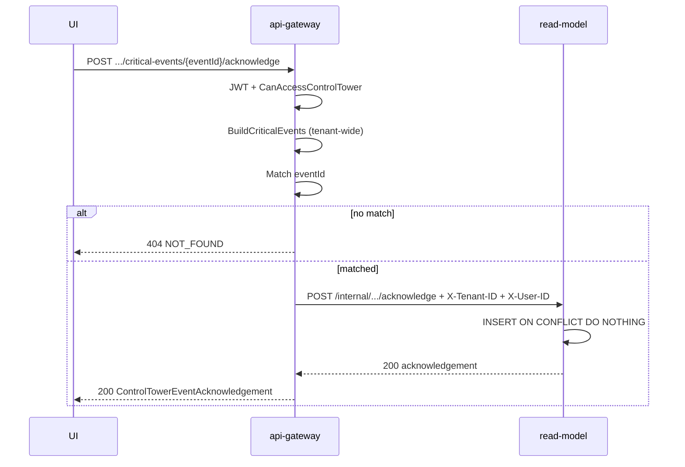
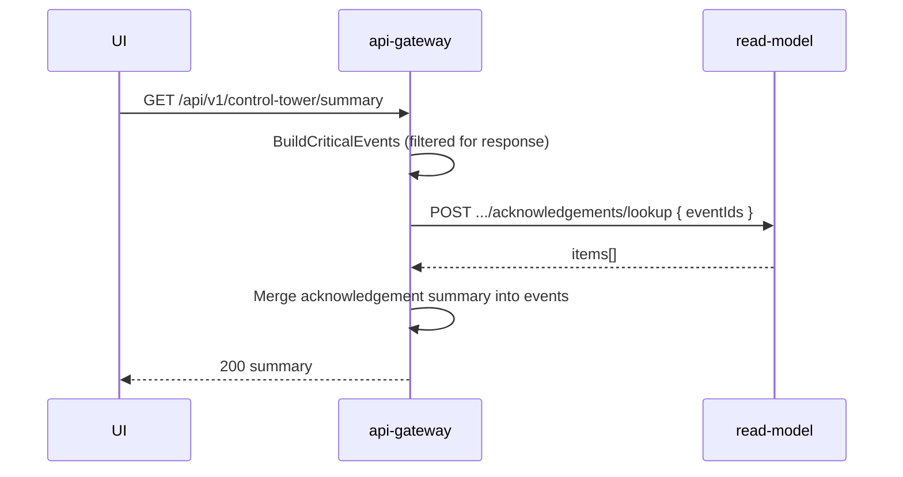

# Control Tower — Critical Event Acknowledgement v0.1 — Architecture (FROZEN)

**Task:** CT-AA-001
**Status:** Contract frozen — implementation in CT-AA-002 / CT-AA-003
**PRODUCT_BASE_SHA:** `02208106e494afcaa46372e44b417761d6613daf`

---

## 1. Overview

Critical Control Tower events are **derived at request time** in `services/api-gateway/internal/controltower/events.go` (`BuildCriticalEvents`). They are not persisted as alert records. Acknowledgement state is **operational metadata** stored in PostgreSQL by `control-tower-read-model-service`.

Public mutation flows through the api-gateway BFF (JWT auth, RBAC, event existence validation). The read-model stores and serves acknowledgement rows via internal endpoints trusted only from the gateway.

```text
Client ──POST acknowledge──► api-gateway (auth, RBAC, derive+match eventId)
                                    │
                                    └──► read-model (persist / lookup)
```

Summary enrichment: `GET /api/v1/control-tower/summary` derives events, batch-lookups acknowledgements by `eventId`, merges optional `acknowledgement` block into each `ControlTowerEvent`.

---

## 2. Service boundaries

| Layer | Component | Responsibility |
|-------|-----------|----------------|
| Public API | `services/api-gateway/internal/controltower/` | JWT, RBAC, derive critical events, validate `eventId`, call read-model, enrich summary |
| Persistence | `services/control-tower-read-model-service/` | Tenant-scoped acknowledgement table, internal write + batch lookup |
| Contract | `packages/openapi/openapi.yaml` | Public POST + enriched schemas |
| Frontend | `apps/web-admin/` (CT-AA-003) | Acknowledge action + display |

Gateway remains **stateless** (no production PostgreSQL). Read-model owns `control_tower` schema migrations.

---

## 3. Public API (frozen)

| Item | Value |
|------|-------|
| Method | `POST` |
| Path | `/api/v1/control-tower/critical-events/{eventId}/acknowledge` |
| Auth | Bearer JWT (required) |
| Request body | Empty (no properties; `additionalProperties: false`) |
| Success | `200` — `ControlTowerEventAcknowledgement` |
| Invalid `eventId` format | `400` — `VALIDATION_ERROR` |
| Missing/invalid JWT | `401` — `UNAUTHORIZED` |
| No Control Tower access | `403` — `FORBIDDEN` |
| Unknown / non-current event | `404` — `NOT_FOUND` (no cross-tenant leak) |

**Security invariants:**

- No request body fields for `tenant_id`, `user_id`, or `acknowledged_by`.
- Tenant and actor from verified JWT / gateway `AuthContext` only.
- Cross-tenant or unknown `eventId` → **404** (never 403 that reveals existence).

---

## 4. Summary enrichment (frozen)

`ControlTowerEvent` gains optional:

```yaml
acknowledgement:
  acknowledgedAt: date-time
  acknowledgedBy:
    userId: uuid
    displayName: string (optional)
```

OpenAPI schema: `ControlTowerEventAcknowledgementSummary` (embedded in summary).
POST response schema: `ControlTowerEventAcknowledgement` (full record including `eventId`, `shipmentId`, `eventType`, `occurredAt`, `source`).

Gateway merges acknowledgements by batch lookup for all derived event IDs in the current summary response.

---

## 5. Internal read-model API (frozen shapes)

Internal routes are **not** in public OpenAPI; documented here for CT-AA-002.

### 5.1 Persist acknowledgement

| Item | Value |
|------|-------|
| Method | `POST` |
| Path | `/internal/v1/control-tower/critical-events/{eventId}/acknowledge` |
| Headers | `X-Tenant-ID`, `X-User-ID` (gateway-set, trusted) |
| Body | `ControlTowerAcknowledgeRequest` (optional JSON) |

```json
{
  "shipmentId": "uuid",
  "eventType": "PICKUP_DELAY",
  "occurredAt": "2026-08-13T10:00:00Z",
  "source": "control-tower"
}
```

All body fields are **audit metadata supplied by gateway** after successful derivation match. Read-model must not accept these from the public API path.

**Responses:**

| Status | Meaning |
|--------|---------|
| `200` | Created or idempotent return — `ControlTowerEventAcknowledgement` (same shape as public) |
| `404` | Should not occur if gateway validated; defensive tenant-scoped miss |
| `500` | Persistence error |

**Idempotent insert:** `INSERT ... ON CONFLICT (tenant_id, event_id) DO NOTHING` then SELECT existing row. Never overwrite `acknowledged_at` / `acknowledged_by_user_id`.

### 5.2 Batch lookup for summary merge

| Item | Value |
|------|-------|
| Method | `POST` |
| Path | `/internal/v1/control-tower/critical-events/acknowledgements/lookup` |
| Headers | `X-Tenant-ID` |
| Body | `{ "eventIds": ["<32-hex>", ...] }` |

**Response:**

```json
{
  "items": [
    {
      "eventId": "...",
      "acknowledgedAt": "...",
      "acknowledgedByUserId": "uuid"
    }
  ]
}
```

Empty `eventIds` → `{ "items": [] }`. Unknown IDs omitted (not errors). Gateway resolves `displayName` if needed for summary embedding.

---

## 6. Persistence — migration 000020 (spec only)

**Owner:** CT-AA-002 (SQL files deferred to backend task).

**Table:** `control_tower.critical_event_acknowledgement`

| Column | Type | Notes |
|--------|------|-------|
| `tenant_id` | UUID | PK component |
| `event_id` | VARCHAR(32) | PK component; lowercase hex |
| `shipment_id` | UUID | Audit |
| `event_type` | VARCHAR(64) | Audit; matches `ControlTowerEventType` |
| `source` | VARCHAR(32) | Always `control-tower` for v0.1 |
| `occurred_at` | TIMESTAMPTZ | Canonical anchor used in identity (audit) |
| `acknowledged_at` | TIMESTAMPTZ | First ack timestamp (immutable) |
| `acknowledged_by_user_id` | UUID | First ack actor (immutable) |

**Primary key:** `(tenant_id, event_id)`

**Indexes:**

- PK covers tenant + event lookup.
- Optional secondary: `(tenant_id, shipment_id)` for future admin/audit queries (CT-AA-002 may add if justified).

**Tenant isolation:** every query includes `tenant_id` predicate from trusted header.

---

## 7. Event identity model

### 7.1 Current algorithm (PRODUCT_BASE_SHA)

```text
event_id = hex( sha256( "{shipmentId}:{eventType}:{occurredAt.Unix()}" )[:16] )
```

Implementation: `deterministicEventID()` in `events.go`.

The third component (`occurredAt`) **varies by event type** and determines whether the hash is a safe acknowledgement key.

### 7.2 Per-event-type identity matrix

Columns: **(A)** same logical occurrence — ID stable? **(B)** resolved — alert gone; ack retained? **(C)** re-triggered — new ID; new ack?

| Event type | `occurredAt` source (today) | (A) Same occurrence stable? | (B) Resolved | (C) Re-triggered |
|------------|----------------------------|-----------------------------|--------------|------------------|
| `PICKUP_DELAY` | `PlannedPickupAt` | **Yes** — ID stable while planned pickup unchanged | Alert removed when pickup completes or SLA reason clears; **ack row retained** (orphan OK) | Planned pickup rescheduled → new `occurredAt` → **new ID, new ack required** |
| `DELIVERY_DELAY` | `PlannedDeliveryAt` | **Yes** — same proof as pickup | Alert removed when delivered or SLA clears; **ack retained** | Planned delivery rescheduled → **new ID, new ack** |
| `SHIPMENT_CANCELLED` | `pickTime(LastUpdatedAt, now)` | **No** — ID shifts when `LastUpdatedAt` changes or `now` fallback used | Shipment removed from active view when no longer cancelled (N/A — cancellation persists); if filtered out, **ack retained** | N/A — cancellation is terminal for the shipment |
| `STALE_UPDATES` | `LastUpdatedAt` | **No** — every shipment update changes ID while stale | SLA reason no longer `STALE_UPDATES`; **ack retained** | Condition returns after clear → new `LastUpdatedAt` → **new ID, new ack** |
| `MISSING_DOCUMENTS` | `pickTime(LastUpdatedAt, now)` | **No** — ID shifts with updates / fallback | Documents uploaded; **ack retained** | Re-delivered edge / docs removed → **new ID, new ack** |
| `TECHNICAL_PROBLEM` | `pickTime(LastUpdatedAt, now)` | **No** — ID shifts with updates / fallback | SLA reason clears; **ack retained** | Problem returns → **new ID, new ack** |

### 7.3 Frozen v0.1 canonical anchors

**Tier 1 — proven safe (no hash input change):**

| Type | Canonical anchor for hash | Proof |
|------|---------------------------|-------|
| `PICKUP_DELAY` | `PlannedPickupAt` UTC unix | Anchor is the SLA breach reference; unchanged while the same overdue pickup episode exists |
| `DELIVERY_DELAY` | `PlannedDeliveryAt` UTC unix | Same proof for delivery |

**Tier 2 — requires revised anchor (CT-AA-002 MUST update `deterministicEventID` inputs):**

| Type | Frozen canonical anchor | Rationale |
|------|-------------------------|-----------|
| `SHIPMENT_CANCELLED` | `(shipmentId, eventType)` → use sentinel unix **`0`** in hash | Cancellation is singleton per shipment; `LastUpdatedAt` must not rotate identity |
| `STALE_UPDATES` | `(shipmentId, eventType, staleEpisodeStart)` where `staleEpisodeStart` = timestamp when `SLAReason` **transitions into** `STALE_UPDATES` | Episodic identity: one ack per stale episode; new episode after clear gets new anchor |
| `MISSING_DOCUMENTS` | `(shipmentId, eventType)` → sentinel unix **`0`** | One ack per missing-docs episode while delivered-without-docs; avoids `LastUpdatedAt` churn |
| `TECHNICAL_PROBLEM` | `(shipmentId, eventType)` → sentinel unix **`0`** | One ack per technical-problem episode per shipment |

**Display `occurredAt` in API responses** may continue to reflect human-readable timing (`pickTime(LastUpdatedAt, now)` or episode start) but **must not** diverge from the canonical anchor used for `event_id` without updating both consistently in CT-AA-002.

**Acknowledgement key (unchanged):** `(tenant_id, event_id)` where `event_id` is the frozen hash output.

**CT-AA-002 implementation note:** add `canonicalEventAnchor(shipment, eventType, episodeState)` helper; unit tests must cover Tier 1 stability and Tier 2 sentinel / episode transitions. Do **not** change OpenAPI `eventId` format.

---

## 8. Acknowledgement existence validation boundary

POST must **not** persist an arbitrary opaque `eventId`.

### 8.1 Validation owner: **api-gateway**

Read-model **must not** treat client-supplied identity as authoritative on the public path. Internal POST receives gateway-trusted metadata only.

### 8.2 Frozen validation flow

1. Authenticate JWT → derive `tenant_id`, `user_id`, roles.
2. Authorize (see §9).
3. Validate `eventId` format: `^[0-9a-f]{32}$` else **400**.
4. Load tenant shipment dataset (same sources as summary BFF — shipments, documents, SLA thresholds).
5. Derive **all** critical events via `BuildCriticalEvents()` over **unfiltered tenant rows** (ignore summary list filters — acknowledgement is tenant-scoped, not filter-scoped).
6. Match `eventId` to exactly one derived event using **frozen canonical anchor rules** (§7.3).
7. If no match → **404** (includes resolved/non-current events, forged IDs, cross-tenant probes).
8. Call read-model internal POST with trusted `{ tenant, user, eventId, shipmentId, eventType, occurredAt, source }`.

**Rationale for 404 on resolved/non-current:** prevents orphan acknowledgements for stale hash inputs and ensures ack always corresponds to a **currently active** derived alert the operator can see in an unfiltered tenant view. Historical ack rows remain in DB for audit but cannot be created after the event drops off the derived set.

**Alternative considered:** allow historical ack (200) for IDs previously seen — rejected because unstable pre-revision IDs would allow guessing old hashes; 404 keeps a single clear rule.

Read-model defensive checks: tenant_id on insert; optional consistency check that body metadata matches stored audit columns on conflict (no overwrite).

---

## 9. Mutation authorization decision

**Decision: Option A — reuse `CanAccessControlTower()` for acknowledgement in v0.1.**

Roles (unchanged from view access):

- `PLATFORM_ADMIN`
- `CARRIER_DISPATCHER`
- `SHIPPER_ADMIN`
- `SHIPPER_LOGIST`
- `FORWARDER_MANAGER`

**Rationale:**

1. Acknowledgement is an in-dashboard operational action on alerts the same roles already monitor.
2. No finer-grained permission exists in the identity model today; introducing a new RBAC seed is out of scope for v0.1 unless product mandates separation of duties.
3. All listed roles represent operational staff who may need to clear noise from critical event panels during dispatch / monitoring workflows.
4. CT-AA-004 Security must explicitly verify this decision before merge.

**Not chosen:** Option B (narrower permission) — deferred until product defines an `ACKNOWLEDGE_CONTROL_TOWER_ALERTS`-style permission with seed migration and frontend gating.

Gateway implementation: call `CanAccessControlTower(roles)` on acknowledge handler (same as summary). Frontend mirrors the same role list (CT-AA-003).

---

## 10. Idempotency semantics (frozen)

| Scenario | HTTP | Behavior |
|----------|------|----------|
| First acknowledgement by authorized user | `200` | Insert row; return `acknowledgedAt` / `acknowledgedBy` from request context |
| Repeat by **same** authorized user | `200` | No row mutation; return **original** `acknowledgedAt` / `acknowledgedBy` |
| Repeat by **different** authorized user | `200` | **First ack wins** — original actor/time preserved; no rewrite |
| Acknowledgement of **resolved / non-current** derived event | `404` | Gateway rejects before read-model (see §8.2) |
| Invalid `eventId` format | `400` | No persistence attempt |
| Read-model unavailable | `503` | No partial state at gateway |

**Explicit non-goals:** silent rewrite of `acknowledged_by` / `acknowledged_at`; `409 CONFLICT` for duplicate ack (idempotent 200 preferred).

Database: `ON CONFLICT DO NOTHING` + SELECT. Response body always reflects persisted first ack.

---

## 11. Cross-cutting flows

### 11.1 Acknowledge sequence



### 11.2 Summary merge sequence



---

## 12. Downstream task inputs

| Task | Uses from this doc |
|------|-------------------|
| CT-AA-002 | Migration 000020, internal API, gateway handler, **Tier 2 identity revision** in `events.go`, summary enrichment |
| CT-AA-003 | OpenAPI types, POST + optional `acknowledgement` display |
| CT-AA-004 | RBAC decision §9, validation boundary §8, security invariants |
| CT-AA-005 | Idempotency table §10, error codes |
| CT-AA-006 | Merge at `CONTRACT_FREEZE_SHA` |

---

## 13. Validation references

- OpenAPI: `packages/openapi/openapi.yaml`
- Identity source: `services/api-gateway/internal/controltower/events.go`
- RBAC source: `services/api-gateway/internal/controltower/rbac.go`
- Pilot plan: `PILOT_PLAN.md`
