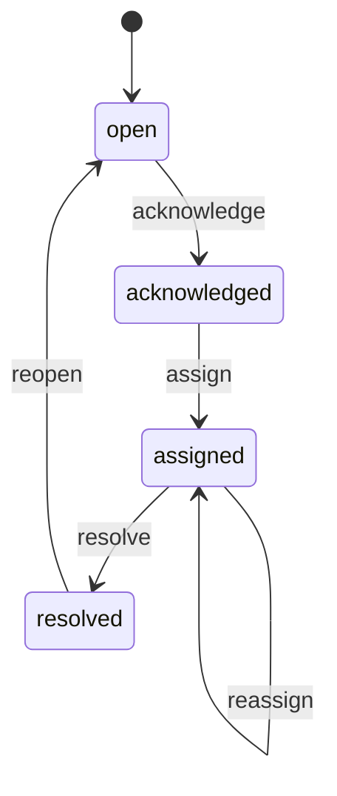

# Control Tower Critical Event Workflow v0.2

## Overview

Extends Control Tower critical event acknowledgement (v0.1) into an operational workflow with assignment, resolution, reopening, and append-only action history.

## States

| Status | Meaning |
|--------|---------|
| `open` | Derived critical event is active and not yet acknowledged in workflow |
| `acknowledged` | Operator acknowledged the event |
| `assigned` | Event assigned to a tenant user |
| `resolved` | Event closed with a resolution code |

Default summary status for events without a workflow row: **`open`**.

## Transitions



Invalid transitions return **409 Conflict** from the read-model service and are mapped to **409** at the API gateway.

## Persistence

| Table | Purpose |
|-------|---------|
| `control_tower.critical_event_acknowledgement` | Preserved v0.1 acknowledgement store (idempotent first-ack) |
| `control_tower.critical_event_workflow` | Materialized current workflow state per `(tenant_id, event_id)` |
| `control_tower.critical_event_action` | Append-only audit trail |

Migration `000021` backfills workflow/action rows from existing acknowledgement records without dropping v0.1 data.

## Audit history

Action types: `acknowledged`, `assigned`, `reassigned`, `resolved`, `reopened`.

Each action stores `tenant_id`, `event_id`, `action_type`, `actor_user_id`, `occurred_at`, and JSON `metadata` (assignment target, resolution code, comment).

State updates and action inserts occur in a **single PostgreSQL transaction** with `SELECT … FOR UPDATE` on the workflow row and optimistic `version` checks.

## API surface (public BFF)

| Method | Path |
|--------|------|
| POST | `/api/v1/control-tower/critical-events/{eventId}/acknowledge` |
| POST | `/api/v1/control-tower/critical-events/{eventId}/assign` |
| POST | `/api/v1/control-tower/critical-events/{eventId}/resolve` |
| POST | `/api/v1/control-tower/critical-events/{eventId}/reopen` |
| GET | `/api/v1/control-tower/critical-events/{eventId}/actions` |

Internal read-model paths mirror these under `/internal/v1/control-tower/…`.

## Tenant boundary

- Tenant identity is derived from verified JWT at the gateway (`X-Tenant-ID` re-set server-side).
- Client-supplied tenant/user headers are stripped.
- All SQL is scoped by `tenant_id`; primary keys include `(tenant_id, event_id)`.
- Unknown `eventId` for the authenticated tenant returns **404** without cross-tenant existence leaks.

## Authorization boundary

Backend RBAC (gateway):

| Capability | Roles (v0.2 backwards-compatible) |
|------------|-----------------------------------|
| VIEW / summary | `PLATFORM_ADMIN`, `CARRIER_DISPATCHER`, `SHIPPER_ADMIN`, `SHIPPER_LOGIST`, `FORWARDER_MANAGER` |
| ACKNOWLEDGE | same |
| ASSIGN / REOPEN | same |
| RESOLVE | same |

Frontend visibility follows the same role list; backend enforces independently.

## Resolution codes

Controlled enum: `issue_resolved`, `false_positive`, `duplicate`, `cancelled`, `other`.

Display labels are translated in web-admin i18n (RU primary).

## Architecture flow

```
web-admin
  → api-gateway (JWT, RBAC, eventId validation against derived events)
  → control-tower-read-model-service (trusted X-Tenant-ID / X-User-ID)
  → PostgreSQL (workflow + action + acknowledgement)
```

Actor attribution always comes from authenticated identity; request bodies never accept tenant or actor overrides.
