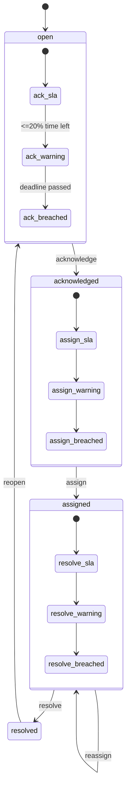

# Control Tower Exception Management v0.3

## Overview

Extends Critical Event Workflow v0.2 with operational exception management: priority, classification, business impact, deterministic SLA deadlines, calculated SLA status, internal escalation state, breach audit history, sorting, filters, and Control Tower KPIs.

No external alerting (PagerDuty, SMS, email, Slack, etc.) is implemented in v0.3.

## Workflow + SLA



SLA phases map to workflow status:

| Workflow status | Active SLA phase |
|-----------------|------------------|
| `open` | `acknowledgement` |
| `acknowledged` | `assignment` |
| `assigned` | `resolution` |
| `resolved` | none (SLA `completed`) |

## Priority model

| Code | Operational meaning |
|------|---------------------|
| `p1` | Critical / immediate intervention |
| `p2` | High / urgent |
| `p3` | Normal operational exception |
| `p4` | Low / informational follow-up |

Defaults on first materialization derive from event severity (`CRITICAL`→P1, `WARNING`→P2, `INFO`→P4, else P3).

## Exception categories

Fixed taxonomy (codes persisted, UI translated):

`delay`, `route_deviation`, `document_issue`, `vehicle_issue`, `driver_issue`, `slot_issue`, `delivery_issue`, `pickup_issue`, `billing_issue`, `integration_issue`, `data_quality`, `other`.

Default category derives from derived event type when a workflow row is first ensured.

## Business impact

Separate from priority: `none`, `low`, `medium`, `high`, `critical`.

## SLA policy (product defaults)

Central definition: `domain/exception.go` → `defaultSLAPolicies`.

| Priority | Ack | Assign | Resolve |
|----------|-----|--------|---------|
| P1 | 5m | 10m | 60m |
| P2 | 15m | 30m | 4h |
| P3 | 60m | 120m | 24h |
| P4 | 240m | 480m | 72h |

Deadlines are stored as `acknowledge_due_at`, `assignment_due_at`, `resolution_due_at` (UTC, server-generated).

### Priority change semantics

When priority/category/impact is updated **before resolution**:

- Unresolved SLA deadlines are recalculated from `exception_activated_at` using the new policy.
- Completed phases retain historical completion timestamps; their due timestamps are not rewritten.
- Breach timestamp columns are not cleared by priority change (breach history remains in `critical_event_action`).

On **reopen**, exception activation time resets, deadlines recalculate, breach marker columns clear; action-table history is preserved.

## SLA status (calculated)

| Status | Rule |
|--------|------|
| `within_sla` | Active phase deadline not yet in warning window |
| `warning` | ≤ 20% of phase window remaining |
| `breached` | Phase deadline passed and phase not completed |
| `completed` | Phase completed or workflow resolved |

`remainingSeconds` is computed at read time from server `now`; not persisted.

## Escalation lifecycle

Internal persisted level on workflow row:

| Level | Mapping |
|-------|---------|
| `none` | Within SLA |
| `level_1` | SLA `warning` |
| `level_2` | SLA `breached` |
| `level_3` | P1 + resolution phase breached |

Escalation changes are auditable via `escalation_changed` actions.

## Breach recording

Idempotent breach markers:

- `ack_sla_breached_at`, `assign_sla_breached_at`, `resolve_sla_breached_at`
- Append-only actions: `ack_sla_breached`, `assign_sla_breached`, `resolve_sla_breached`

Breach actions are inserted once per phase per workflow cycle.

## Sorting (summary critical events)

1. Unresolved before resolved
2. P1 → P2 → P3 → P4
3. SLA breached → warning → within SLA
4. Nearest deadline (`remainingSeconds` ascending)
5. `occurredAt` descending (tie-break)

## Filters

Query parameters (additive to v0.2 shipment filters):

`event_status`, `priority`, `exception_category`, `business_impact`, `event_sla_status`, `escalation_level`, `unassigned_only`.

## API

| Method | Path |
|--------|------|
| PATCH | `/api/v1/control-tower/critical-events/{eventId}/exception` |

Body (at least one field):

```json
{
  "priority": "p1",
  "category": "delay",
  "businessImpact": "high"
}
```

Summary response adds optional fields on each `ControlTowerEvent` and `exceptionKpi` block (backwards compatible).

## RBAC

| Capability | Roles |
|------------|-------|
| MANAGE_EXCEPTION | Same as Control Tower access roles (v0.2 compatible) |

Actor and tenant always from verified auth context; never from request body.

## Persistence (migration 000022)

Extended columns on `critical_event_workflow`:

- `priority`, `exception_category`, `business_impact`
- `exception_activated_at`
- `acknowledge_due_at`, `assignment_due_at`, `resolution_due_at`
- `escalation_level`
- breach marker timestamps

Indexes: `(tenant_id, priority)`, `(tenant_id, resolution_due_at)`, `(tenant_id, escalation_level)`.

## Time semantics

- All persisted timestamps are server-generated UTC.
- SLA evaluation uses read-model server time during lookup/summary enrichment.
- Frontend countdown uses deadline ISO + local 30s display timer; no per-second API polling.

## Performance

- Batch `EnsureExceptionWorkflows` + batch `LookupWorkflows` — no N+1 per event.
- SLA processing runs during workflow lookup in one repository round-trip per summary refresh.

## Tenant boundary

Unchanged from v0.2: all queries scoped by `(tenant_id, event_id)`; cross-tenant IDOR returns 404.
