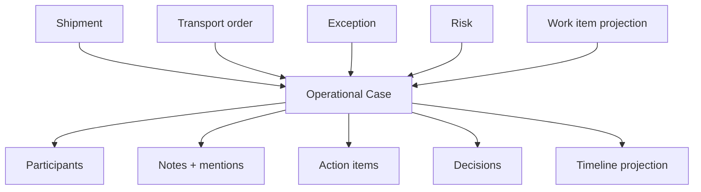
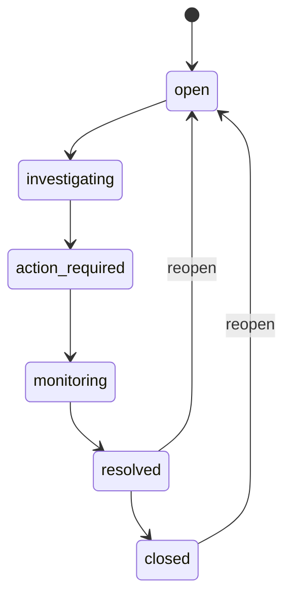

# Control Tower Operational Case Management v0.6 — Architecture

Pilot branch: `feat/control-tower-operational-case-management-v0.6`  
Baseline: v0.5.1 operator workspace (`03e3c754c75f01dd58b021a97a8288b3251d6d4c`)

## Purpose

Extend Control Tower from an operator work queue into **Operational Case Management** — a coordination layer that groups shipments, transport orders, risks, exceptions, and work items without replacing their canonical models.

## Aggregate model

Canonical persistence remains authoritative:

| Domain | Canonical store |
|--------|-----------------|
| Exception workflow | `control_tower.critical_event_workflow` |
| Predictive risk | `control_tower.shipment_risk` |
| Work queue | SQL projection (no `operator_work_item` table) |
| Case coordination | `control_tower.operational_case*` (new) |

## Case identity

| Field | Semantics |
|-------|-----------|
| `id` | Immutable UUID primary key |
| `reference` | Human-readable `CT-YYYY-NNNNNN`, tenant-scoped via PostgreSQL counter |
| Search | Reference, title, linked shipment/order refs |

Reference generation uses `operational_case_reference_counter` with `INSERT … ON CONFLICT DO UPDATE` — no `MAX+1` race.

## Status lifecycle

Case status is **coordination state** — not mirrored from linked exception/risk status.

## Active work item uniqueness

**Rule:** An active exception/risk/work item may belong to **at most one active case**.

- Enforced via `operational_case_active_work_link` + server validation
- Conflict → **409** with reference to existing case when authorized
- Same shipment only → weak duplicate warning (no auto-merge)

## Severity

| Field | Role |
|-------|------|
| `derivedSeverity` | Computed from linked P1/P2, SLA breach, critical/high risk |
| `effectiveSeverity` | Operator-visible severity |
| `severityOverride` | True when operator overrides derived value |

Derived value is preserved when overridden.

## Ownership vs participants

| Concept | Field | Notes |
|---------|-------|-------|
| Case owner | `owner_user_id` | Coordination responsibility |
| Work item owner | exception `assigned_to` / risk `owner_user_id` | Separate; not mass-reassigned on case claim |
| Participants | `operational_case_participant` | Roles: owner, collaborator, observer |

## Collaboration primitives

### Notes

- Table: `operational_case_note`
- Visibility: `internal` (schema ready for `customer_visible`; not exposed in v0.6)
- Mentions: `operational_case_note_mention` with resolved user IDs only
- Author may edit own note; `edited_at` preserved

### Action items

Lightweight tasks — not a project-management subsystem.

Statuses: `open`, `in_progress`, `done`, `cancelled`  
Optional `due_at` (UTC); overdue/ due-soon are UI-derived.

### Decisions

Append-only log (`operational_case_decision`) — operational decisions with optional rationale.

## Resolution and close

Resolution requires controlled `resolutionCode`:

- `operational_issue_resolved`, `risk_cleared`, `shipment_replanned`, …

**Safety rule:** Resolving/closing a case does **not** auto-resolve linked exceptions/risks. UI warns when active linked work remains.

## Timeline

Unified chronological projection from:

- Case-native events (`operational_case_event`)
- Linked workflow/risk/handoff signals (read-only projection)

Endpoint: `GET /api/v1/control-tower/cases/{caseId}/timeline` (paginated)

## Database (migration 000025)

Additive tables in `control_tower` schema:

- `operational_case_reference_counter`
- `operational_case`
- `operational_case_link`
- `operational_case_active_work_link`
- `operational_case_participant`
- `operational_case_note` + `operational_case_note_mention`
- `operational_case_action_item`
- `operational_case_decision`
- `operational_case_event`

`saved_view.workspace_scope` extended: `work_items` | `cases` (backwards compatible).

Migration **not applied** in pilot — remains alongside unapplied 000024.

## API surface (gateway)

Public prefix: `/api/v1/control-tower/cases`

Actor/tenant from JWT — never from browser body.

Key endpoints: list, create, detail, patch, claim/assign/unassign, links, notes, actions, decisions, resolve/close/reopen, timeline, kpi, duplicates.

## Workspace integration

Operator workspace gains **Cases** tab (alongside Work):

- Case list with presets: my, unassigned, critical, action_required, monitoring, resolved, closed
- Separate case KPI — work-item KPI unchanged (no double-count)
- Work item drawer shows active case badge (`CT-YYYY-NNNNNN`) or create/add-to-case flow

## Concurrency

- Optimistic `version` on `operational_case`
- Row locks on claim/assign/link mutations
- Deterministic **409** on version/ownership/active-link conflicts

## RBAC (minimal extension)

Permissions: `VIEW_CASE`, `CREATE_CASE`, `MANAGE_CASE`, `ASSIGN_CASE`, `ADD_CASE_NOTE`, `MANAGE_CASE_ACTIONS`, `MANAGE_CASE_PARTICIPANTS`, `RESOLVE_CASE`

## Performance

- Case list: batched queries; no per-row timeline load
- `last_activity_at` maintained on case mutations
- Detail view loads linked entities on open

## Future extension points

- Policy-based automatic case creation (not v0.6 — manual + create-from-work-item only)
- Document link type when stable document reference model exists
- Full case merge (duplicate warning + link preferred in v0.6)
- Participant HTTP routes in gateway (repository ready)
- Saved views filter schema v2 for case-specific filters
- SLA-at-risk / overdue-actions list presets (partial repository support)

## Known v0.6 limitations

- No document linking
- No external notifications for @mentions
- Derived severity/health enrichment is incremental
- Tracking: `shipment.updated_at` is not GPS; ETA/slot windows not fabricated
- Read-model/database required — mutations fail cleanly when unavailable
