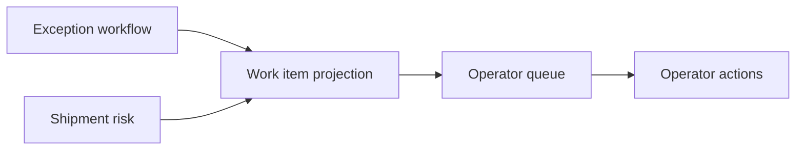
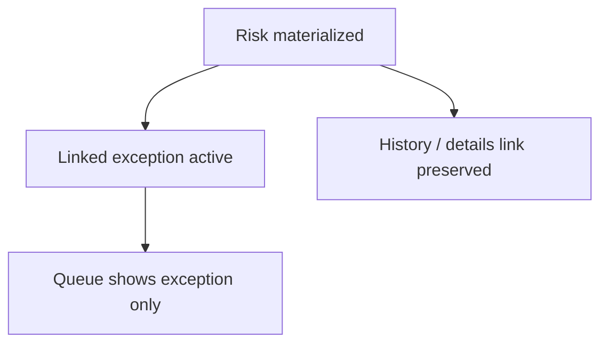
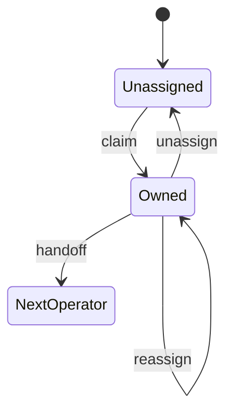

# Control Tower Operator Workspace v0.5 — Architecture

Pilot branch: `feat/control-tower-operator-workspace-v0.5`  
Baseline: v0.4 shipment risk (`caa4cd5c480dba587270483d5e6601288398d428`)

## Purpose

Extend Control Tower into a daily operator workspace by projecting **actual exceptions** and **predictive risks** into a unified queue without merging their canonical persistence.

## Projection model

- **Exception canonical state**: `control_tower.critical_event_workflow`
- **Risk canonical state**: `control_tower.shipment_risk`
- **No** `operator_work_item` table — queue is query/projection based

### Work item identity

| Field | Example |
|-------|---------|
| `id` | `exception:<eventId>` or `risk:<riskKey>` |
| `itemType` | `exception` \| `risk` |
| `sourceId` | domain-native id |

## Unified ordering (server-side)

Deterministic precedence groups:

1. Exception with SLA breach
2. P1 exception
3. Exception with SLA warning
4. Critical predictive risk
5. P2 exception
6. High predictive risk
7. Other unresolved exceptions (by urgency)
8. Medium / low risks

Within groups: escalation → nearest deadline → priority → risk score → oldest created → id tie-break.

## Urgency (derived, not editable)

| Signal | Urgency |
|--------|---------|
| SLA breached + P1 | critical |
| P1 | critical |
| SLA warning / P2 / escalation | high |
| P3 | normal |
| Critical risk | critical/high |
| High risk | high |

Does **not** overwrite exception priority, risk level, or business impact.

## Materialized risk deduplication

Workload KPI counts each operational item once.

## Ownership

| Domain | Owner field | Claim semantics |
|--------|-------------|-----------------|
| Exception | `assigned_to_user_id` | Ack + assign to actor |
| Risk | `owner_user_id` | Operational owner only — not lifecycle |

Risk lifecycle remains: active → acknowledged → mitigating → cleared/materialized.

## Concurrency

Claim/assign uses row locks + version checks. Second claimant receives **409 Conflict** with machine-readable `field: owner`.

## Bulk actions

- Endpoint: `POST /api/v1/control-tower/work-items/bulk-action`
- Max batch: **100** (`BulkActionMaxBatch`)
- Per-item atomic outcomes; partial success explicit
- Supported: claim, assign, unassign, acknowledge (risk)

## Saved views

- Tables: `control_tower.saved_view`, `control_tower.user_workspace_preference`
- Scopes: `private`, `shared` (tenant-bound)
- `filterSchemaVersion: 1` — server validates allowed filter keys only

## Shift handoff

- Tables: `control_tower.shift_handoff`, `control_tower.shift_handoff_item`
- Transfers ownership per item; partial failures recorded per item
- Note stored as plain operational text (sanitized length)

## RBAC (gateway)

Mapped onto existing Control Tower roles:

- `VIEW_WORKSPACE`, `CLAIM_WORK`, `ASSIGN_WORK`, `BULK_MANAGE_WORK`
- `VIEW_TEAM_WORKLOAD`, `MANAGE_SHARED_VIEWS`, `CREATE_HANDOFF`

## API layers

| Public (BFF) | Internal (read model) |
|--------------|----------------------|
| `/api/v1/control-tower/work-items` | `/internal/v1/control-tower/work-items` |
| `/api/v1/control-tower/workload` | `/internal/v1/control-tower/workload` |
| `/api/v1/control-tower/views` | `/internal/v1/control-tower/views` |
| `/api/v1/control-tower/handoffs` | `/internal/v1/control-tower/handoffs` |

User display names enriched in gateway via identity `/v1/users`.

## Performance

- Queue bounded by page limit (max 100)
- Workload/KPI currently scans active projection in-process (acceptable for pilot; aggregate SQL follow-up)
- No N+1 owner/shipment lookup in gateway list — batch user map + shipment numbers

## Guardrails (carried from v0.4)

- **Tracking proxy**: `shipment.updated_at` = staleness proxy, not GPS heartbeat
- **Slot data**: status only — no fabricated slot windows
- **Read model required**: workspace mutations fail safely when `ControlTower.ReadModel` disabled

## Migration

`000024_add_control_tower_operator_workspace_v0.5` — **not applied** in this pilot (product-only).

Adds: risk ownership columns, saved views, handoffs, extended action types.

## Diagram: ownership flow

## OpenAPI

Extended additively in `packages/openapi/openapi.yaml`.  
`openapi.json` sync deferred if generation is test-coupled (FOLLOW_UP).
