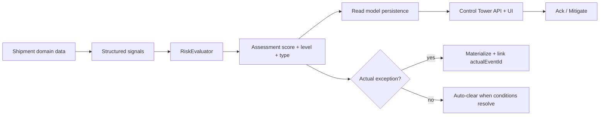
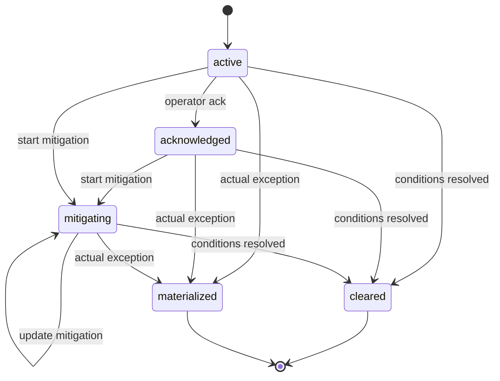
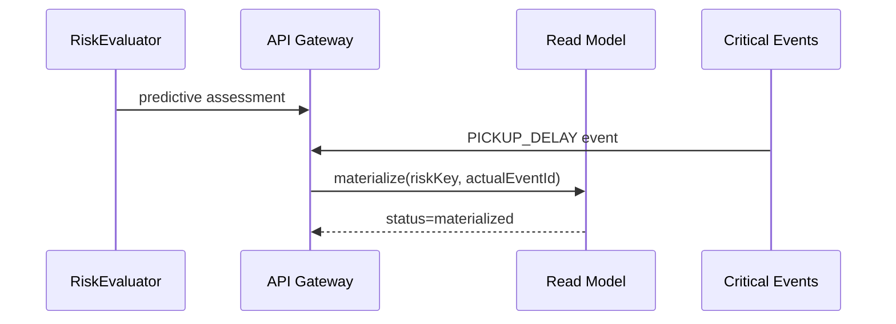

# Control Tower Shipment Risk & Predictive Exceptions v0.4

Deterministic, explainable shipment risk prediction extending Exception Management v0.3.

## Flow

## Risk model

| Level | Score band |
|-------|------------|
| none | 0–19 |
| low | 20–39 |
| medium | 40–59 |
| high | 60–79 |
| critical | 80–100 |

Score = sum of active signal weights (capped at 100). No ML confidence field.

## Predicted exception types (v0.4)

Implemented when source data exists:

- `pickup_delay_risk`
- `delivery_delay_risk`
- `slot_miss_risk` (status + deadline proximity; no slot time windows)
- `tracking_loss_risk` (stale `updated_at` proxy for in-transit shipments)
- `driver_assignment_risk`
- `vehicle_assignment_risk`

Reserved for future rules (not fabricated in v0.4):

- `route_deviation_risk`, `temperature_risk`, `capacity_risk`, `customs_risk`, `border_delay_risk`, `weather_risk`

## Signals

Each signal: `signalCode`, `severity`, `weight`, `observedAt`, `source`, optional `value`, `explanationKey`.

Rules use server-side shipment/status/SLA timestamps only. ETA-based delivery delay reasons are **not** emitted when ETA is unavailable.

## Lifecycle

| Status | Meaning |
|--------|---------|
| active | Risk condition currently present |
| acknowledged | Operator has seen the risk |
| mitigating | Operator started mitigation |
| cleared | Condition resolved without actual exception |
| materialized | Predicted risk became an actual critical event |

Predictive risks are distinct from v0.3 operational exceptions (`delay` vs `delivery_delay_risk`).

## Materialization

When a derived critical event matches `MaterializationMap` (e.g. `PICKUP_DELAY` → `pickup_delay_risk`):

- `status = materialized`
- `actual_event_id` set
- idempotent update (no duplicate actual exceptions from repeated evaluation)

## Clearing

When evaluation no longer produces a risk key, backend auto-clears with `clear_reason = conditions_resolved`. History preserved via assessments and actions.

## Mitigation

Operator action stores `mitigationCode` + optional comment. Codes are persisted, not translated labels. No automated execution in v0.4.

## Persistence (migration 000023)

- `control_tower.shipment_risk` — current risk state per tenant/shipment/type
- `control_tower.shipment_risk_assessment` — historical snapshots
- `control_tower.shipment_risk_signal` — explainability per assessment
- `control_tower.shipment_risk_action` — append-only operator/system actions

Deduplication: new assessment row only on meaningful change (level/type band, ≥10 score delta, lifecycle change).

## Evaluation trigger

On-demand during Control Tower summary computation:

1. Evaluate active shipments via `RiskEvaluator`
2. Sync evaluations + materializations to read model
3. Load persisted risks for API response

Future: dedicated scheduler hook; no new distributed scheduler in v0.4.

## API (gateway BFF)

- `GET /api/v1/control-tower/summary` — additive `riskKpi`, `shipmentRisks`
- `GET /api/v1/control-tower/risks`
- `GET /api/v1/control-tower/risks/{riskId}`
- `POST /api/v1/control-tower/risks/{riskId}/acknowledge`
- `POST /api/v1/control-tower/risks/{riskId}/mitigate`

## Security

- Tenant from verified auth context only
- RBAC: `CanViewRisk`, `CanAckRisk`, `CanMitigateRisk` (same roles as Control Tower v0.3)
- System actor UUID for automated clear/materialize actions

## Performance

- Batch evaluation over active shipment population in summary path
- Single sync + list query for risks (no N+1 per shipment in UI path)
- Assessments written only on meaningful change

## Sorting

Risks: critical → high → medium → low → nearest threatened deadline → score desc → stable `riskId`.

Actual breached exceptions (v0.3) remain visually primary; predictive low/medium risks are secondary.

## Future ML extension point

`RiskEvaluator` interface in gateway package can be swapped for an ML implementation without changing frontend/API contracts. v0.4 uses deterministic `risk.Evaluator` only.

## Diagrams

### Risk lifecycle

### Materialization

