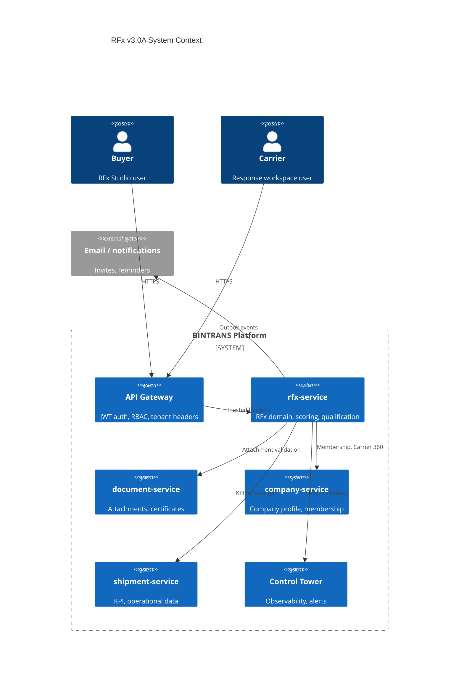
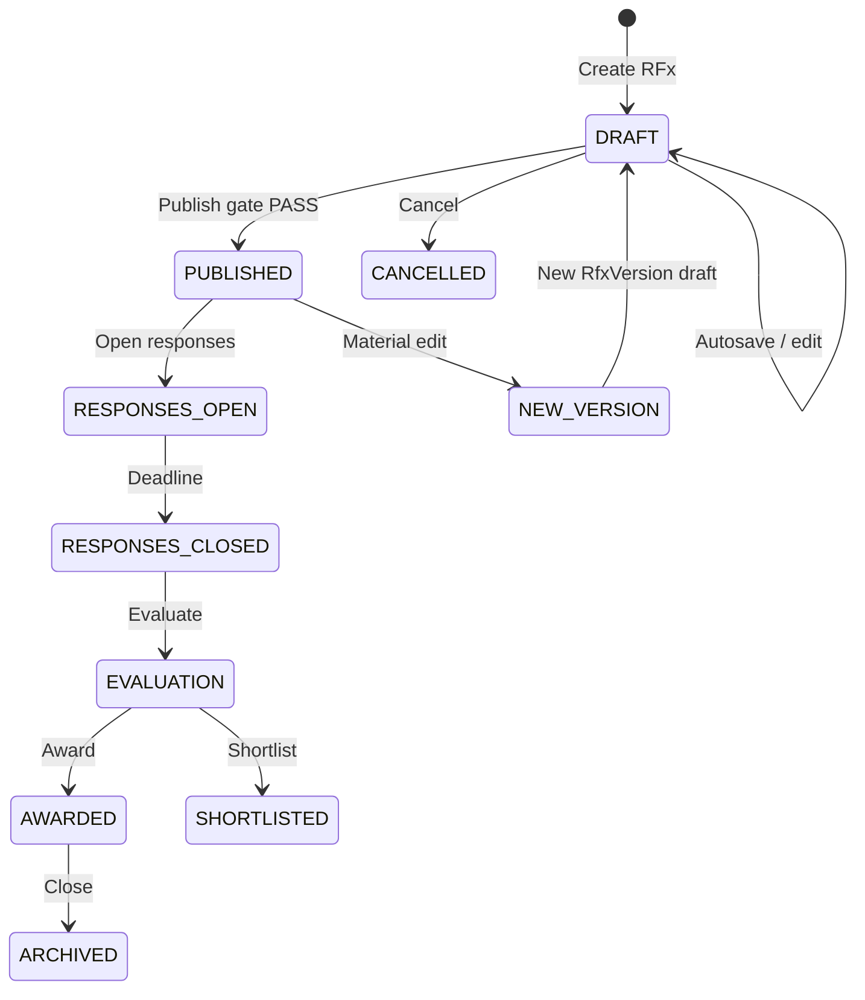
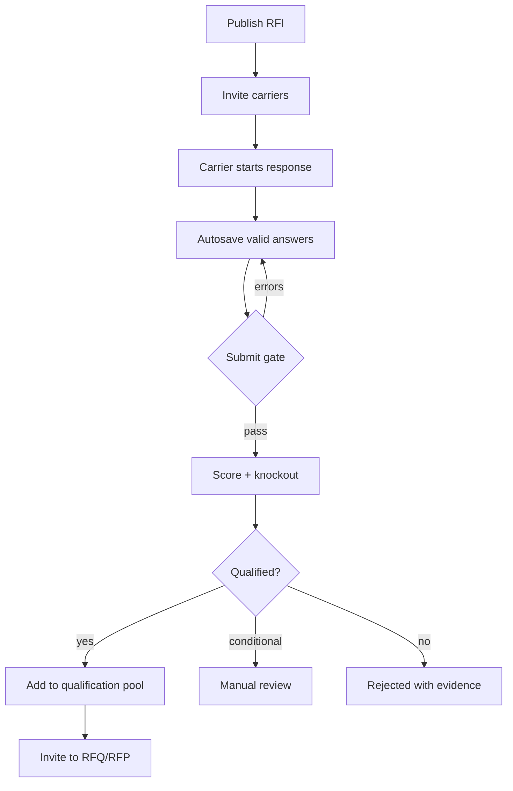
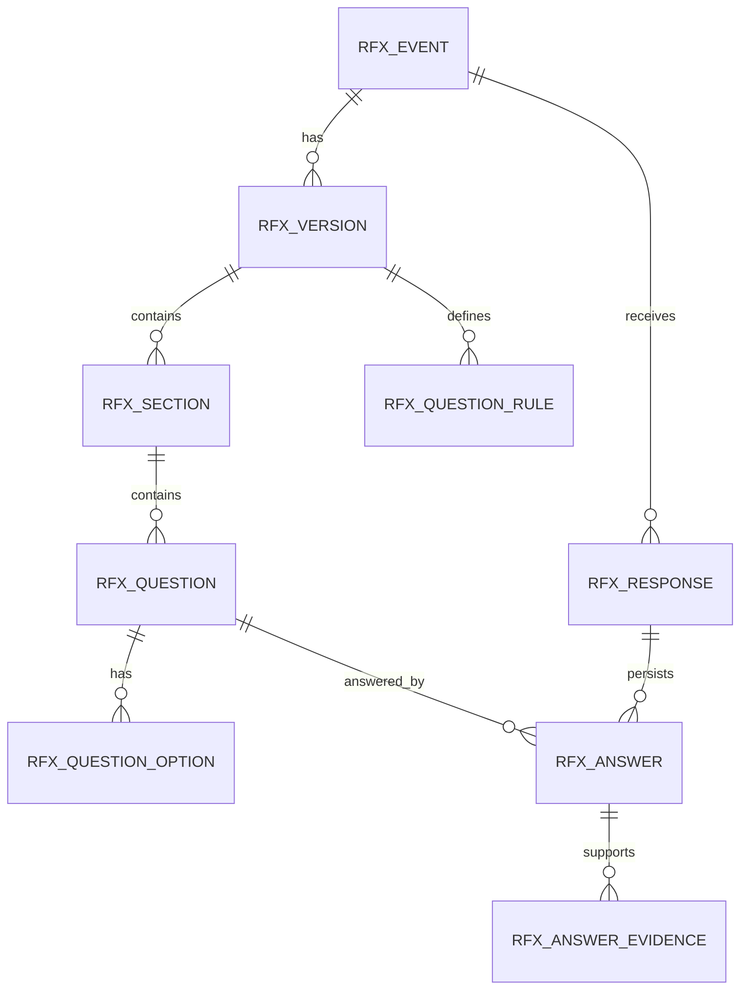
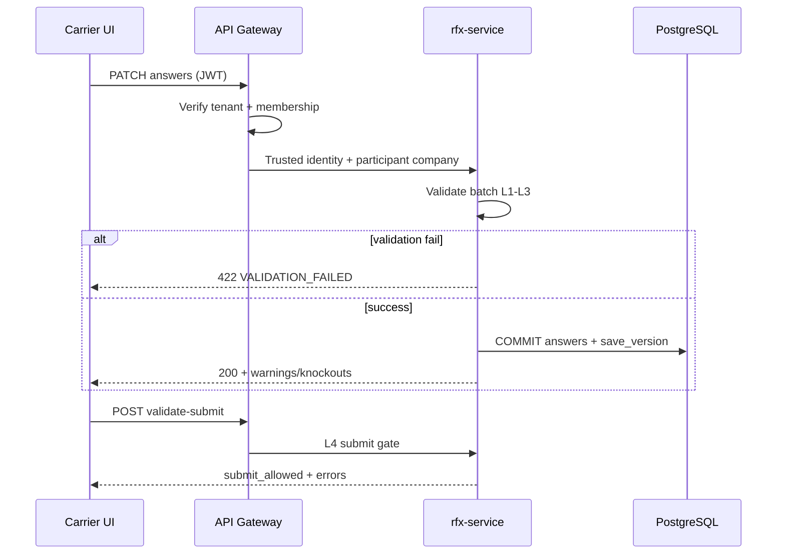
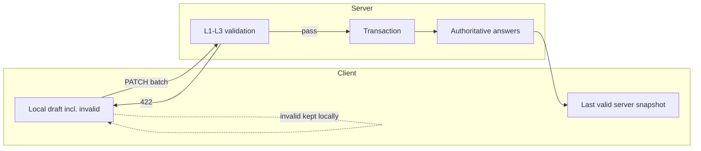
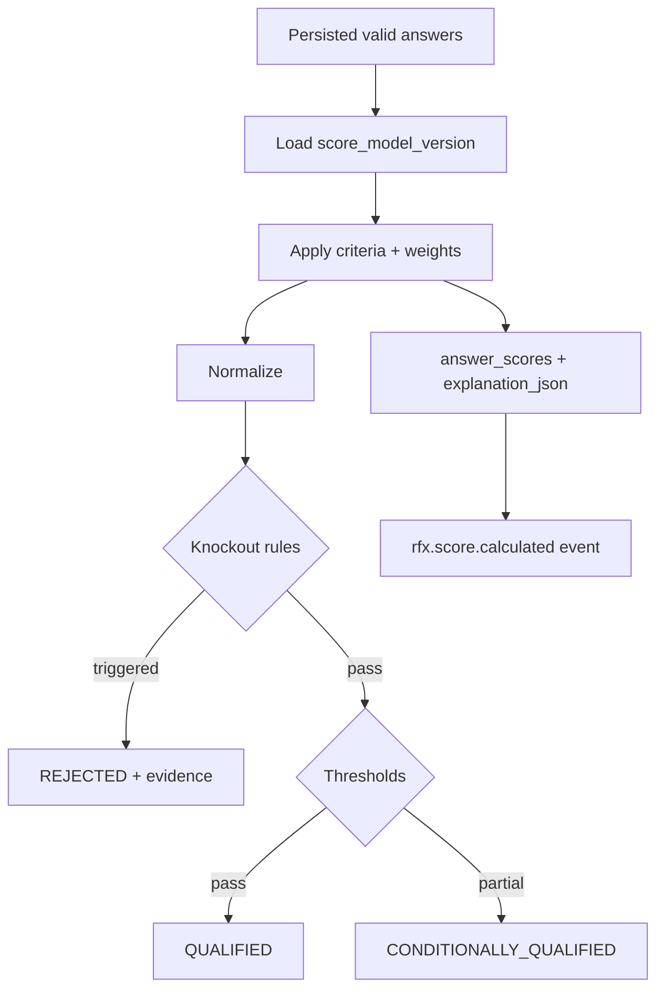
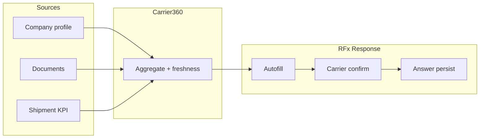
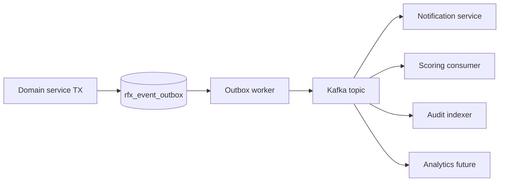
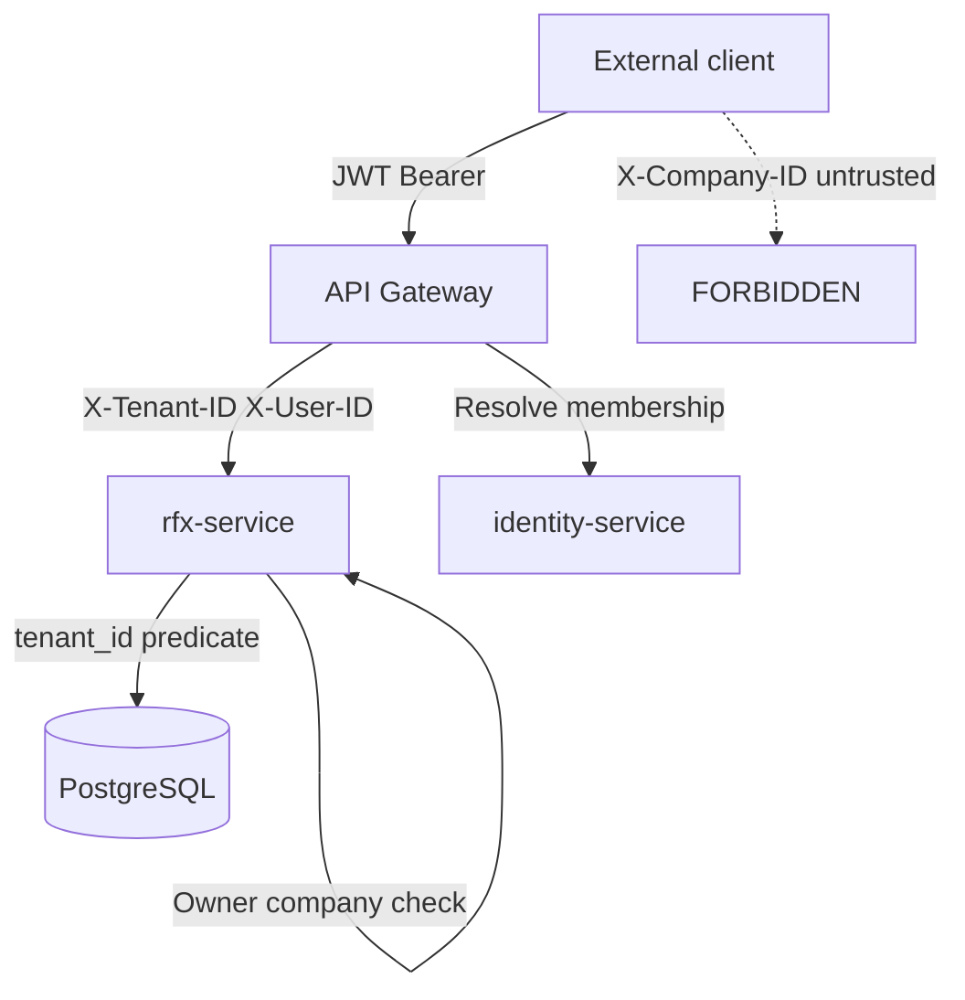

# RFx v3.0A — Architecture Diagrams

**Status:** Architecture draft  
**Format:** Mermaid (render in GitHub / compatible viewers)

---

## 1. System Context

---

## 2. RFx Lifecycle

---

## 3. RFI Qualification Flow

---

## 4. Questionnaire Domain

---

## 5. Carrier Response Flow

---

## 6. Validation / Autosave Flow

---

## 7. Scoring Flow

---

## 8. Carrier 360 Flow

---

## 9. Event Flow

---

## 10. Security / RBAC Boundary

**Flags:** `CLIENT_SUPPLIED_COMPANY_AUTHORITY=FORBIDDEN`, `TENANT_AUTHORITY=SERVER_VERIFIED`, `CROSS_TENANT_SPOOF=DENIED`.

---

## Diagram index

| # | Diagram | Section |
|---|---|---|
| 1 | System Context | §1 |
| 2 | RFx Lifecycle | §2 |
| 3 | RFI Qualification Flow | §3 |
| 4 | Questionnaire Domain | §4 |
| 5 | Carrier Response Flow | §5 |
| 6 | Validation / Autosave | §6 |
| 7 | Scoring Flow | §7 |
| 8 | Carrier 360 Flow | §8 |
| 9 | Event Flow | §9 |
| 10 | Security / RBAC | §10 |

---

## References

- [RFX_V3_DOMAIN_MODEL.md](./RFX_V3_DOMAIN_MODEL.md)
- [RFX_V3_STATE_MACHINES.md](./RFX_V3_STATE_MACHINES.md)
- [RFX_V3_EVENTS.md](./RFX_V3_EVENTS.md)
- [RFX_V3_SECURITY.md](./RFX_V3_SECURITY.md)
