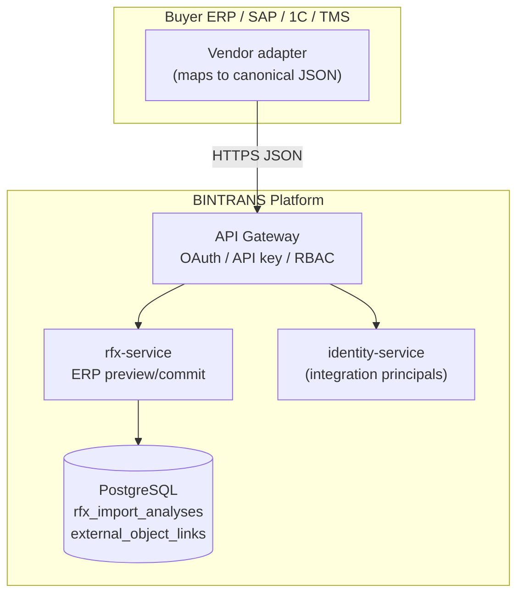
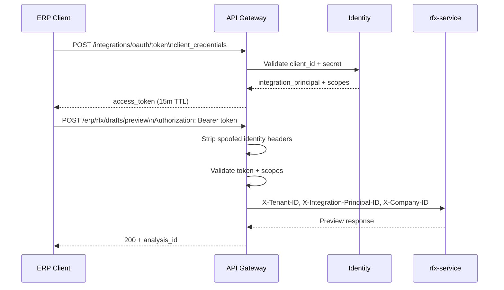
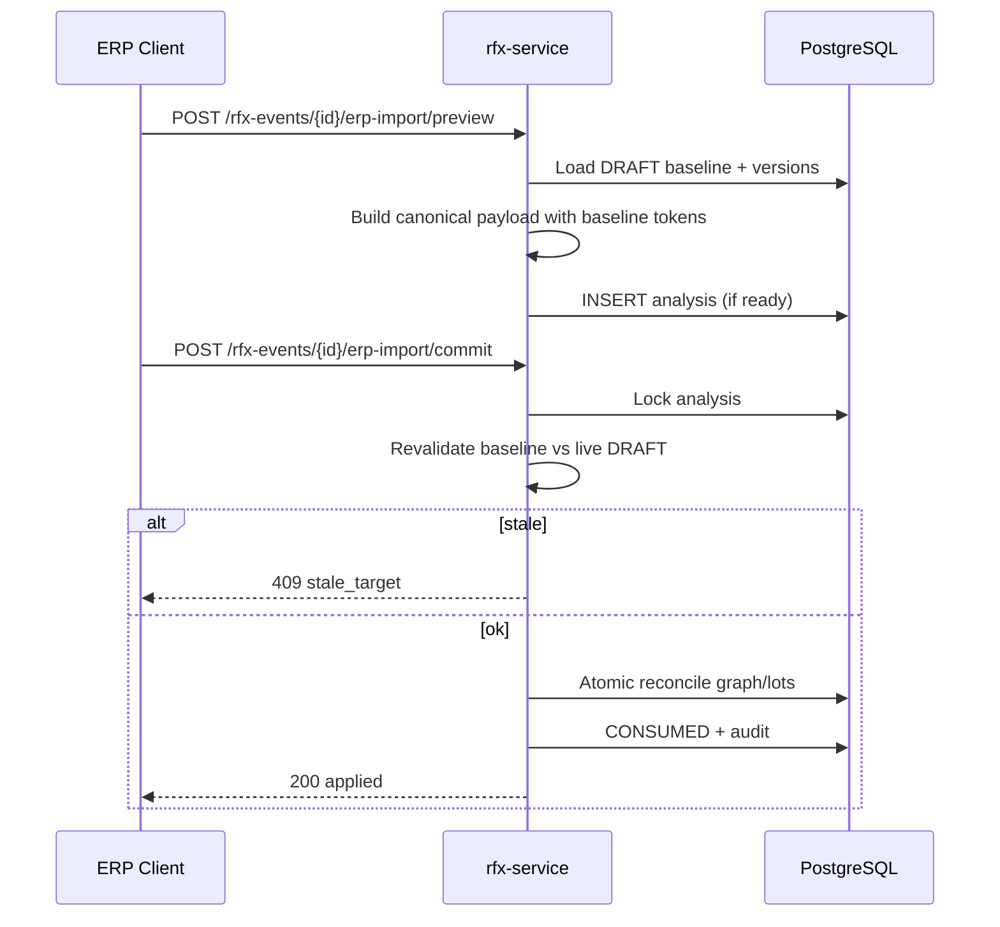
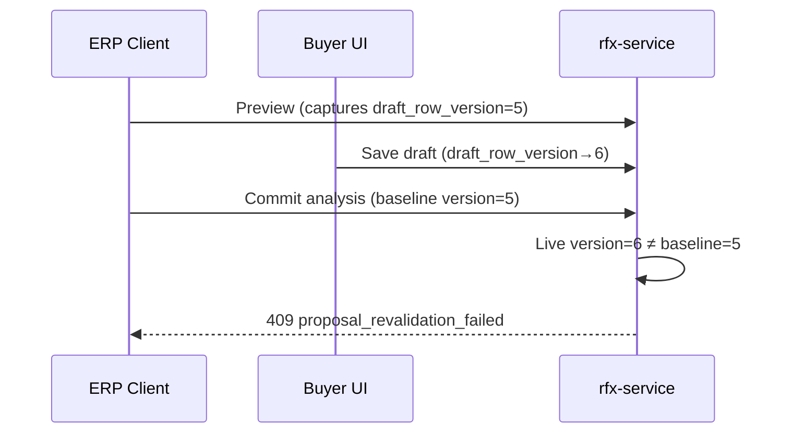
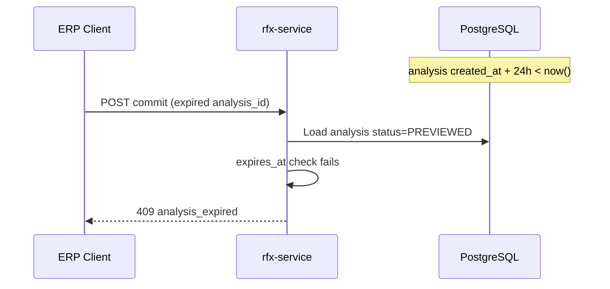
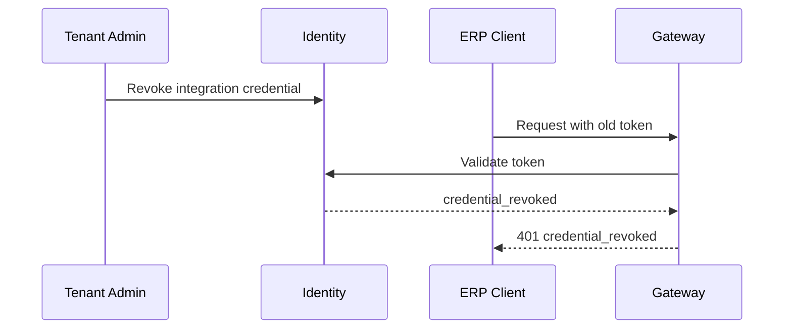
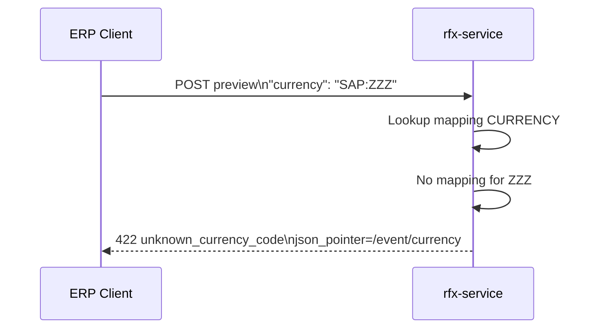
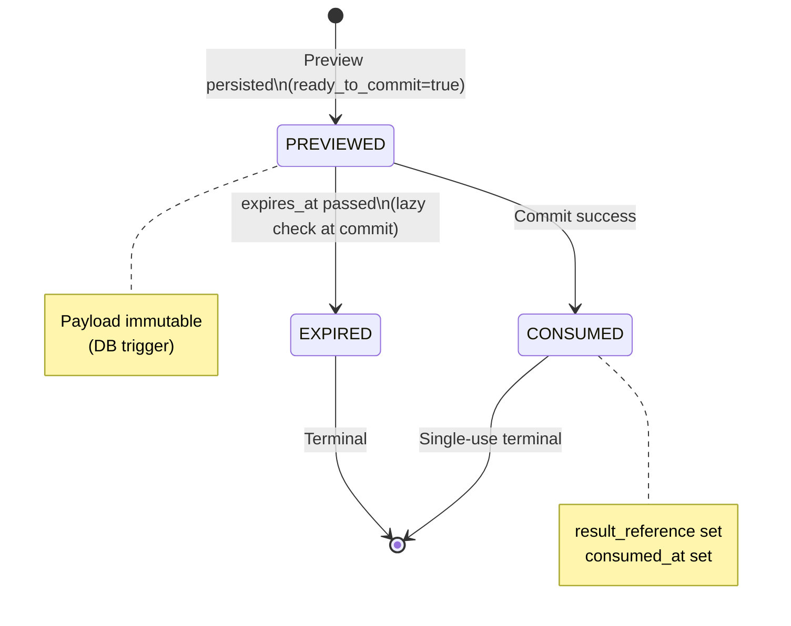

# RFx v3.0E7 Phase 2 — ERP API Diagrams

**Status:** Architecture freeze  
**Parent:** [RFX_V3_0E7_ERP_API.md](./RFX_V3_0E7_ERP_API.md)

---

## 1. System context



---

## 2. Machine authentication



---

## 3. CREATE Preview → Commit

```mermaid
sequenceDiagram
    participant ERP as ERP Client
    participant GW as Gateway
    participant RFx as rfx-service
    participant DB as PostgreSQL

    ERP->>GW: POST .../drafts/preview\nBINTRANS_RFX_ERP_JSON_V1
    GW->>RFx: Forward authenticated
    RFx->>RFx: Map reference codes
    RFx->>RFx: Validate domain rules
    alt ready_to_commit
        RFx->>DB: INSERT rfx_import_analyses\nPREVIEWED, hash, TTL 24h
        RFx-->>ERP: analysis_id
    else blocking errors
        RFx-->>ERP: 422 + issues
    end

    ERP->>GW: POST .../drafts/commit\nanalysis_id + Idempotency-Key
    GW->>RFx: Forward
    RFx->>DB: LOCK analysis FOR UPDATE
    RFx->>RFx: Verify hash + binding
    RFx->>DB: BEGIN; CREATE event; reconcile graph/lots
    RFx->>DB: INSERT external_object_link
    RFx->>DB: Mark CONSUMED; idempotency record
    RFx->>DB: COMMIT
    RFx-->>ERP: 201 rfx_event_id
```

---

## 4. UPDATE Preview → Commit



---

## 5. Retry after timeout

```mermaid
sequenceDiagram
    participant ERP as ERP Client
    participant RFx as rfx-service
    participant DB as PostgreSQL

    ERP->>RFx: POST commit (Idempotency-Key: K1)
    RFx->>DB: Success; store idempotency response
    Note over ERP,RFx: Network timeout before response

    ERP->>RFx: POST commit (Idempotency-Key: K1, same body)
    RFx->>DB: Find idempotency record scope+K1
    RFx-->>ERP: Replay stored 201 (no duplicate event)
```

---

## 6. Concurrent ERP / UI update



---

## 7. Expired analysis



---

## 8. Credential revocation



---

## 9. Mapping failure (fail closed)



---

## 10. Analysis state machine


