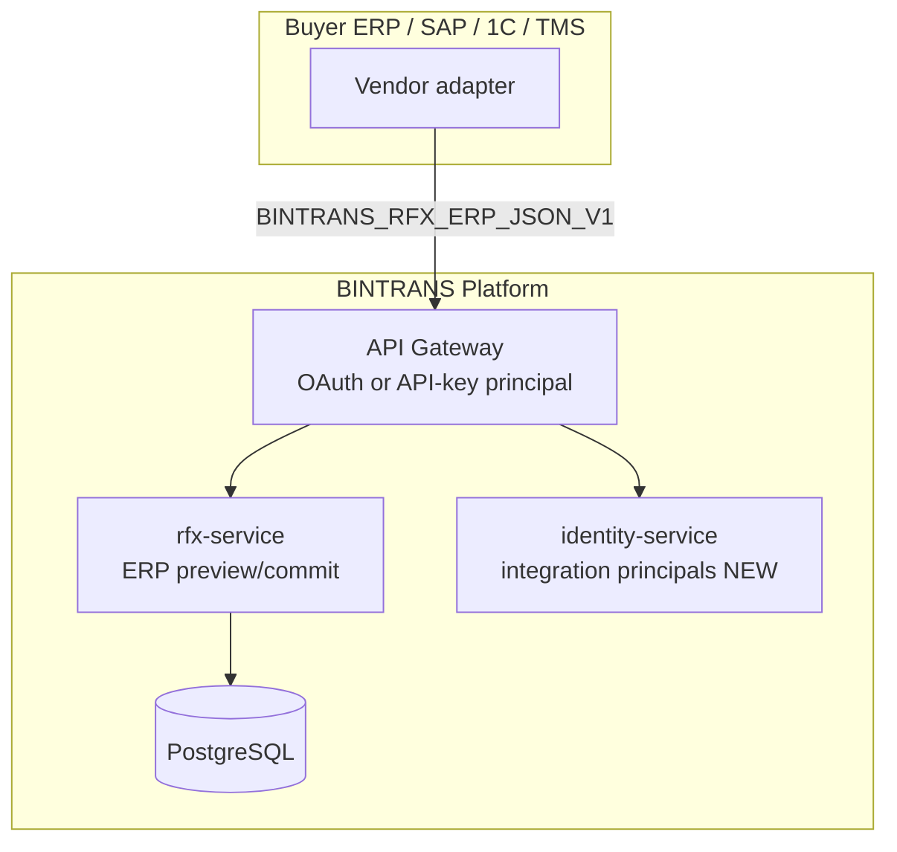
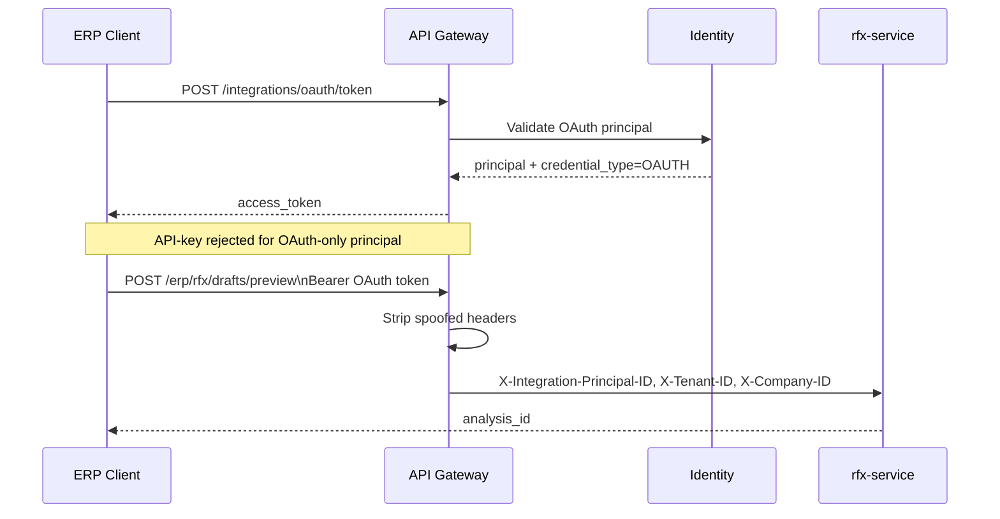
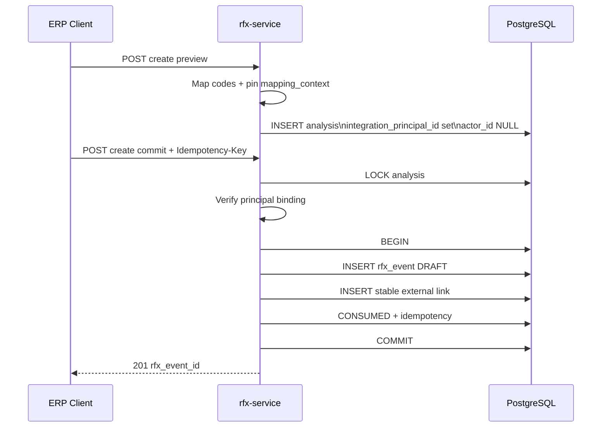
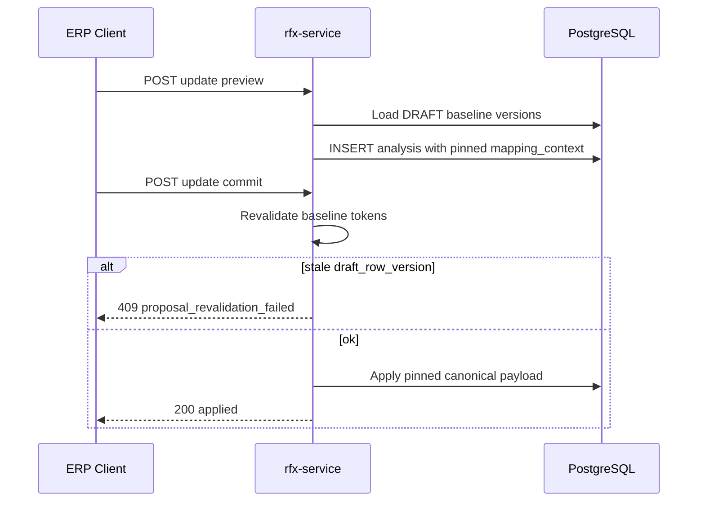
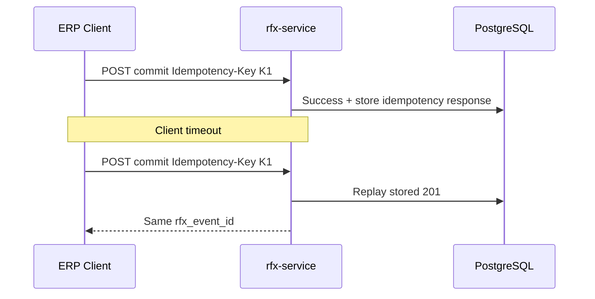
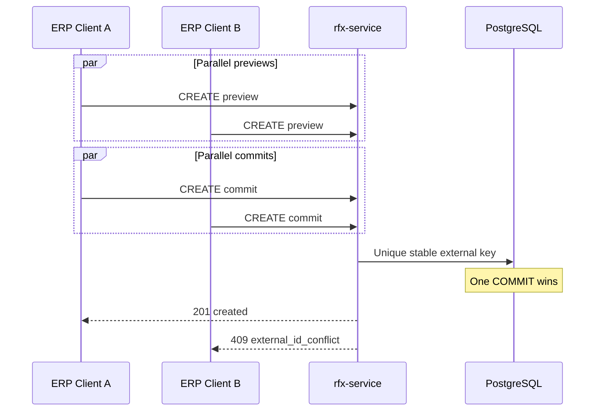
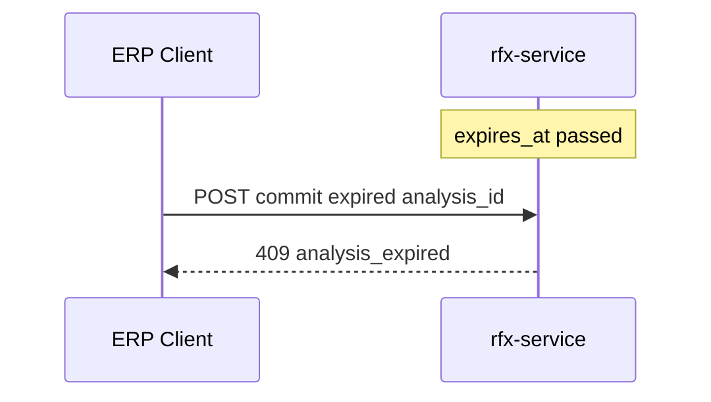
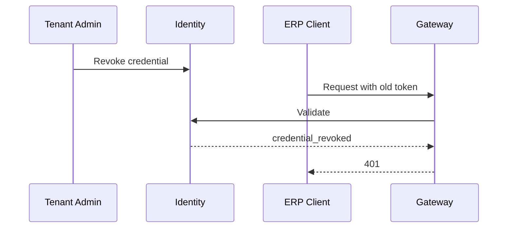
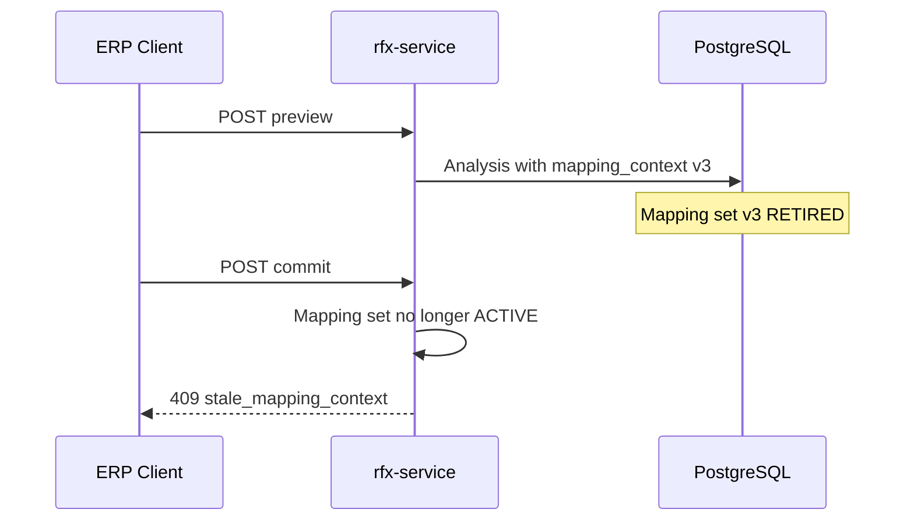
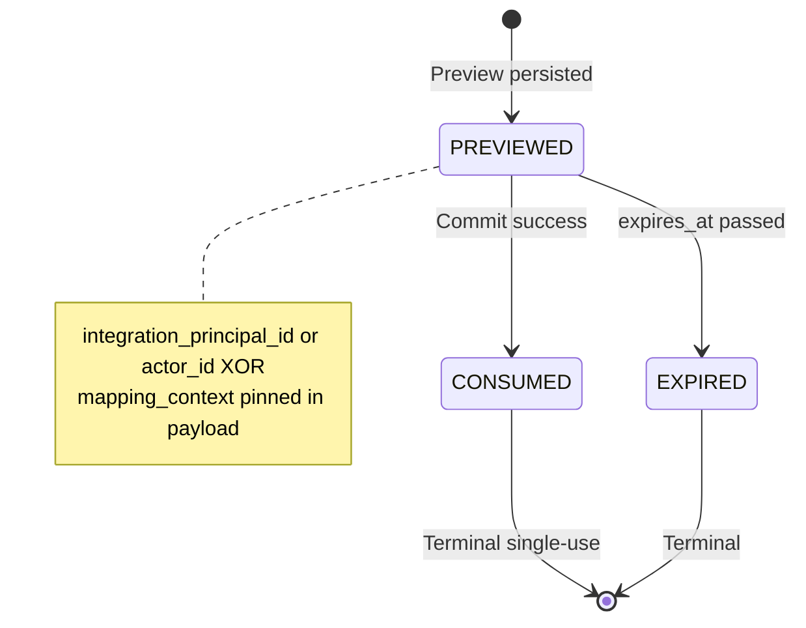

# RFx v3.0E7 Phase 2 — ERP API Diagrams

**Status:** REMEDIATION_COMPLETE_PENDING_RE_REVIEW
**Parent:** [RFX_V3_0E7_ERP_API.md](./RFX_V3_0E7_ERP_API.md)
**Validation:** `MERMAID_VALIDATION=MANUAL_ONLY` (no repository automated validator)

---

## 1. System context

---

## 2. Machine authentication (no downgrade)

---

## 3. CREATE Preview → Commit (stable identity)

---

## 4. UPDATE Preview → Commit

---

## 5. Retry after timeout

---

## 6. Concurrent CREATE (winner/loser)

---

## 7. Expired analysis

---

## 8. Credential revocation

---

## 9. Mapping version pin / stale mapping

---

## 10. Analysis state machine

