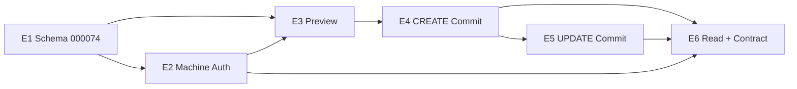

# RFx v3.0E7 Phase 2 — ERP API Implementation Plan

**Status:** `FROZEN_PENDING_REVIEW`
**Architecture base:** `origin/main` @ `6c142bb7378b46a4fbb8fc629bea682861558f19` (PR #137 merged)
**Mode:** Planning only — **no product implementation authorized**

| Marker | Value |
|---|---|
| `ERP_API_ARCHITECTURE_STATUS` | `FROZEN_ACCEPTED` |
| `ERP_API_IMPLEMENTATION_PLAN_STATUS` | `FROZEN_PENDING_REVIEW` |
| `ERP_API_IMPLEMENTATION_STATUS` | `NOT_STARTED` |
| `ERP_API_IMPLEMENTATION_AUTHORIZED` | `NO` |
| `ERP_API_IMPLEMENTATION_STARTED` | `NO` |
| `ERP_API_E1_AUTHORIZED` | `NO` |
| `MIGRATION_000074_AUTHORIZED` | `NO` |
| `MIGRATION_000074_CREATED` | `NO` |
| `CONTROLLER_VERDICT` | `PENDING` |
| `NEXT_ACTION` | `INDEPENDENT_CONTROLLER_REVIEW_ERP_API_IMPLEMENTATION_PLAN` |

**Normative architecture (frozen):**

- [RFX_V3_0E7_ERP_API.md](./RFX_V3_0E7_ERP_API.md)
- [RFX_V3_0E7_ERP_API_ACCEPTANCE_MATRIX.md](./RFX_V3_0E7_ERP_API_ACCEPTANCE_MATRIX.md)
- [RFX_V3_0E7_ERP_API_IMPLEMENTATION_WAVES.md](./RFX_V3_0E7_ERP_API_IMPLEMENTATION_WAVES.md)
- ADR-012..015 (Accepted)

---

## 1. Purpose

Decompose accepted ERP API architecture into **six implementation waves (E1–E6)** with explicit dependencies, collision boundaries, test ownership (`E7P2-INT-120..195`), and per-wave authorization gates.

This document does **not** authorize code, migration execution, or test implementation.

---

## 2. Read-only inventory summary

### 2.1 Identity and authentication (current code)

| Capability | Status | Evidence |
|---|---|---|
| User JWT (HS256) | **Implemented** | `services/api-gateway/internal/http/middleware/auth.go`, `services/identity-service/internal/platform/security/jwt.go` |
| Password hashing (bcrypt cost 12) | **Implemented** | `identity-service/internal/platform/security/password.go` |
| Trusted header injection | **Implemented** | Gateway `Auth()` → `X-User-ID`, `X-Tenant-ID`; company guards → verified `X-Company-ID` |
| Spoofed header stripping | **Implemented** | `auth_context.go` `StripUntrustedIdentityHeaders` + FP-SEC tests |
| IP rate limit (global `/api/v1`) | **Implemented** | `middleware/ratelimit.go` — **not** per-principal |
| S2S internal token | **Implemented** | `packages/shared-go/internalauth` — **forbidden for public ERP** (ADR-013) |
| OAuth client_credentials | **Absent** | Zero Go/OpenAPI matches; ADR-013 |
| Public API-key auth | **Absent** | Zero Go matches; ADR-013 |
| Integration principal model | **Partial schema** | `integration_principal_id` column on `rfx_external_object_links` (000073); no principals table |
| Auth audit events | **Absent** | Login updates `last_login_at` only |

### 2.2 RFx Preview/Commit primitives (reusable)

| Primitive | Status | Primary path |
|---|---|---|
| Buyer XLSX Preview | **Implemented** | `excel_exchange_preview.go`, `buyer_import_parser.go` |
| Buyer XLSX Commit | **Implemented** | `excel_exchange_commit.go`, `excel_exchange_reconcile.go` |
| Carrier XLSX Preview/Commit | **Implemented** | `excel_exchange_carrier_*.go` |
| `rfx_import_analyses` | **Implemented** | `import_analysis_repository.go`; human `actor_id` NOT NULL |
| Canonical hash (XLSX) | **Implemented** | `buyer_import_hash.go` `StableStoredPayload` |
| Idempotency store | **Implemented** | `idempotency_repository.go`; scope uses `actor_id` |
| Transaction runner | **Implemented** | `repository/executor.go` |
| External object links repo | **Exists, unwired** | `external_object_link_repository.go`; not in `main.go` |
| Reference mapping tables | **Absent** | ADR-015 / planned 000074 |
| ERP routes/handlers | **Absent** | No `/integrations/erp` in services |
| `RFX_ERP_INTEGRATION_ENABLED` | **Absent** | Docs only; XLSX uses `RFX_EXCEL_EXCHANGE_ENABLED` |
| Route manifest pattern | **Implemented** | `packages/shared-go/rfx/e7_excel_exchange_routes.go` |

### 2.3 Data model and migrations

| Item | Value |
|---|---|
| `CURRENT_MAX_MIGRATION` | **000073** |
| `MIGRATION_000074_FREE` | **YES** |
| `MIGRATION_NUMBER_COLLISION` | **NO** |
| External unique index | Includes `external_version` — **must change** per ADR-015 |
| `actor_id` on analyses | NOT NULL — **must become nullable** with XOR CHECK |
| Idempotency unique key | `(tenant_id, actor_id, operation, aggregate_scope, idempotency_key)` |

### 2.4 Test infrastructure

| Item | Path / pattern |
|---|---|
| PostgreSQL harness | Per-service; RFx: `internal/integration/excelexchange/test_helpers.go` |
| Matrix guards | `e7p2_*_test_matrix_test.go` (INT-21..119) |
| Route parity | `excel_exchange_route_parity_test.go` (service + gateway) |
| OpenAPI validate | `make openapi-validate`, `make openapi-check` |
| Repository-safety | CI job `repository-safety` |
| Release contract max | `bintrans_staging_release_contract_selfcheck.sh` pins 000073 |

---

## 3. Architecture vs code — implementability matrix

`ARCHITECTURE_IMPLEMENTABILITY_GAP_FOUND=NO` — accepted architecture is implementable by extending existing XLSX Preview/Commit patterns. Gaps below are **planned work**, not contradictions.

| Architecture decision | Existing primitive | Gap | Target | Wave |
|---|---|---|---|---|
| `BINTRANS_RFX_ERP_JSON_V1` | XLSX schema CHECKs | ERP schema blocked by 000073 CHECK | `rfx-service` erp parser + migration | E1, E3 |
| 8 ERP operations | 6 XLSX routes | No ERP routes/OpenAPI | gateway + rfx-service + manifest | E3–E6 |
| 4 operation constants | XLSX commit ops only | ERP constants undefined in code | `domain/excel_exchange.go` | E1, E4, E5 |
| OAuth client_credentials | User JWT only | New token endpoint + validation | identity + gateway | E2 |
| Hashed API-key fallback | bcrypt for users | New credential store + bearer parse | identity + gateway | E1, E2 |
| Auth scheme binding | N/A | Typed principal + `auth_scheme_denied` | gateway auth layer | E2 |
| Integration principal | Column on links only | Principals/credentials/scopes tables | migration 000074 | E1 |
| XOR actor/principal | `actor_id` required | Nullable + CHECK | migration 000074 | E1 |
| Principal scopes | RBAC via user roles | Machine scopes on principal | E1 schema + E2 enforcement | E1, E2 |
| Stable external identity | Index includes revision | Redesign unique key | migration 000074 | E1 |
| Revision metadata | `external_version` in key | Separate `external_revision` column | migration 000074 | E1 |
| Mapping-set pin | No mapping tables | New tables + preview pin | migration + preview | E1, E3 |
| Preview → Commit | XLSX flow | ERP JSON ingress + principal binding | rfx-service | E3–E5 |
| Commit idempotency | actor-scoped | Extend for `integration_principal_id` | idempotency repo | E1, E4, E5 |
| CREATE concurrency | N/A for CREATE | Atomic link insert + unique winner | commit service | E4 |
| `ErpRfxDraftSummary` | Human UI DTOs | New allowlisted read DTO | handlers + OpenAPI | E6 |
| Capabilities | N/A | Authenticated schema/limits endpoint | E6 | E6 |
| No auto-publish | XLSX commit pattern | Reuse — no publish call | commit services | E4, E5 |
| Lots/questionnaire v1 | XLSX reconcile | Reuse `reconcileImport*` | E4, E5 | E4, E5 |
| Lanes/routes rejected | N/A in XLSX | Explicit 422 `unsupported_field_v1` | ERP parser | E3 |
| Migration 000074 | Not created | Full proposal in architecture §16 | infrastructure | E1 |
| INT-120..195 | Not implemented | 76 integration tests | `internal/integration/erp/` | E1–E6 |

**Note:** Idempotency scope must evolve from `{tenant_id, actor_id, ...}` to support `{tenant_id, integration_principal_id, ...}` without breaking XLSX human path (E1 design task).

---

## 4. Implementation waves (E1–E6)

Detailed test ownership: [RFX_V3_0E7_ERP_API_IMPLEMENTATION_WAVES.md](./RFX_V3_0E7_ERP_API_IMPLEMENTATION_WAVES.md).

| Wave | Branch (proposed) | Worktree (proposed) | Primary deliverable |
|---|---|---|---|
| **E1** | `feat/rfx-erp-schema-principals-e1-v3.0e7` | `rfx-erp-schema-e1-v3.0e7-phase2` | Migration 000074 + repositories (no public ERP routes) |
| **E2** | `feat/rfx-erp-machine-auth-e2-v3.0e7` | `rfx-erp-machine-auth-e2-v3.0e7-phase2` | OAuth + API-key + gateway principal context |
| **E3** | `feat/rfx-erp-preview-e3-v3.0e7` | `rfx-erp-preview-e3-v3.0e7-phase2` | ERP parser + CREATE/UPDATE Preview + mapping pin |
| **E4** | `feat/rfx-erp-create-commit-e4-v3.0e7` | `rfx-erp-create-commit-e4-v3.0e7-phase2` | CREATE Commit + stable link + concurrency |
| **E5** | `feat/rfx-erp-update-commit-e5-v3.0e7` | `rfx-erp-update-commit-e5-v3.0e7-phase2` | UPDATE Commit + stale baseline + coexistence |
| **E6** | `feat/rfx-erp-contract-closure-e6-v3.0e7` | `rfx-erp-contract-closure-e6-v3.0e7-phase2` | GET APIs + capabilities + OpenAPI + matrix closure |

### Wave E1 — Schema and integration principal foundation

**Scope (when authorized):**

- Create migration `000074` per architecture §16 (20 checklist items in §10 below)
- Integration principals, credentials, scopes, rotation metadata, allowed CIDRs
- `rfx_import_analyses.integration_principal_id`; nullable `actor_id`; XOR CHECK
- Extend workbook/schema CHECKs for `ERP_BUYER_JSON` / `BINTRANS_RFX_ERP_JSON_V1`
- Stable external identity index (drop revision from uniqueness)
- Mapping-set tables + entries
- Repository methods: principal lookup, credential verify hooks, external link upsert, mapping resolve
- Extend idempotency scope column strategy for machine principals (preserve XLSX compatibility)
- **No public ERP HTTP routes**

**Primary tests:** E7P2-INT-187 (+ migration harness E7P2-INT-01..05 pattern for 000074)

**Gates:** up/down/up; legacy XLSX rows unchanged; XOR constraint; no plaintext secrets in DB; release contract max updated in same PR.

### Wave E2 — Machine authentication and gateway foundation

**Scope:**

- `POST /api/v1/integrations/oauth/token` (client_credentials)
- API-key bearer validation for `credential_type=API_KEY` principals
- Auth scheme binding → `401 auth_scheme_denied` (INT-190)
- Gateway: strip spoofed identity headers; inject `X-Integration-Principal-ID`, `X-Tenant-ID`, `X-Company-ID`
- Scope enforcement middleware for ERP routes (as added)
- IP allowlist + per-principal rate limits (extend beyond global IP bucket)
- Credential rotation grace window
- Auth audit (`auth_scheme`, never secrets)

**Primary tests:** E7P2-INT-120..131, 190, 186

**Dependency:** E1 principals/credentials tables must exist before credential verification tests.

**Partial parallel:** E2 gateway middleware **design** can start after E1 schema is frozen; credential integration tests require E1 merged.

### Wave E3 — ERP canonical parser and Preview

**Scope:**

- `BINTRANS_RFX_ERP_JSON_V1` parser/validator (allowlist, normalization, depth/size limits)
- Reference mapping resolution + `mapping_context` pin in canonical payload/hash
- CREATE Preview + UPDATE Preview routes (gateway + service)
- Valid-only analysis persistence (OPTION A); **zero RFx mutation**
- Feature flag `RFX_ERP_INTEGRATION_ENABLED`
- Reject deferred fields (`lanes[]` → INT-195)

**Primary tests:** E7P2-INT-133, 135, 136, 142, 143, 146, 147, 148, 149, 165–176, 195

**Dependency:** E1 (schema, mapping tables, principal column) + E2 (authenticated principal context)

### Wave E4 — CREATE Commit

**Scope:**

- CREATE Commit route; mandatory Idempotency-Key; op `ERP_BUYER_CREATE_COMMIT`
- Principal binding on analysis; hash verification; expiry/consumed checks
- Pinned mapping validation → `409 stale_mapping_context`
- Atomic: create DRAFT event + stable external link + CONSUMED + idempotency
- Concurrent CREATE winner/loser (INT-194)
- Audit `rfx.erp.draft.created.v1`; `creation_channel=ERP`; no publish

**Primary tests:** E7P2-INT-132, 137–141, 144, 145, 177, 180, 191, 193, 194

**Dependency:** E1 + E2 + E3

### Wave E5 — UPDATE Commit

**Scope:**

- UPDATE Commit route; op `ERP_BUYER_UPDATE_COMMIT`
- DRAFT-only; stale `event_row_version` / `draft_row_version` / lots fingerprint
- Reuse `reconcileImportLots` / `reconcileImportQuestionnaire` patterns
- Mapping pin on commit; idempotency; audit `rfx.erp.draft.updated.v1`
- No carrier/scoring/award side effects; ERP/UI/XLSX coexistence

**Primary tests:** E7P2-INT-150–159, 178, 179, 181, 183, 184 (+ INT-156, 191 UPDATE paths)

**Dependency:** E1 + E2 + E3 + E4 (CREATE path proves link + analysis machinery)

### Wave E6 — Read APIs, capabilities, contract closure

**Scope:**

- GET by internal ID + GET by stable external ID (`ErpRfxDraftSummary` allowlist)
- GET analysis status; GET capabilities (`rfx:status:read`)
- OpenAPI + shared route manifest + gateway/service parity tests
- Full INT-120..195 matrix guards; Buyer/Carrier XLSX regression gates
- Confidentiality: no competitor data in GET DTO (INT-188)

**Primary tests:** E7P2-INT-134, 160–164, 182, 185, 188, 189, 192

**Dependency:** E1–E5 functional endpoints (E6 can stub earlier for INT-134 only after minimal route exists — primary closure in E6)

---

## 5. Dependency graph



| Question | Answer |
|---|---|
| E2 parallel with E1? | **Partial** — E2 design/prototypes possible; credential DB tests need E1 merged |
| E1 required for auth? | **Yes** — principals/credentials/scopes tables |
| E3 parallel with E2? | **No for integration tests** — Preview requires authenticated principal |
| E4 depends on | E1 + E2 + E3 |
| E5 depends on | E1 + E2 + E3 + E4 |
| E6 depends on | E1–E5 (full contract closure) |

### Shared-file collision risks

| File / zone | Waves | Policy |
|---|---|---|
| `infrastructure/migrations/000074_*` | E1 only | Single owner; no parallel migration files |
| `packages/shared-go/rfx/*_routes.go` | E3–E6 | Serialize manifest edits; E6 owns final parity |
| `packages/openapi/rfx-service.yaml` | E3–E6 | Incremental ops per wave; E6 final validate |
| `services/api-gateway/internal/http/router.go` | E2–E6 | E2 auth block; later waves add ERP proxy routes |
| `services/rfx-service/internal/domain/excel_exchange.go` | E1, E4, E5 | E1 constants/types; E4/E5 commit ops |
| `services/rfx-service/internal/service/excel_exchange_*.go` | E3–E5 | Prefer new `erp_exchange_*.go` files to reduce XLSX collision |

### Parallel agent policy

- **Never** parallelize E1 migration with another migration author.
- E2 may use separate worktree after E1 schema **design** is frozen (pre-merge) only for gateway scaffolding — **no merge** until E1 lands.
- E3–E6 are sequential merges recommended: E3 → E4 → E5 → E6.

---

## 6. Migration 000074 implementation plan (file not created)

`MIGRATION_000074_CREATED=NO` — plan only.

| # | Item |
|---|---|
| 1 | `rfx.rfx_integration_principals` (tenant, client_id, credential_type, company_id, status, allowed_cidrs) |
| 2 | `rfx.rfx_integration_credentials` (hashed secrets, rotation, display-once metadata) |
| 3 | `rfx.rfx_integration_scopes` |
| 4 | Rotation/revocation timestamps + grace window columns |
| 5 | Allowed CIDRs (optional JSONB or join table) |
| 6 | `rfx_import_analyses.integration_principal_id` nullable FK |
| 7 | `actor_id` nullable; XOR CHECK (actor XOR principal) |
| 8 | Extend source/workbook CHECK for `ERP_BUYER_JSON` |
| 9 | Extend schema_version CHECK for `BINTRANS_RFX_ERP_JSON_V1` |
| 10 | Replace `uq_rfx_external_object_identity` — **remove `external_version` from unique key** |
| 11 | `external_revision` column + optional revision history table |
| 12 | `rfx_reference_mapping_sets` + `rfx_reference_mapping_entries` |
| 13 | Indexes for stable lookup, principal credential lookup, mapping resolution |
| 14 | Extend idempotency uniqueness or add parallel scope for integration principal |
| 15 | Preserve payload immutability trigger on analyses |
| 16 | Legacy compatibility: existing XLSX rows keep populated `actor_id` |
| 17 | Down migration: reversible; ordered drop per 000073 convention |
| 18 | Migration locking: standard single-flight `migrate` job |
| 19 | Runtime risk: backfill none required for new columns (nullable/additive) |
| 20 | Release contract: update max migration pin to 000074 in same authorized PR |

**Rollback limitations:** Down removes ERP-specific CHECK values; analyses rows with ERP schema must be absent or migrated before down in production.

**PostgreSQL tests:** Extend `migration_integration_test.go` pattern (INT-01..05 style) + INT-187.

---

## 7. Security implementation plan

| Threat | Preventive control | Detection/audit | Test IDs | Wave |
|---|---|---|---|---|
| Credential theft | TLS, hashed storage, rotation | Auth failure metrics | 120–124, 126 | E2 |
| Plaintext secret leakage | Hash-only persistence | DB inspection in tests | 124 | E1, E2 |
| OAuth→API-key downgrade | Typed principals | `auth_scheme_denied` audit | 190 | E2 |
| Revoked/expired credentials | Status + expiry columns | 401 machine codes | 122, 123 | E2 |
| Tenant spoofing | Strip client tenant header | — | 128 | E2 |
| Company spoofing | Strip client company header | — | 129 | E2 |
| Cross-tenant access | Tenant predicate on all queries | — | 130 | E2, E6 |
| Cross-company access | Company binding on principal | — | 131 | E2, E6 |
| Principal-binding bypass | XOR + commit verify | `actor_binding_denied` | 156, 191 | E4, E5 |
| Replay | Idempotency-Key + body hash | idempotency store | 140, 145, 157 | E4, E5 |
| Idempotency conflict | Same key different body → 409 | — | 145 | E4 |
| Mass assignment | JSON allowlist | — | 143 | E3 |
| Payload/depth bomb | Size/depth limits | — | 147, 175 | E3 |
| External-ID collision | Stable unique + atomic commit | — | 139, 194 | E4 |
| Concurrent CREATE | Transaction + unique index | — | 194 | E4 |
| Hash tampering | Server-side hash verify | — | 153 | E5 |
| Mapping drift | Pinned `mapping_context` | — | 193 | E4, E5 |
| Stale overwrite | Version tokens + fingerprint | — | 151, 152 | E5 |
| Competitor leakage | GET DTO allowlist | — | 188 | E6 |
| Accidental publish | Commit path excludes publish | status remains DRAFT | 177 | E4 |
| Carrier mutation | Commit scope excludes responses | row counts unchanged | 178 | E5 |
| Secrets in logs/audit | Redaction policy | test inspection | 182 | E6 |

---

## 8. Commit and PR strategy (per wave)

| Wave | Base prerequisite | Expected packages | Forbidden | Validation level |
|---|---|---|---|---|
| E1 | `ERP_API_E1_AUTHORIZED=YES` | `infrastructure/migrations/000074_*`, `rfx-service/internal/repository/*`, domain types | HTTP routes, OpenAPI ERP ops | L2: migration up/down/up + unit |
| E2 | E1 merged | `identity-service`, `api-gateway`, shared auth helpers | RFx mutation routes | L2: auth unit + targeted integration |
| E3 | E1+E2 merged | `rfx-service` erp parser/preview, gateway routes, flag | Commit handlers | L2: preview integration INT subset |
| E4 | E3 merged | CREATE commit service/handler, idempotency | UPDATE commit | L2: E4 INT set + XLSX regression |
| E5 | E4 merged | UPDATE commit, reconcile reuse | CREATE changes | L2: E5 INT set + coexistence |
| E6 | E5 merged | GET handlers, capabilities, OpenAPI, matrix guards | New business features | L3: full INT-120..195 + parity |

**Each wave PR:** Draft until controller review → merge commit → post-merge closeout doc (pattern: Carrier XLSX C3).

**Controller gate:** Required before each wave merge and before `ERP_API_E{N}_AUTHORIZED=YES` for next wave.

---

## 9. Authorization gates

### Planning acceptance (this document)

After independent controller review:

```
ERP_API_IMPLEMENTATION_PLAN_STATUS=FROZEN_ACCEPTED
```

### Implementation authorization (separate decisions)

| Marker | Meaning |
|---|---|
| `ERP_API_IMPLEMENTATION_AUTHORIZED=YES` | Program-level go (does not auto-start all waves) |
| `ERP_API_E1_AUTHORIZED=YES` | May create migration 000074 |
| `MIGRATION_000074_AUTHORIZED=YES` | Explicit migration creation gate (subset of E1) |
| `ERP_API_E2_AUTHORIZED=YES` | May implement machine auth (after E1 merge) |
| … | E3–E6 require prior wave merge + explicit authorization |

**Current state:** all `NO` / `NOT_STARTED`.

---

## 10. Controller evidence placeholder

| Field | Value |
|---|---|
| Architecture reviewed head | `6c142bb7378b46a4fbb8fc629bea682861558f19` |
| Implementation plan status | `FROZEN_PENDING_REVIEW` |
| Implementation authorized | **NO** |

---

## 11. References

- [RFX_V3_0E7_ERP_API_IMPLEMENTATION_WAVES.md](./RFX_V3_0E7_ERP_API_IMPLEMENTATION_WAVES.md)
- [RFX_V3_0E7_BUYER_XLSX_IMPORT_P4_COMMIT.md](./RFX_V3_0E7_BUYER_XLSX_IMPORT_P4_COMMIT.md)
- [RFX_V3_0E7_PHASE2_EXCEL_ERP.md](./RFX_V3_0E7_PHASE2_EXCEL_ERP.md)
- `services/rfx-service/internal/integration/excelexchange/` (harness pattern)
- `docs/engineering/COLLISION_POLICY.md`
